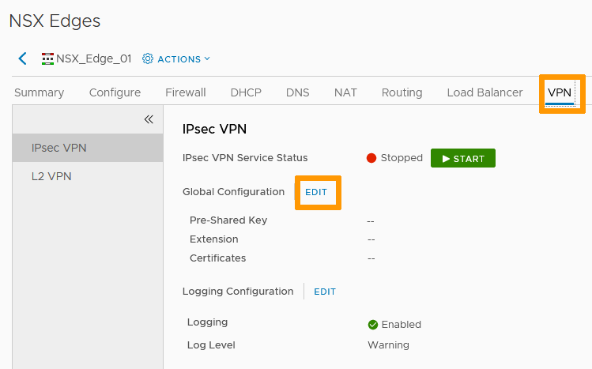
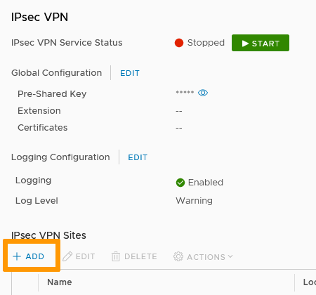
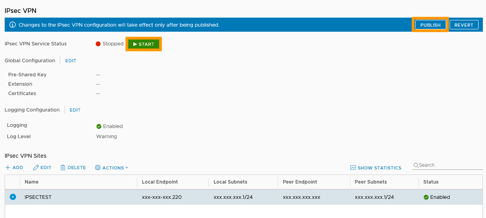
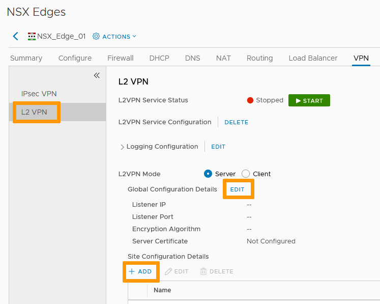
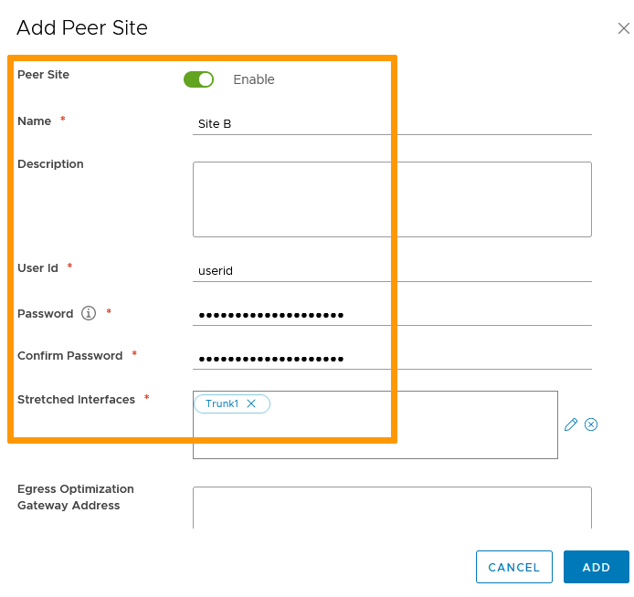
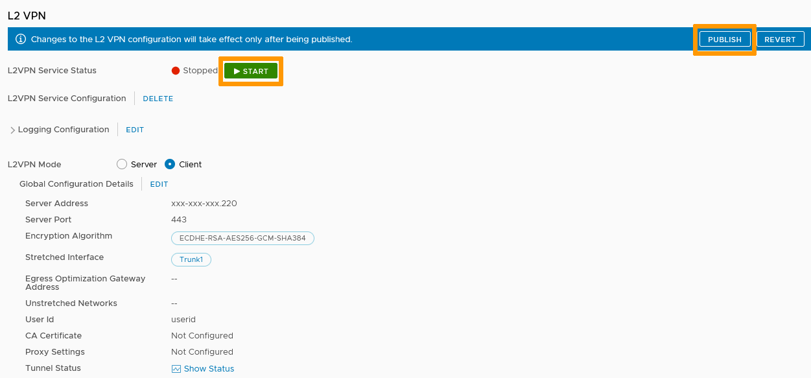

**Last Updated on 30th November 2021**

## Objective

A VPN creates a secured tunnel accross public networks to connect remote clients or sites to your infrastructure.

**This guide explains the two ways to do it through the NSX Edge Gateway**

## Requirements

- being an administrative contact of your [Hosted Private Cloud infrastructure](https://www.ovhcloud.com/en-ca/enterprise/products/hosted-private-cloud/) to receive login credentials
- a user account with access to vSphere as well as the specific rights for NSX (created in the [OVHcloud Control Panel](https://ca.ovh.com/auth/?action=gotomanager&from=https://www.ovh.com/ca/en/&ovhSubsidiary=ca))
- a deployed [NSX Edge Services Gateway](https://docs.ovh.com/ca/en/private-cloud/how-to-deploy-an-nsx-edge-gateway/)

## Instructions

### Interface access

In the vSphere interface menu, go to the `Networking and Security`{.action} dashboard.

{.thumbnail}

On the left side, navigate to the `NSX Edges`{.action} section then click on the appliance you're setting up.

{.thumbnail}

In the `VPN`{.action} tab, you'll notice two types of VPN:

- IPsec VPN : Internet Protocol Security VPN secures traffic between two networks connected over a public network through IPSec gateways called endpoints. It is hardware agnostic.
- L2 VPN : in the case of NSX Edge Gateway, Layer 2 VPN connects NSX appliances across multiple sites and secures the connection through IPsec. 

### IPsec VPN

In the `IPsec VPN`{.action} section, click on the `Edit`{.action} button next to `Global Configuration`.

{.thumbnail}

Set a Pre-Shared Key to be used by all connecting endpoints as needed.     
You can add certificates if you have created any for VPN purposes in that window.

Click `Save`{.action} when done.

{.thumbnail}

In the `IPsec VPN Sites` section, click `+ Add`{.action}.

{.thumbnail}

Name the site and enable it.

On the `Endpoint`{.action} page:

- **Local Id** is the public IP of the VPN or its FQDN.
- **Local Endpoint** is the IP address or FQDN of the NSX Edge Gateway (typically the same IP as Local ID). 
- **Local Subnets** are the subnets used for the VPN.
- **Peer Id** is the public IP of the remote site or its FQDN.
- **Peer Endpoint** default value is "any" but can be changed to an IP or FQDN. *If you retain the default value, the Global PSK must be set.*
- **Peer Subnets** are the internal subnets used on the peer site.

{.thumbnail}

In the `Tunnel Configuration`{.action} page, set your encryption parameters (including certificates if needed) then click `Add`{.action}.

{.thumbnail}

You can now `Start`{.action} the IPsec VPN service and `Publish`{.action} all the changes made.

{.thumbnail}

Your tunnel is up and active.

### L2 VPN

L2 VPN is a Client-Server type of connection. We will set up the Server first.

#### Server Side

In the `L2 VPN`{.action} section, select **Server mode** then click on the `Edit`{.action} button next to `Global Configuration Details`.

{.thumbnail}

Set your Server Settings:

- **Listener IP** is the Public IP of the NSX Edge Gateway you will use.
- **Listener port** is 443 by default (standard https) but can be changed.
- Choose your encryption type.
- Use system generated certificate or select an available third party one if you added one.

Click `OK`{.action} then `Save`{.action}.

{.thumbnail}

Back in the L2 VPN section, click `+ Add`{.action} in `Site Configuration Details`.

Set your Peer Site Settings:

- Enable the site.
- Name it.
- Define a **User Id** and **password** that will be used to authenticate the tunnel connection.
- **Stretched Interfaces** are the internal interfaces that will communicate with the peer site. *Those interfaces need to be trunk interfaces.* 

Click `Add`{.action}.

{.thumbnail}

You can now `Start`{.action} the L2 VPN service and `Publish`{.action} all the changes made.

{.thumbnail}

Your server is up and active.

#### Client Side

On the client NSX, in the `L2 VPN`{.action} section, select **Client mode** then click on the `Edit`{.action} button next to `Global Configuration Details`.

{.thumbnail}

The settings mirror those of the server:

- **Server Address** is the public IP of the NSX server side.
- The **Server Port** is the one defined (443 by default but you may have changed it).
- Use the same encryption type as the server.
- This time, the **Stretched Interfaces** will be the client internal ones that will be communicating with the server side.
- The **User Id** and **password** must be the same as defined on the server .

Click `Save`{.action}.

{.thumbnail}

You can now `Start`{.action} the L2 VPN service and `Publish`{.action} all the changes made.

{.thumbnail}

The client side is set and communications should flow.

## Go further

Join our community of users on <https://community.ovh.com/en/>.
