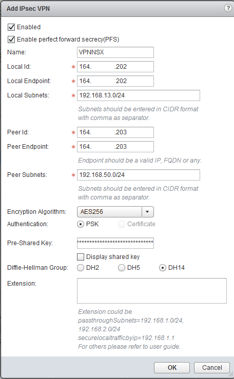
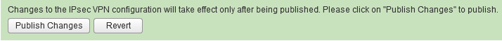
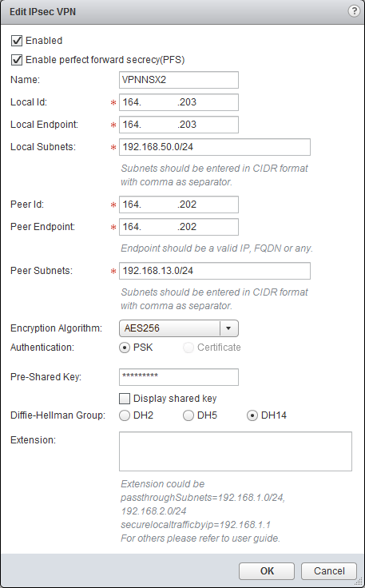
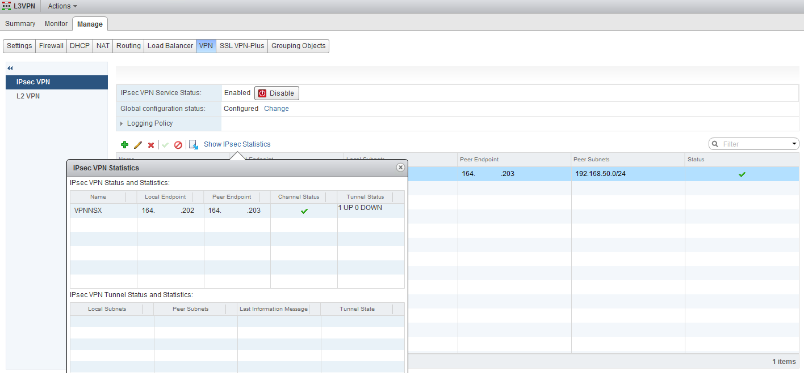
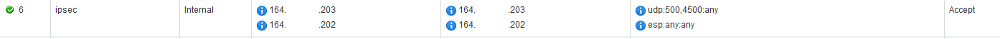
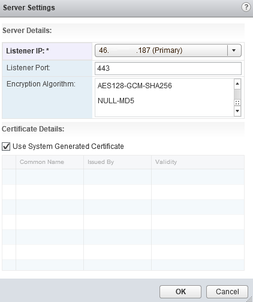
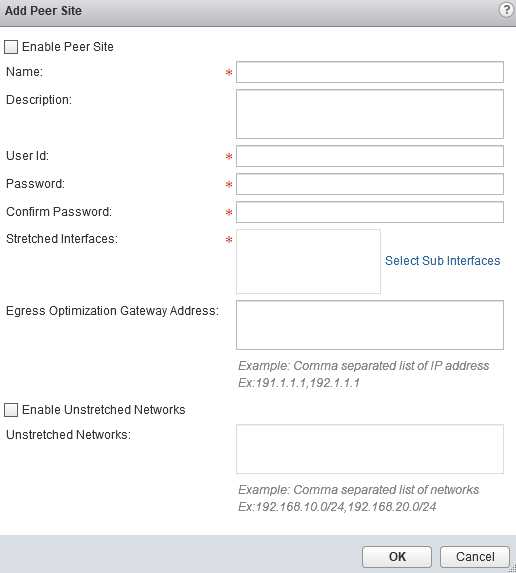

**Dernière mise à jour le 27/02/2019**

## Objectif

Le VPN permet la mise en place d'un tunnel IPsec entre une source et une destination distante.

**Ce guide explique comment établir cette solution**

## Prérequis

- Disposer d'un utilisateur ayant accès  à [l'interface de gestion NSX](https://docs.ovh.com/fr/private-cloud/acceder-a-l-interface-de-gestion-nsx/)

## En pratique

Depuis le menu de la Edge, rendez-vous dans l'onglet "Manage" puis "VPN" pour accéder à la configuration du [VPN IPsec](#ConfigurerunVPNviauneGatewayEdge-IPsecVPN)ou [VPN L2](#ConfigurerunVPNviauneGatewayEdge-L2VPN).

### IPsec VPN

Le VPN IPsec permet la mise en place d'un tunnel VPN entre un VPN client et un VPN serveur configurés sur des systèmes différents.

Par défaut le VPN est désactivé sur la Edge, vous pouvez cliquer sur le bouton "Démarrer" pour l'activer. Si nécessaire, vous pouvez activer les logs via la case "Activer la journalisation" et définir le niveau de ces logs via le menu déroulant "Niveau de journal".

Le "statut de la configuration global" doit être "Configuré"" pour l'utilisation de certificat d'authentification au VPN.

Vous ne pourrez pas publier vos changements si vous n'avez pas au moins un site distant de configuré.

{.thumbnail}

Dans notre exemple, le VPN est géré côté client et serveur par une Edge NSX de la même infrastructure, d'où l'utilisation d'une plage IP similaire. Vous pouvez néanmoins utiliser un autre dispositif due NSX pour la gestion du VPN IPsec sur votre site distant.

Pour ajouter un VPN IPsec, cliquez le le bouton `Add` (petit `+`{.action} vert). Vous pourrez alors configurer les champs suivants :

- Enabled : Active le VPN pour ce lien si coché.
- Enable perfect forward secrecy (PFS) : Active la confidentialité persistante si coché.
- Name : Le nom du VPN.
- Local Id : L'IP publique de la Edge locale utilisée pour le VPN.
- Local Endpoint : Similaire au "Local Id".
- Local Subnets : La plage d'IP privée des VMs qui utiliseront le VPN derrières la Edge locale. Plusieurs plages peuvent être ajoutées, séparées par des virgules.
- Peer Id : L'IP publique distante du système hébergeant le VPN distant. dans notre exemple, nous renseignons l'IP publique d'une Edge différente sur la même infrastructure utilisant la même plage IP.
- Peer Endpoint : Similaire au "Peer Id".
- Peer Subnets : La plage d'IP privée des VMs qui utiliseront le VPN derrières le VPN distant. Plusieurs plages peuvent être ajoutées, séparées par des virgules.

Les champs suivant dépendent de la configuration du VPN distant souhaité. Les configurations de part et d'autre doivent être similaire à ce niveau.

{.thumbnail}

N'oubliez pas de publier pour appliquer votre ajout de VPN ou vos modifications.

{.thumbnail}

Dans notre exemple, le site distant est configuré de manière similaire sur une autre Edge NSX, en inversant les informations "Peer" et "Local".

{.thumbnail}

Vous pouvez vérifier l'état du tunnel via le bouton "Afficher les statistiques `IPSec`{.action}.

{.thumbnail}

L'ajout d'un VPN IPsec sur une Edge NSX ajoute automatiquement une règle pour autoriser le trafic du VPN sur la Edge en question si vous avez autoriser la génération automatique de règle à la création de la Edge.

{.thumbnail}

### L2 VPN

Le L2 VPN vous permet de monter un tunnel VPN entre deux localisations, au même titre que le VPN IPsec, mais en se basant sur la couche 2 du modèle OSI ("Liaison de données" au lieu de la couche 3 "Réseau" via un tunnel VPN Ipsec).

Le L2 VPN NSX ne peut être utiliser qu'entre 2 Edges NSX, vous ne pouvez pas avoir un équipement autre pour monter le tunnel avec le L2 VPN NSX.

Le L2 VPN est désactivé par défaut, vous pouvez l'activer via le bouton "Démarrer". 

> [!primary]
>
> L'activation ne pourra être publiée que si un tunnel VPN est déjà créé.
>

Le L2 VPN peut être configuré en mode *serveur* ou *client* en fonction de vos besoins.

{.thumbnail}

#### L2 VPN Server

Séléctionnez le mode **serveur** pour accèder à la configuration.

Vous pouvez configurer le serveur de façon globale via le bouton `Modifier`{.action}. Vous pouvez configurer les paramètres suivantes :

- Listener IP : L'IP publique de la Edge utilisée pour le montage du tunnel VPN.
- Listener Port : Port d'écoute du tunnel VPN.
- Encryption Algorithm : Algorithme similaire sur chaque Edge utilisé pour monter le tunnel VPN.

Vous pouvez décocher la case "Use System Generated Certificate" pour utilisé un certificat ajouté précédemment sur la Edge (partie "Settings" puis "Certificates").

{.thumbnail}

Vous pouvez ensuite cliquer sur `Add` (petit `+`{.action} vert) pour ajouter des sites distants qui pourront se connecter à votre serveur VPN. Il vous faut pour cela renseigner les champs suivants :

- Enable Peer Site : Active l'autorisation de connexion pour le site distant si coché.
- Name : Le nom donné au site distant.
- User Id : Utilisateur utilisé pour initier le montage du tunnel VPN (doit être similaire côté serveur et client).
- Password : Mot de passe utilisé pour initier le montage du tunnel VPN (doit être similaire côté serveur et client).
- Stretched Intefaces : Utilisez le bouton "Select Sub Interfaces" pour sélectionner une interface de la Edge dans la liste proposée. Seules les interfaces en "Trunk" sont proposées.

Si votre infrastructure n'a pas été créée initialement avec une gestion de vLANs par NSX, vous ne disposez pas de switch logique en "Trunk" et aurez une erreur pour sélectionner les "Stretched Interfaces". Dans ce cas cette fonctionnalité n'est pas utilisable.

{.thumbnail}

#### L2 VPN Client

Séléctionnez le mode **client** pour accèder à la configuration.

Vous pouvez configurer le client de façon globale via le bouton `Modifier`{.action}. Vous pouvez configurer les paramètres suivantes :

- Server Address : 
- Server Port : 
- Encryption Algorithm : Algorithme similaire sur chaque Edge utilisé pour monter le tunnel VPN.
- Stretched Intefaces : Utilisez le bouton "Select Sub Interfaces" pour sélectionner une interface de la Edge dans la liste proposée. Seules les interfaces en "Trunk" sont proposées.
- Egress Optimization Gateway Address : Utilisez l'adresse IP de la passerelle des sous-interfaces ou les adresses IP vers lesquelles le trafic ne doit pas circuler dans le tunnel.
- Unstretched Networks : Permet d'éviter l'utilisation de route statique
- User Details : Renseignez les informations d'identification de l'utilisateur pour vous authentifier sur le serveur.

{.thumbnail}

## Aller plus loin

Échangez avec notre communauté d'utilisateurs sur <https://community.ovh.com>.