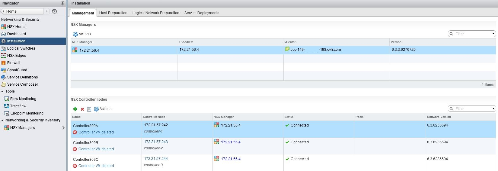
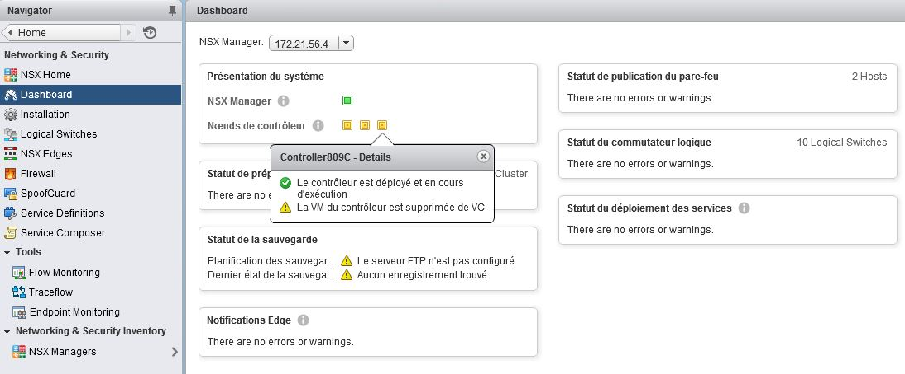

**Last updated 20th June 2018**

## Objective

In your NSX interface, you may encounter the *Controller VM deleted* message.

**This guide will explain what this message means.**

## Requirements

- NSX option activated
- a user with NSX access permissions

## Instructions

In your [NSX interface](https://docs.ovh.com/gb/en/private-cloud/accessing-NSX-interface/), under the `Installation`{.action} section, the *Controller VM deleted* error message may appear under the name of the controller:

This is because OVH does not host controllers on your infrastructure. They are hosted on a separate internal management infrastructure, so that they do not consume any of your infrastructure's resources.

Under the standard configuration for NSX, the controllers are expected to be in the same datacentre as your virtual machines, so this explains this error message. This message will have no effect on your machine's regular functionality.

You just need to make sure that the status of the controllers in your NSX interface is set to `Connected`. If it is, your machine is working.

> [!warning]
>
> Resolving this error by clicking on `Resolve`{.action} will delete the controllers from your infrastructure, which will mean you can no longer use NSX or the infrastructure’s network properly. We would therefore advise against doing this. OVH is still responsible for the administration of the NSX controllers.
> 

This also explains the following alert on the NSX dashboard:

## Go further

Join our community of users on <https://community.ovh.com/en/>.