**Last updated on 19th November 2021**

## Objective

The NSX Edge Services Gateway is a VMware appliance providing services such as Firewall, NAT, DHCP, VPN, Load Balancer and High Availability.

**This guide explains how to deploy such an appliance**

## Requirements

- being an administrative contact of your [Hosted Private Cloud infrastructure](https://www.ovhcloud.com/en-gb/enterprise/products/hosted-private-cloud/) to receive login credentials
- Have a user account with access to vSphere as well as the specific rights for NSX (created in the [OVHcloud Control Panel](https://www.ovh.com/auth/?action=gotomanager&from=https://www.ovh.co.uk/&ovhSubsidiary=GB))

## Instructions

You're about to embark in the NSX appliance deployment adventure.   

We'll guide you step by step on how to set up an Edge Services Gateway with a connection inside your environment as well as another to communicate with the outside.   

First, in the vSphere interface, go to the `Networking and Security`{.action} dashboard.

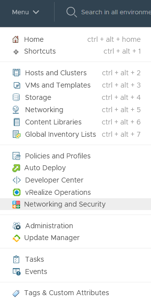{.thumbnail}

On the left side, navigate to the `NSX Edges`{.action} section.

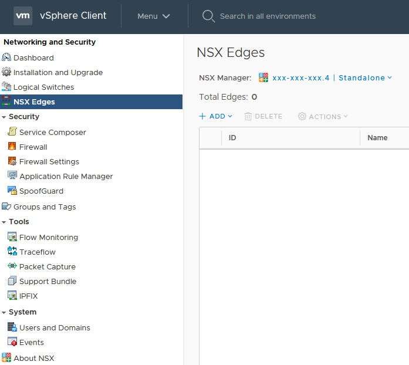{.thumbnail}

Click on `+ Add`{.action} then click `Edge Services Gateway`{.action}.

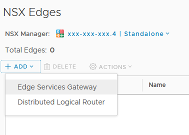{.thumbnail}

The guided installation  window pops up.

### Basic Details

Fill in the basic information. Only the name is mandatory, the other fields are optional and will either be automatically created or be ignored if non applicable to your case.

When done, click `Next`{.action}.

Leave `Deploy Edge Appliance VM `checked. 
Unchecking it would create the rules and settings but nothing would be active until a VM is deployed. 
We are leaving High Availibility out of our scope for now.

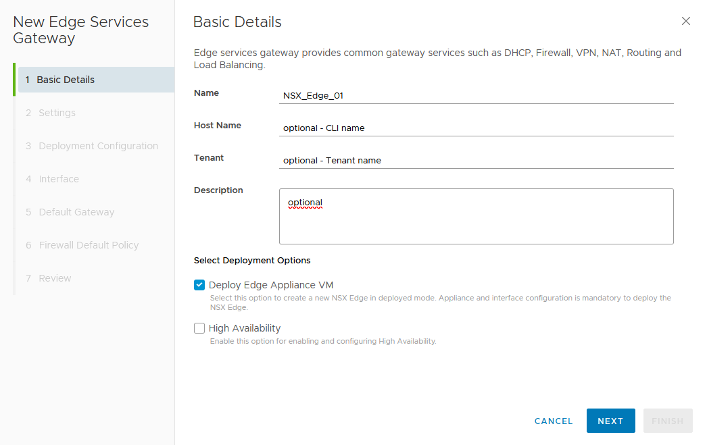{.thumbnail}

### Settings

Now on the to the settings window.

- The default administrator user name is filled in automatically but you can change it as you need.    
- Create and confirm a compliant password.    
- `Auto Rule Generation` will add firewall, NAT, and routing to enable control traffic to flow for these services.   
- The `SSH access` option allows console access on port 22 if needed. We recommend leaving it off by default and only open access as needed.     
- `FIPS mode` enforces encryption and security levels compliant with the United States Federal Information Processing Standards.     
- The logging level can be adapted to your needs.

Click `Next`{.action}

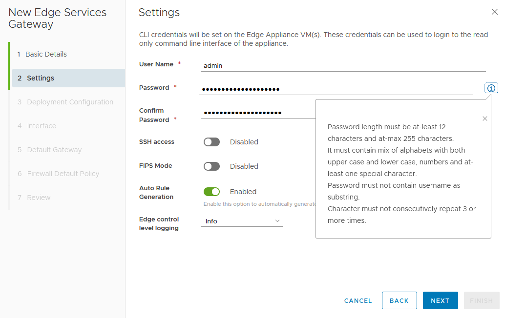{.thumbnail}

### Deployment Configuration

Select the destination datacenter (if you only have one datacenter in vSphere, there is no choice possible), the size of the appliance (size will determine processing power and resource consumption) and hit the `+`{.action} button.

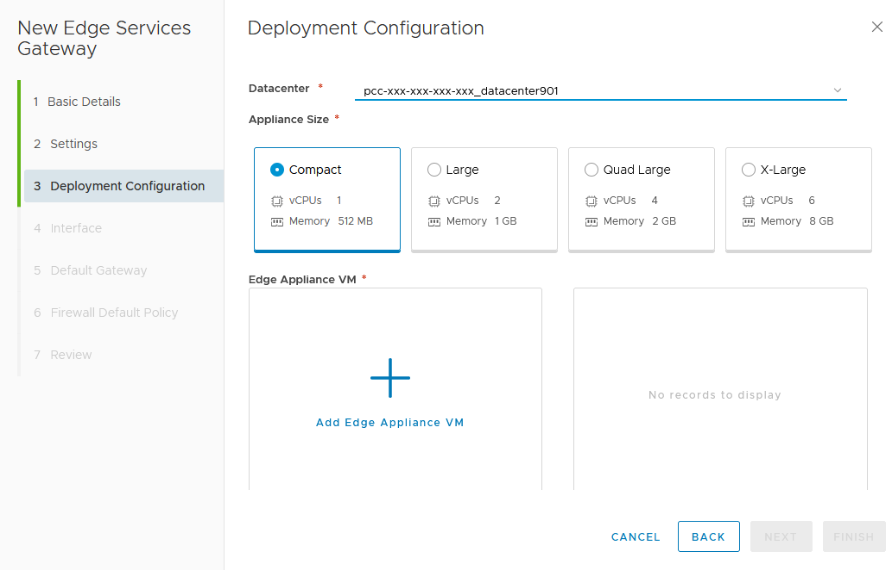{.thumbnail}

In the next window, select where the appliance will live within the chosen datacenter.  
Only `Cluster/Resource Pool` and `Datastore` are mandatory field (vSphere will select the best suited places for the rest if you do not input data).

Click `Add`{.action}.

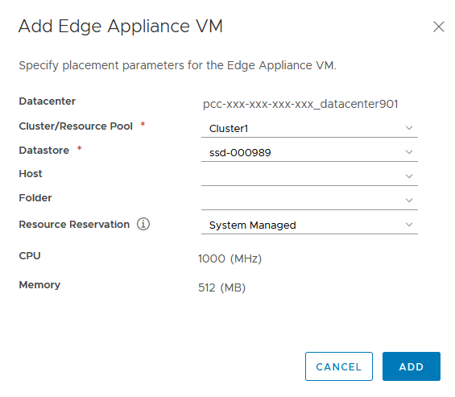{.thumbnail}

Back in the Deployment Configuration window, click `Next`{.action}.

### Interface

The Configure Interfaces is now before you.

Click on `+ Add`{.action}

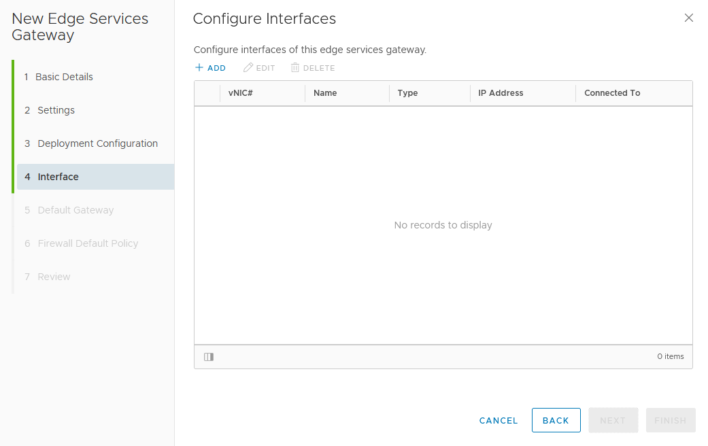{.thumbnail}

There are 2 types of interfaces:

- `Uplink` will communicate with the outside of your network
- `Internal` will be confined to your network

Let's name an interface and choose `Uplink`.    
Click on the `pencil`{.action} symbol to select how it will connect out.

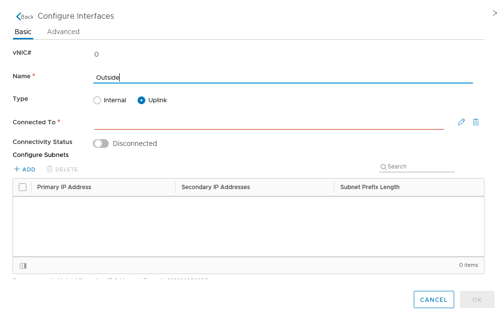{.thumbnail}

Typically, in the `Distributed Virtual Port Group`{.action} tab, the VM Network is the default outside access network (if you customized your environment, select accordingly).

Click `OK`{.action}.

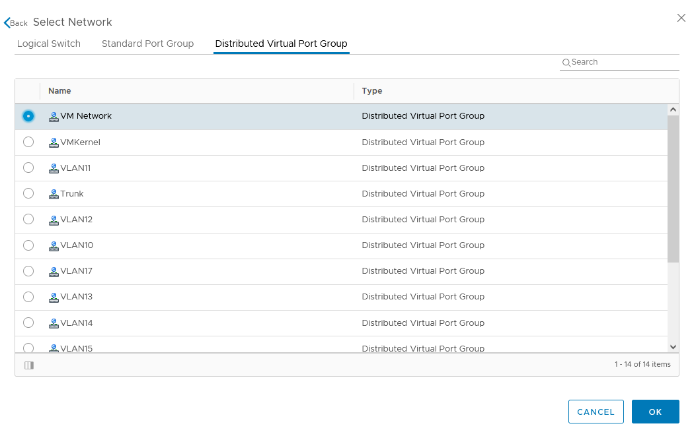{.thumbnail}

Back in the Interface configuration window, add a primary IP and subnet prefix for the interface.

Click `OK`{.action}.

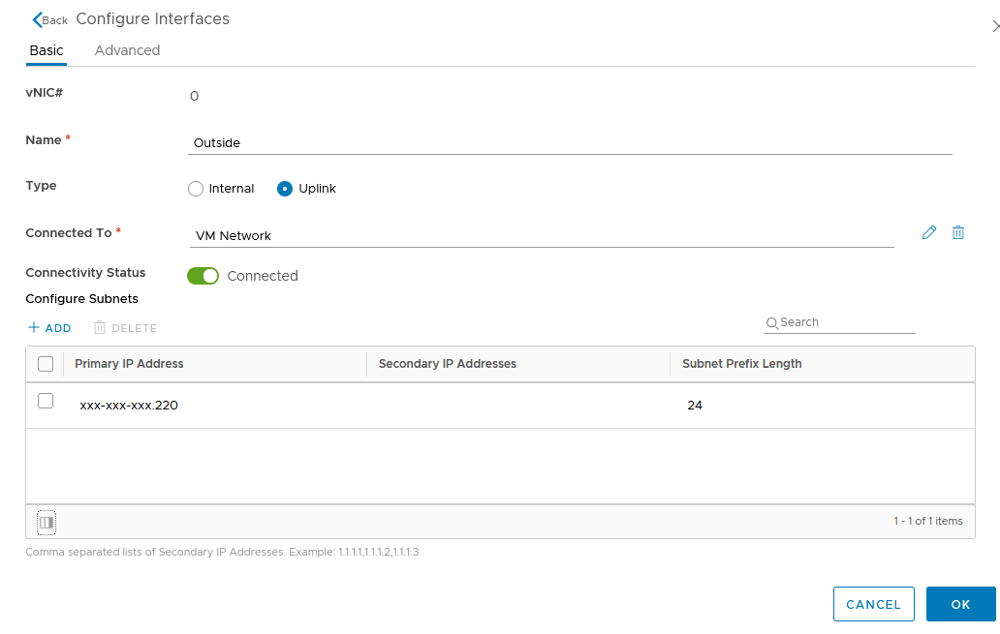{.thumbnail}

`Add`{.action} a second interface. This time it will be an `Internal` one.    
Click on the `pencil`{.action} symbol again to select the network the interface will be part of.     
Also, add the primary IP and subnet prefix for the vNIC.

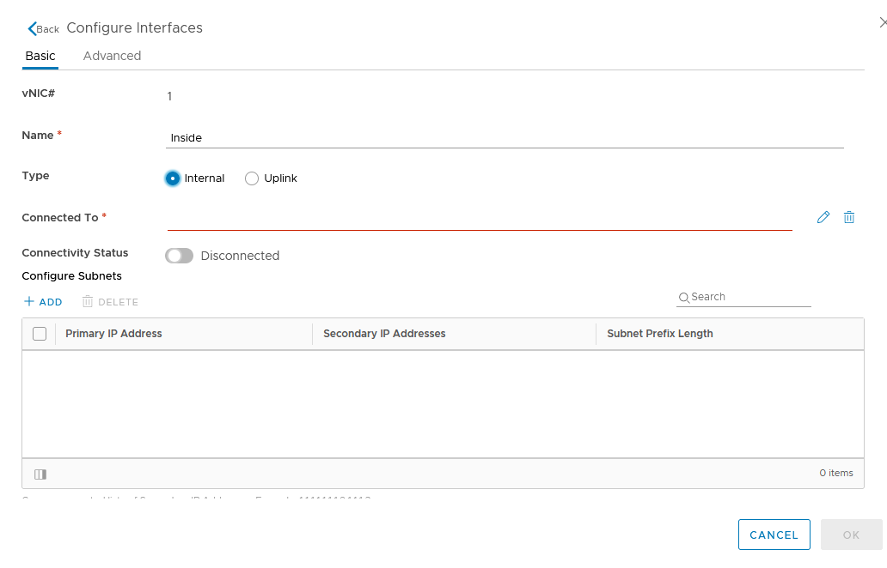{.thumbnail}

Interfaces are ready. Review and click `Next`{.action}.

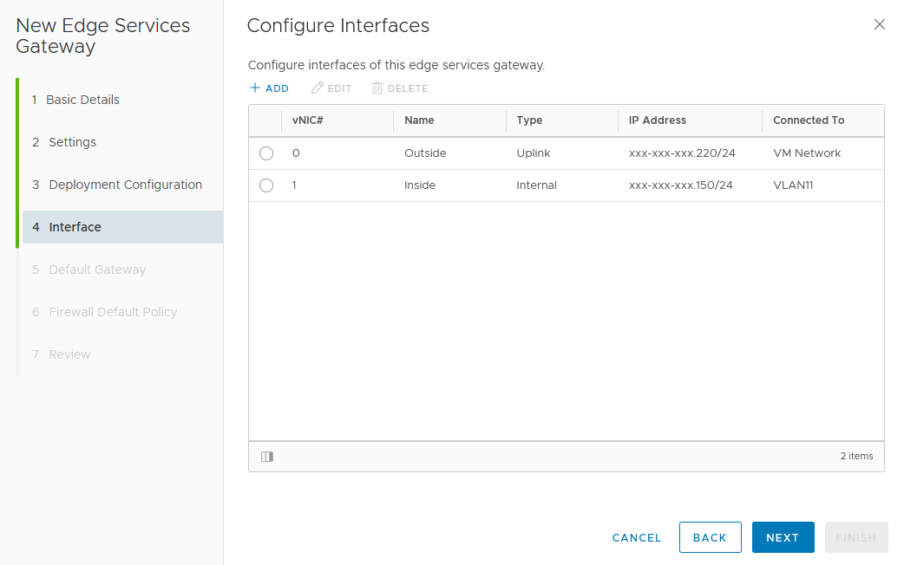{.thumbnail}

### Default Gateway

Configure the Default Gateway for external access. This is not mandatory and can be disabled to be done later.

Click `Next`{.action}

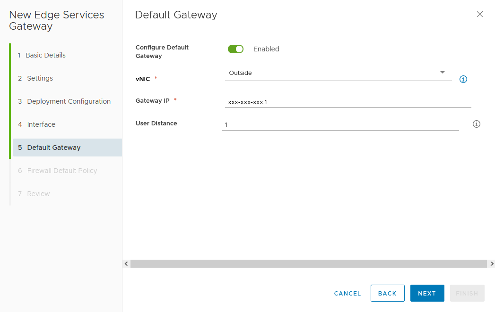{.thumbnail}

### Firewall Default Policy

Enable or disable Firewall Default Policy and click `Next`{.action}.

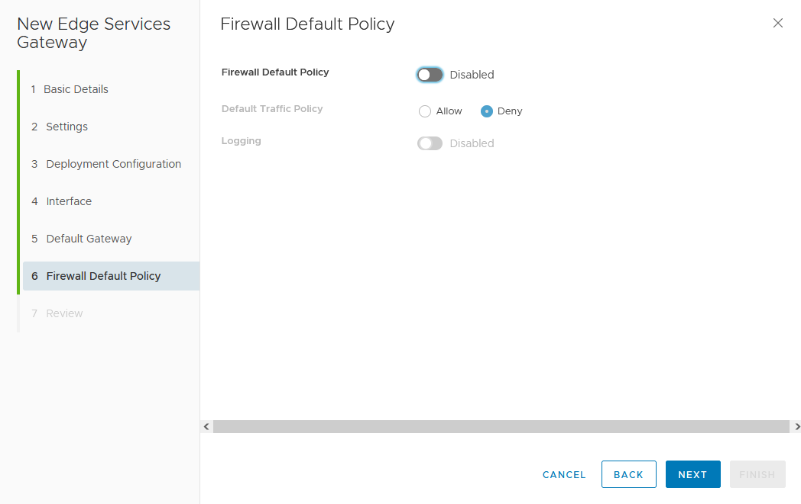{.thumbnail}

### Review

Review the configuration and hit that `Finish`{.action} button.

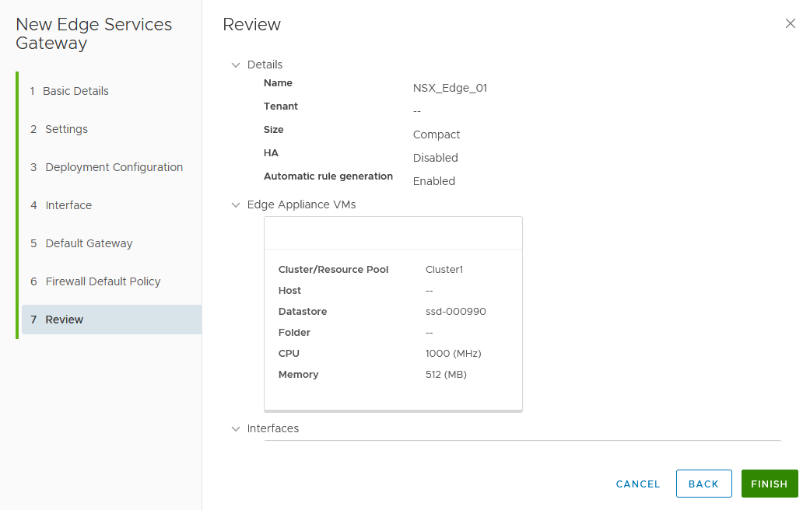{.thumbnail}

The Gateway will deploy. It will show a "Busy" and "Installing" status until done.  
If the deployment fails, it will show you basic error message and link to the full logs in the `Failed` section.

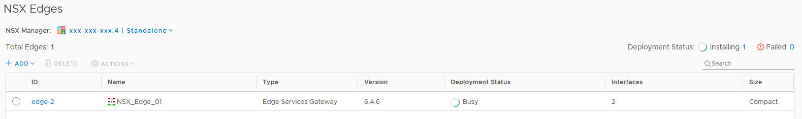{.thumbnail}

After some time, your appliance will show as "Deployed".

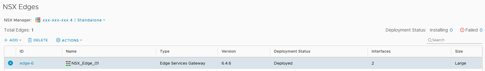{.thumbnail}

Congratulations and welcome to the world of NSX!   

## Go further

Join our community of users on <https://community.ovh.com/en/>.
