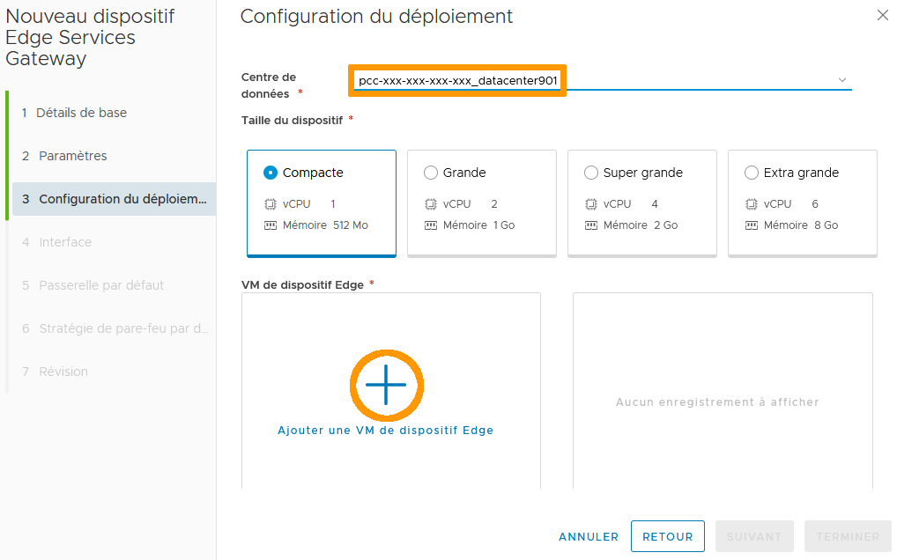
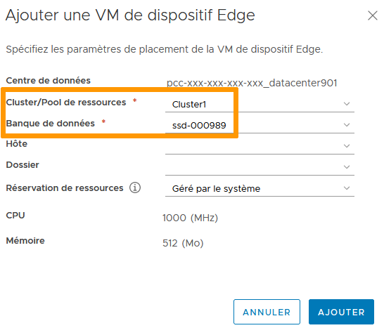
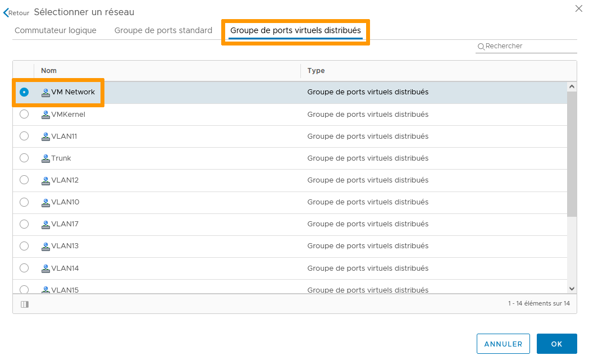
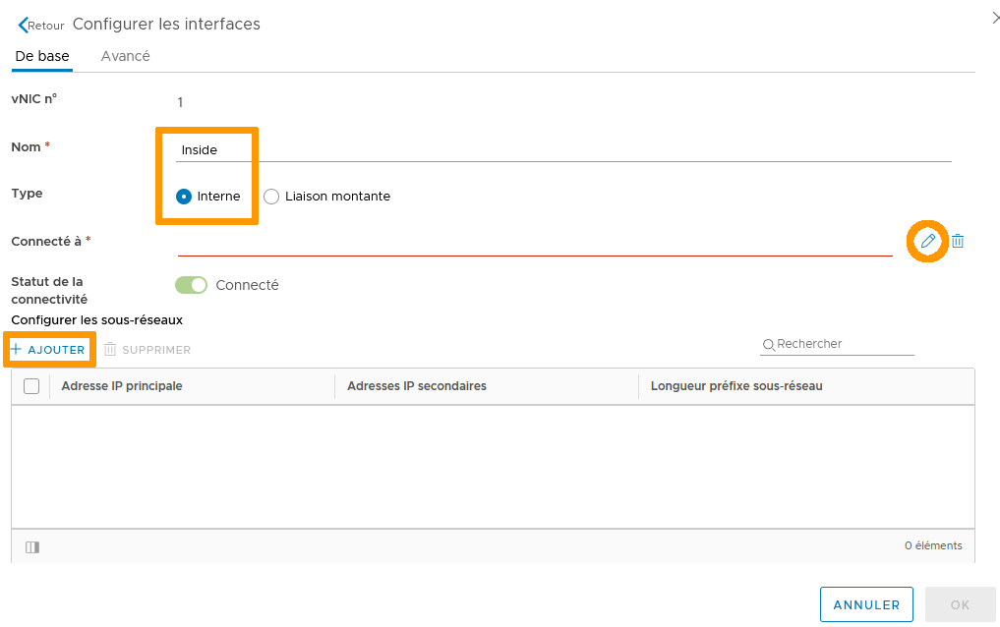
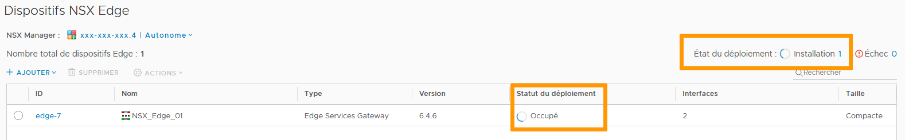
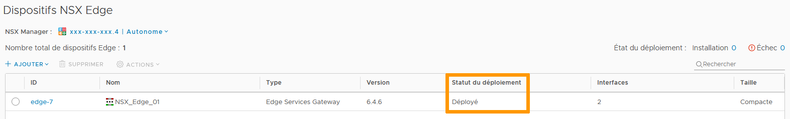

**Dernière mise à jour le 18/11/2021**

## Objectif

La NSX Edge Services Gateway est une appliance VMware offrant des services tels que le pare-feu, NAT, DHCP, VPN, l'équilibrage de charge et la haute disponibilité.

**Ce guide explique comment procéder au déploiement de cette appliance**

## Prérequis

- Être contact administrateur du [Hosted Private Cloud infrastructure](https://www.ovhcloud.com/fr/enterprise/products/hosted-private-cloud/), pour recevoir des identifiants de connexion 
- Avoir un identifiant utilisateur actif avec les droits spécifiques pour NSX (créé dans le [OVHcloud Control Panel](https://www.ovh.com/auth/?action=gotomanager&from=https://www.ovh.co.uk/&ovhSubsidiary=GB))

## En pratique

Vous allez vous embarquer dans l'aventure du déploiement d'une appliance NSX.   
Nous vous guiderons étape par étape dans l'installation d'une Edge Services Gateway avec une connection interne à votre environnement et une autre pour communiquer avec l'extérieur.    

Tout d'abord, dans votre interface vSphere, allez dans the tableau de bord `Mise en réseau et sécurité`{.action}.

Sur la gauche de votre écran, cliquez sur `Dispositifs NSX Edge`{.action}.

Cliquez sur `+ Ajouter`{.action} puis `Edge Services Gateway`{.action}.

La fenêtre d'installation guidée apparait.   
Remplissez les détails de base. Seuls le nom est obligatoire. Les autres champs seront créés automatiquement ou ignorés en fonction de votre infrastucture.   
Quand vous êtes prêt, cliquez sure `Suivant`{.action}.    
*Laissez Déployer une VM de dispositif Edge cochée. Décocher l'option entraine la création des règles et paramètres mais tout sera inactif tant qu'une VM n'est pas déployée. Nous laissons la Haute Disponibilité de coté pour l'instant.*

La fenêtre des Paramètres suit.    
Le compte d'administration par défaut est rempli automatiquement. Vous pouvez le changer à votre convenance.    
Créez et confirmez un mot de passe conforme.    
*Génération automatique de règles ajoute les règles de Pare-Feu, NAT, et routage pour la surveillance des services.*    
L'option Accès SSH autorise un accès par console sur le port 22. Nous recommandons de la laisser désactivée par défaut et de ne l'activer que de manière temporaire quand c'est nécessaire.     
Mode FIPS impose le chiffrement et un niveau de sécurité conforme aux normes des Federal Information Processing Standards du gouvernement américain.     
Le niveau de journalisation peut être adapté a vos besoin.    
Cliquez sur `Suivant`{.action}

Au tour de la Configuration du déploiement.     
Selectionnez le centre de données cible (si vous n'avez qu'un seul centre de données dans vSphere, il n'y a pas d'autre choix possible), la taille du dispositif (la taille détermine la consommation de ressources et la puissance de calcul) puis appuyez sur le bouton `+`{.action}.

In the next window, select where the appliance will live within the chosen datacenter.    
Only Cluster/Resource Pool and Datastore are mandatory field.   
*vSphere will select the best suited places for the rest if you do not input data.*    
Click `Add`{.action}.

Back in the Deployment Configuration window, click `Next`{.action}.

Things get more serious with the Configure Interfaces.    
Click on `+Add`{.action}

There are 2 types of interfaces:
- Uplink will communicate with the outside of your netword
- Internal will be confined to your network

Let's name an interface and choose Uplink.   
Click on the `pen symbol`{.action} to select how it will connect out.

Typically, in the `Distributed Virtual Port Group`{.action} tab, the VM Network is the default outside access network.    
*If you customized your environment, select accordingly.*   
Click `OK`{.action}.

Back in the Interface configuration window, add a primary IP and subnet prefix for the interface.    
Click `OK`{.action}.

Add a second interface. This time it will be an Internal one.    
Click on the `pen symbol`{.action} again to select the network the interface will be part of.    
Also, add the primary IP and subnet prefix for the vNIC.

Interfaces are ready. Review and click `Next`{.action}.

Configure the Default Gateway for external access.   
*This is not mandatory and can be disabled to be done later.*    
Click `Next`{.action}

Enable or disable Firewall Default Policy and click `Next`{.action}.

Review the configuration and hit that `Finish`{.action} button.

The Gateway will deploy. It will show a Busy and Installing status until done.    
*If the deployment fails, it will show you basic error message and link to the full logs in the Failed section.*

After some time, your appliance will show as Deployed.

Congratulations and welcome to the world of NSX!   
The journey is only starting.

## Aller plus loin

Échangez avec notre communauté d'utilisateurs sur <https://community.ovh.com>.
