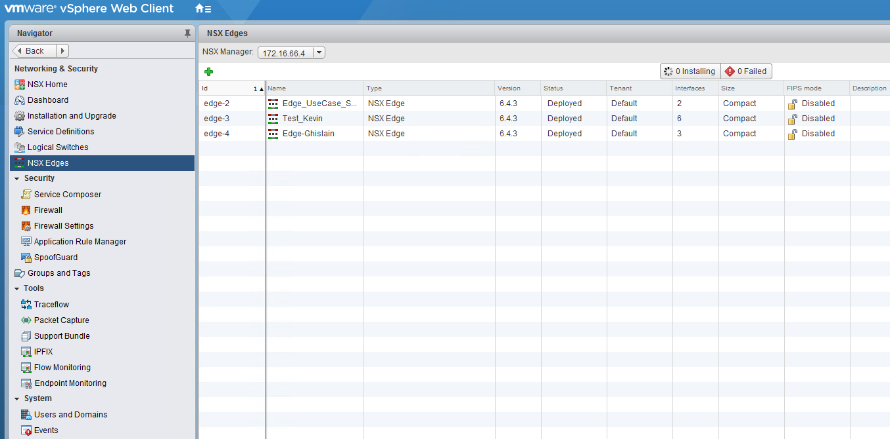
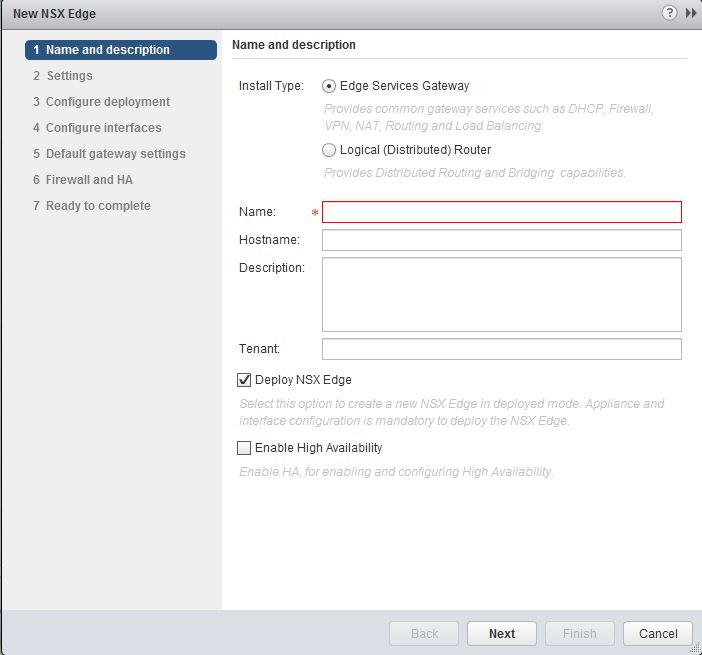
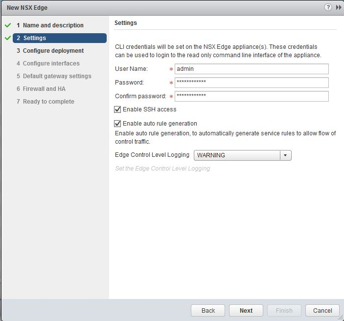
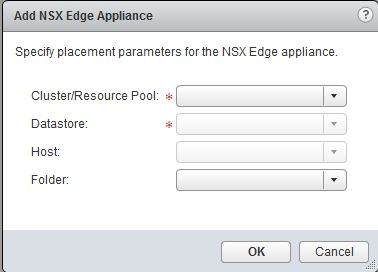
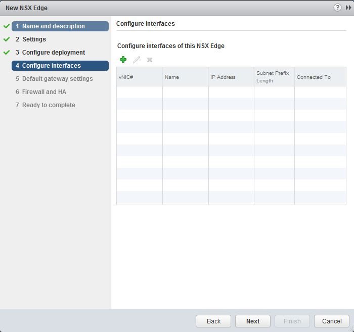
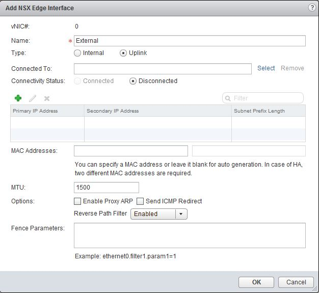
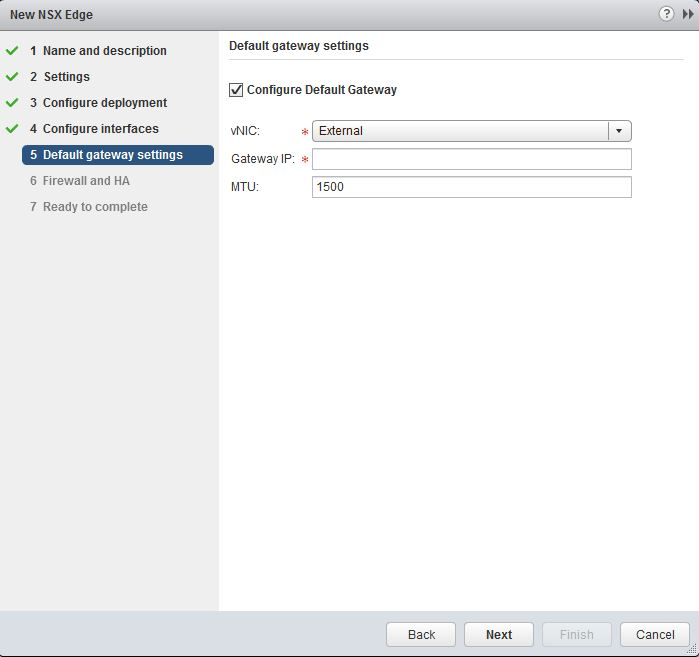
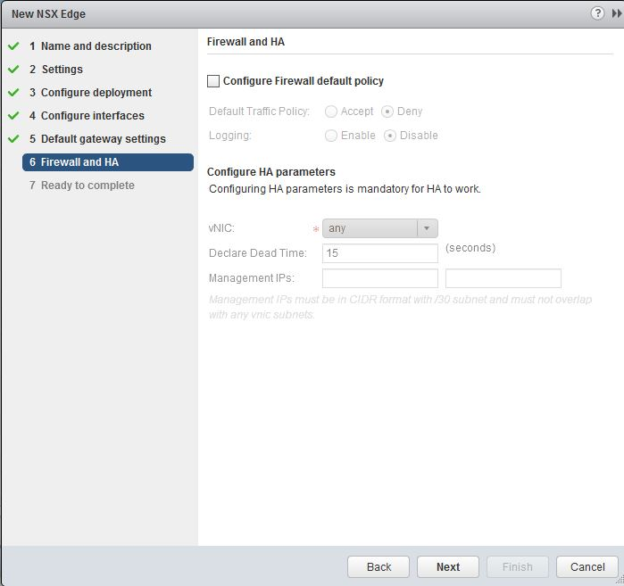
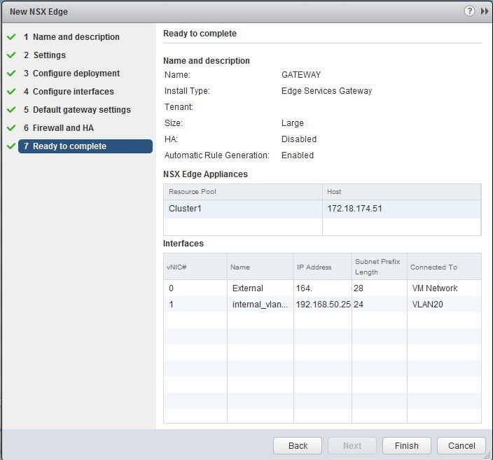
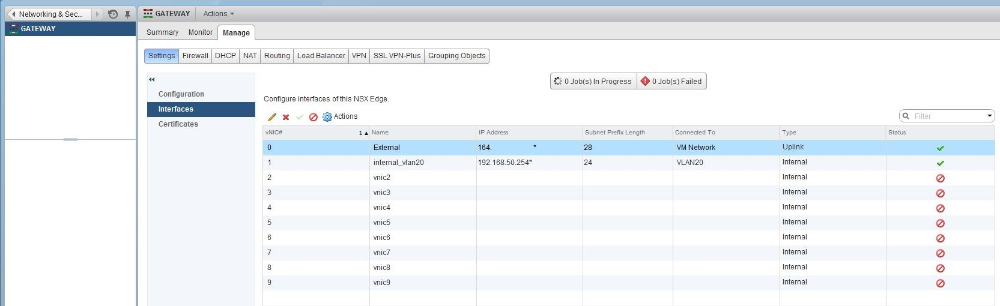

**Dernière mise à jour le 27/02/2019**

## Objectif

Une *edge gataway NSX* est une appliance VMware permettant d'accèder à tous les services NSX Edge tels que le pare-feu, NAT, DHCP, VPN, l'équilibrage de charge.

**Ce guide explique comment procéder au déploiement de cette appliance**

## Prérequis

- Disposer d'un utilisateur ayant accès  à [l'interface de gestion NSX](https://docs.ovh.com/fr/private-cloud/acceder-a-l-interface-de-gestion-nsx/)

## En pratique

Pour commencer, rendez-vous dans la partie `NSX Edges` afin de trouver la liste des Edges déjà déployées. Dans l'exemple ci-dessous, nous avons déjà une Edge déployée nommée `TestFW`.

Cliquez sur le bouton `Add` (petit `+` vert au dessus de la liste des Edges) afin d'ouvrir l'assistant de déploiement depuis lequel vous pourrez choisir `Edge Services Gateway`.

Renseignez au moins le nom de la Edge, et les autres champs en fonction de votre besoin.

Par défaut, vous pouvez laisser cochée la case `Deploy NSX Edge`, à moins que vous ayez un besoin spécifique contraire. Cela ne sera pas utile dans le cadre du déploiement de la Edge.

La case `Enable High Availability` implique qu'une seconde machine virtuelle Edge sera créée et répliquée avec la principale afin de la seconder en cas de défaillance. Ne pas cocher la case impliquera le déploiement d'une unique Edge. Quand l'option est active, il faut donc prévoir que les ressources utilisées (RAM, vCPU, disque) seront doublées.

Vous pouvez ensuite renseigner les accès de votre Edge. Par défaut, l'utilisateur "admin" est renseigné. Le mot de passe doit respecter les pré-requis de complexité standards (majuscules, minuscules, chiffres, caractères spéciaux, etc ...).

La case `Enable SSH access` vous permet d'autoriser ou non les connexions en SSH directement sur la Edge (via le port 22).

La case `Enable auto rule generation` permet de générer automatiquement des règles afin d'autoriser le trafic de monitoring des services.

Vous pouvez choisir le datacenter dans lequel la Edge sera déployée si vous en avez plusieurs. Il est également possible de choisir un format pour la Edge, ce qui définit ses ressources (entre autre RAM et processeur).

|Format|RAM|vCPU|Disque|
|---|---|---|---|
|Compact|512MB|1vCPU|512MB|
|Large|1GB|2vCPU|512MB|
|X-Large|8GB|6vCPU|4.5GB
|Quad Large|1GB|4vCPU|512MB

> [!primary]
>
> VMWare recommande l'utilisation du format "Compact" pour des besoins de test mais pas en production, pour des questions de performances.
> 

Sur cette même page, il est nécessaire de cliquer sur `Add` (petit `+` vert) afin de déployer le `NSX Edge Appliance` (la Edge en elle même). Vous devez a minima choisir le cluster et le datastore sur lesquels le déploiement de cette Edge sera effectué, mais vous pouvez également choisir un hôte et un dossier si vous le souhaitez.

Vous devez alors créer les interfaces réseau nécessaires au fonctionnement de votre Edge.

Cliquez sur le bouton `Add` (petit `+` vert) afin de créer votre première interface réseau. Celle-ci peut être votre carte publique et la seconde votre carte privée par exemple. Nous prendrons ce cas en exemple pour la suite de ce guide.

Renseignez le nom de l'interface, si possible compréhensible par n'importe qui (par exemple `Publique`, `Externe` ou `Wan` pour la carte publique).

Choisissez le type en fonction de la carte, par exemple `Uplink` pour la carte publique afin d'autoriser une communication avec l'extérieur de l'infrastructure, et `Internal` pour la carte privé afin de ne permettre que des communications locales.

Dans la partie `Connected to`, vous pouvez cliquer sur "Select" afin de choisir le réseau correspondant à votre carte. Vous aurez par exemple le `VMNetwork` pour la carte réseau publique, et divers vLANs pour la carte privée. L'interface doit passer automatiquement en état `Connecté`.

Cliquez sur le bouton `Add` (petit `+` vert) pour avoir accès à la première ligne du tableau correspondant à la configuration IP. Vous pouvez renseigner une IP disponible en `Primary IP Address` ainsi que le préfixe de votre bloc en `Subnet Prefix Length`. Si nécessaire, vous pouvez également renseigner plusieurs IPs séparées par des virgules dans la partie `Secondary IP Address` afin d'avoir plusieurs IP sur cette même interface.

Vous pouvez créer plusieurs cartes réseau privées ou commencer pas une seule et ajouter les suivantes ultérieurement par exemple.

L'étape suivante vous permettra de configurer une passerelle par défaut pour la Edge.

La `vNIC` correspond au nom de votre carte publique, à sélectionner dans le menu déroulant.

La `Gateway IP` sera la passerelle du bloc publique utilisé.

Le MTU peut ou non être modifié en fonction de votre besoin. Un MTU de 1500 est standard et répond à tous les besoins génériques.

Vous aurez ensuite la possibilité de configurer ou non des règles de firewall par défaut durant le déploiement de la Edge.

La case `Configure Firewall default policy` vous donne accès aux choix suivants afin de définir les règles par défaut.

Vous pouvez accepter ou refuser l'intégralité des connexions par défaut avec le paramètre `Default Traffic Policy` et activer ou non les logs par défaut sur les règles avec le paramètre `Logging`.

La partie `Configure HA parameters` n'est accessible que si vous avez activé la haute disponibilité en début de déploiement en cochant la case `Enable High Availability`.

Vous pouvez sélectionner une carte réseau particulière ou la totalité avec le champ `vNIC`.

Le champ `Declare Dead Time` est le délai en secondes après lequel la bascule est effectuée sur la Edge secondaire en cas de perte d'accès à la Edge principale.

Pour finir, vous avez une page récapitulative de votre configuration. Vous pouvez la vérifier et cliquer sur `Finish` ensuite pour lancer le déploiement de la Edge.

Quelques instants plus tard, la Edge est déployée et prête à être utilisée.

Il vous suffit de retourner dans la liste des Edges et d'effectuer un double clic sur votre Edge pour accéder à sa configuration.

## Aller plus loin

Échangez avec notre communauté d'utilisateurs sur <https://community.ovh.com>.