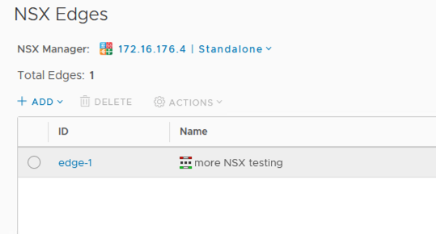
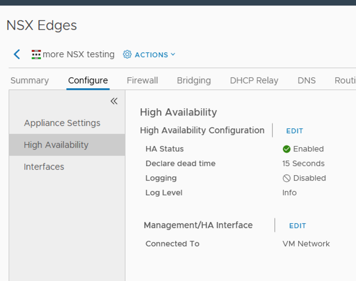
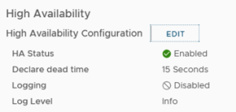
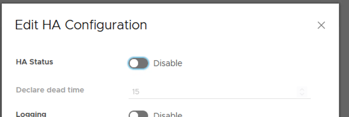

**Last updated 14th September 2022**

## Objective

This article is meant to guide you through the process of disabling and enabling HA on your NSX Edges after an upgrade. After an upgrade, HA will be in a disabled state and will need to be enabled again.

> [!primary]
>
> Regardless of which method you use, make sure the HA you are disabling is the NSX Edge HA - not the cluster HA.

## Requirements

- a user account with access to vSphere as well as the specific rights for NSX (created in the [OVHcloud Control Panel](https://www.ovh.com/auth/?action=gotomanager&from=https://www.ovh.pt/&ovhSubsidiary=pt)).
- a deployed [NSX Edge Services Gateway](https://docs.ovh.com/pt/private-cloud/how-to-deploy-an-nsx-edge-gateway/).

## Instructions

### Enabling/Disabling HA via vSphere

To begin, log into your vSphere environment. Click `Menu`{.action} on the left-hand side of the screen and select `Networking and Security`{.action} from the drop-down menu.


Next, click `NSX Edges`{.action} in the left-hand column.


Then, select the Edge on which you wish to disable HA. Please note that if you have multiple edges, this will need to be disabled across all of them.



Click the `Configure`{.action} tab on the top of the page. Then select **High Availability** on the left-hand column.



Select `Edit`{.action} next to "High Availability Configuration".



Click the slider next to "Enable" to disable HA.


To confirm that HA has been disabled, click the `Configure`{.action} tab and select `High Availability`{.action} in the left-hand column.


To enable HA after the upgrade has completed, select `Edit`{.action} next to "High Availability Configuration" again and click the slider next to "HA Status" to set it back to enabled.



To confirm that HA has been enabled, click the `Configure`{.action} tab and select `High Availability`{.action} in the left-hand column.


Next, we will take a look at how to do this same process via VMware's API.

### Enabling/Disabling HA via the API

> [!primary]
>
> The GET/PUT URLs are set to `pcc-147-x-x-x`. Make sure you update thes values to those of your PCC.

To begin, download [Postman](https://www.postman.com/product/rest-client/) or another supported REST API client and either install the app or integrate it into your browser. Set authentication to be basic with your username and password.

You can ensure the username has access to NSX via the [OVHcloud Control Panel](https://www.ovh.com/auth/?action=gotomanager&from=https://www.ovh.pt/&ovhSubsidiary=pt). This will be the same username and password used for your web-client login.

Add one header Content-Type application/xml.<br>
Refer to page 14 of the following document: [https://docs.vmware.com/en/VMware-NSX-Data-Center-for-vSphere/6.4/nsx\_64\_api.pdf](https://docs.vmware.com/en/VMware-NSX-Data-Center-for-vSphere/6.4/nsx_64_api.pdf)

For a comprehensive list of Edge's uses, use **GET**: 

- [https://nsx.pcc-147-x-x-x.ovh.us/api/4.0/edges](https://nsx.pcc-147-x-x-14.ovh.us/api/4.0/edges).<br>
Refer to page 346 in the following document: [https://docs.vmware.com/en/VMware-NSX-Data-Center-for-vSphere/6.4/nsx\_64\_api.pdf](https://docs.vmware.com/en/VMware-NSX-Data-Center-for-vSphere/6.4/nsx_64_api.pdf)

The output will be similar to the below:

```bash
<?xml version="1.0" encoding="UTF-8"?>
 <pagedEdgeList>
  <edgePage>
   <pagingInfo>
    <pageSize>256</pageSize>
    <startIndex>0</startIndex> 
    <totalCount>8</totalCount> 
    <sortOrderAscending>true</sortOrderAscending>
    <sortBy>id</sortBy>
   </pagingInfo>
   <edgeSummary>
    <objectId>edge-1</objectId>
    <objectTypeName>Edge</objectTypeName>
    <vsmUuid>42342BAA-1BE4-9C10-FB40-AEBBCDE3CDEE</vsmUuid>
    <nodeId>dd409b86-6a10-41f3-a32e-544d06dfdfff</nodeId>
    <revision>278</revision>
    <type>
     <typeName>Edge</typeName>
    </type>
    <name>Lab_Edge</name>
```

From the above output, you will need to find the edge <objectId> that corresponds to the edge name. If you have more than one edge you will need to find all the edge ID's based on the edge name. In the example above, the edge ID is edge-1.

To check the HA status, use **GET**:

- [https://nsx.pcc-147-x-x-x.ovh.us/api/4.0/edges/edge-1/highavailability/config](https://nsx.pcc-147-x-x-14.ovh.us/api/4.0/edges/edge-1/highavailability/config).<br>
Please refer to page 458 of the following document: [https://docs.vmware.com/en/VMware-NSX-Data-Center-for-vSphere/6.4/nsx\_64\_api.pdf](https://docs.vmware.com/en/VMware-NSX-Data-Center-for-vSphere/6.4/nsx_64_api.pdf)

```bash
<?xml version="1.0" encoding="UTF-8"?>
<highAvailability>
<version>34</version>
<enabled>false</enabled>
<declareDeadTime>15</declareDeadTime>
<logging>
<enable>false</enable>
<logLevel>info</logLevel>
</logging>
<security>
<enabled>false</enabled>
</security>
</highAvailability>
```

Based on the above output, HA is "false" which mean's its disabled. If it is enabled, the output will be listed as true. See the sample output below for HA enabled:

```bash
<?xml version="1.0" encoding="UTF-8"?>
<highAvailability>
<version>35</version>
<enabled>true</enabled>
<declareDeadTime>6</declareDeadTime>
<logging>
<enable>false</enable>
<logLevel>info</logLevel>
</logging>
<security>
<enabled>false</enabled>
</security>
</highAvailability>
```

To disable HA, you will need to run **DELETE**:

- [https://nsx.pcc-147-x-x-x.ovh.us/api/4.0/edges/edge-1/highavailability/config](https://nsx.pcc-147-x-x-14.ovh.us/api/4.0/edges/edge-1/highavailability/config).<br>
Make sure the DELETE points to the correct Edge. Repeat the same steps for each Edge that needs HA disabled. Deleting the configuration is not deleting the Edge - just the HA configuration. This is why it is crucial to point the DELETE API to the correct URL.

To enable HA, you will need to run **PUT**:

- [https://nsx.pcc-147-x-x-x.ovh.us/api/4.0/edges/edge-1/highavailability/config](https://nsx.pcc-147-x-x-14.ovh.us/api/4.0/edges/edge-1/highavailability/config).<br>
Before hitting "Send," please add the below configuration to the body inside Postman. Without the body below, PUT will fail to enable HA.

```bash
<highAvailability>
<declareDeadTime>6</declareDeadTime>
<enabled>true</enabled>
</highAvailability>
```

Once you run PUT, you can run a **GET**:

- [https://nsx.pcc-147-x-x-x.ovh.us/api/4.0/edges/edge-1/highavailability/config](https://nsx.pcc-147-x-x-14.ovh.us/api/4.0/edges/edge-1/highavailability/config) to confirm that HA is enabled.

```bash
<?xml version="1.0" encoding="UTF-8"?>
<highAvailability>
  <version>35</version>
  <enabled>true</enabled> 
  <declareDeadTime>6</declareDeadTime>
  <logging>
    <enable>false</enable>
    <logLevel>info</logLevel>
  </logging>
  <security>
    <enabled>false</enabled>
  </security>
</highAvailability>
```

## Go further

Join our community of users on <https://community.ovh.com/en/>.
