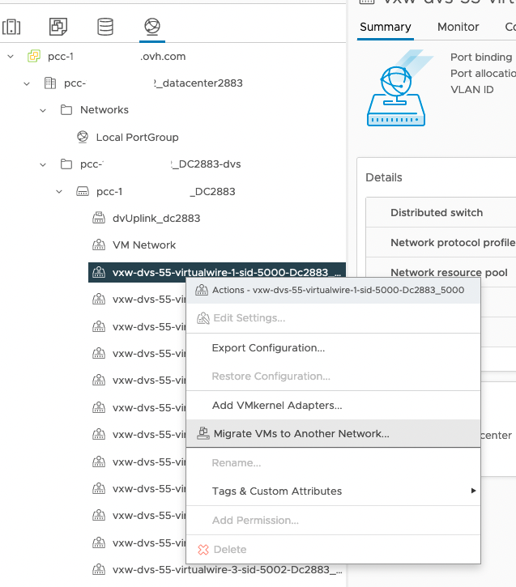

## Objective

You are using the VMware NSX-V component (Network and Security Virtualization); we inform you that this component will no longer be maintained by VMware as of January 15, 2024, and will therefore be deactivated on that date.

This guide helps you analyse your use of NSX-V features and therefore offers you different evolution scenarios: From disabling the NSX-V component to migrating to its successor NSX-T (named NSX by VMware since version 4.0).

## Instructions

### Identifying your NSX-V usage

To identify your usage of the NSX-V feature in your Hosted Private Cloud environment, you have to ask yourself the following questions:

- Am I using VXLAN?
{.thumbnail}
- Am I using a Distributed Firewall rules?
{.thumbnail}
- Am I using a Distributed Logical Router or an Edge Services Gateway?
{.thumbnail}
- Am I using an SSL VPN?

#### I do not use any of the NSX-V features

If you do not use any of the above features, we will deactivate NSX-V starting 1st September 2023. 
You will be notified when the deactivation process is available.

#### I only use VXLAN

If the only feature you use is VXLAN, you have the following choice:

- Migrating to NSX (see [details](#migration) below),
- Reconfiguring your network in order to replace VXLAN with [VLAN](/pages/cloud/private-cloud/creation_vlan).

If you wish to migrate to VLAN, to help you to configure your network, you can use this API call to generate a mapping between VXLAN to VLAN.

> [!api]
>
> @api {POST} /dedicatedCloud/{serviceName}/generateVxlanToVrackMapping
>

> **Parameters:**
>
> serviceName: The reference for your PCC as `pcc-XX-XX-XX-XX`.

> [!primary]
>
>  Find more information on the OVHcloud API in our guide on [Getting started with the OVHcloud API](/pages/account/api/first-steps).

To create your VLAN networks, you can follow this documentation: [VLAN Creation](/pages/cloud/private-cloud/creation_vlan)

Then you can migrate VMs from VXLAN to DVS vRACK.
From the Network view in the vSphere UI, right click on the vxlan portgroup where VMs are assigned and select `Migrate VMs to Another Network..`.

{.thumbnail}

Select the target portgroup by browsing the vlan vrack portgroup. Previous email sent advices you about the vxlan/vlan matching.
Go to the next step by clicking `NEXT`{.action}.

{.thumbnail}

From this screen, select the VMs that will migrate to this VLAN portgroup.
You should migrate all VMs as you won't be able to deactivate NSX-V if one VM network interface is still assigned to vxlan portgroup.

{.thumbnail}

{.thumbnail}

Complete your operation and reproduce this for each used vxlan portgroup.

VMs will only experience a very brief reconnection. In some cases, this may only be loss of a single ping request.

We will deactivate NSX-V starting 1st September if you don't use any features of NSX-V.
You will be notified when the deactivation process is available.

#### I use some of the NSX-V features

We recommend migrating to NSX (see [details](#migration) below) to benefit from all its included features.

Alternatively, you can decide to deploy alternative components (Load Balancer, Firewall appliance, VPN, ...) and then disable NSX-V (you will be notified when the deactivation process is available).

### Migrating to NSX 

The NSX software is enabled at the Virtual Datacenter (vDC) level. In order to migrate from NSX-V to NSX, you can order a new vDC for your existing Hosted Private Cloud service (feature available starting July 18, 2023), add new Hosts and then migrate from your current vDC to the new vDC using VMware vMotion.

The documentation to migrate to NSX is available here: [vDC Migration](/pages/cloud/private-cloud/service-migration-vdc)

Our support teams and [Professional Services experts](https://www.ovhcloud.com/en-au/professional-services/) can provide you with assistance.

## Go further 

[Getting started with NSX](/pages/cloud/private-cloud/nsx-01-first-steps)

If you need training or technical assistance to implement our solutions, contact your sales representative or click on [this link](https://www.ovhcloud.com/en-au/professional-services/) to get a quote and ask our Professional Services experts for a custom analysis of your project.

Join our community of users on <https://community.ovh.com/en/>.
