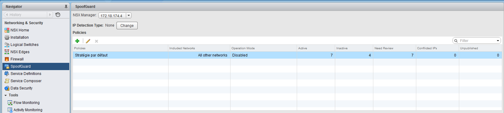
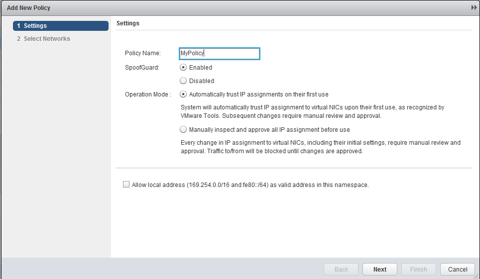
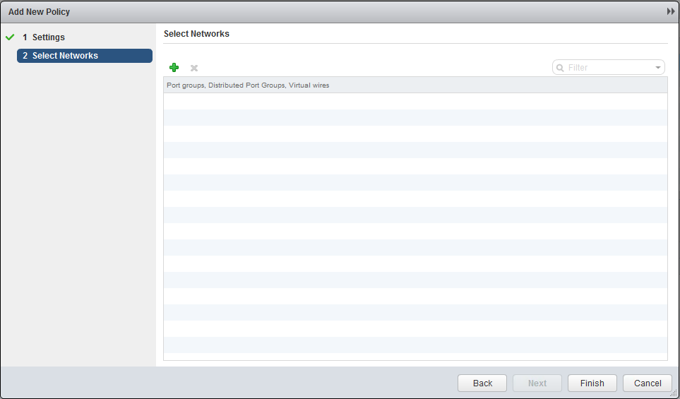
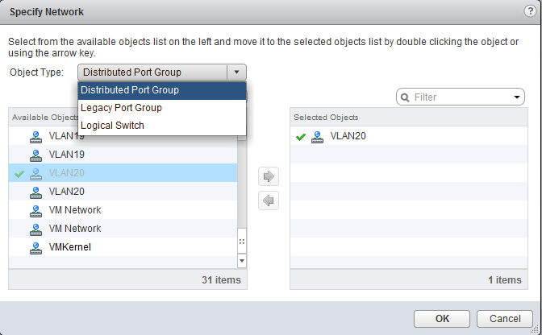
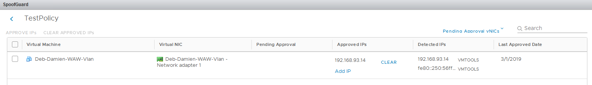

**Dernière mise à jour le 28/02/2019**

## Objectif

Le service SpoofGuard permet d'éviter une forme d'attaque malveillante appelée « falsification Web » ou « hameçonnage ».

**Ce guide explique comment établir cette solution**

## Prérequis

- Être contact administrateur du [Hosted Private Cloud infrastructure](https://www.ovhcloud.com/fr/enterprise/products/hosted-private-cloud/), pour recevoir des identifiants de connexion.
- Avoir un identifiant utilisateur actif avec les droits spécifiques pour NSX (créé dans l'[espace client OVHcloud](https://www.ovh.com/auth/?action=gotomanager&from=https://www.ovh.com/fr/&ovhSubsidiary=fr))

## En pratique

### Accès à l'interface

Dans l'interface vSphere, allez dans le Tableau de bord `Mise en réseau et sécurité`{.action}.

{.thumbnail}

Sur la gauche de votre écran, naviguez vers `Dispositifs NSX Edge`{.action} puis cliquez sur le dispositif à paramétrer.

{.thumbnail}

Pour accèder au service SpoofGuard, rendez vous dans l'interface de gestion NSX et séléctionnez le service disponible sur le bandeau latéral gauche.

{.thumbnail}

### Créer une politique SpoofGuard

Cliquez sur le bouton `+ Ajouter`{.action} pour créer une nouvelle politique.

Entrez le nom de votre politique, puis activez la.

Séléctionnez le mode de votre choix :

- Approuver automatiquement les attributions d'adresse IP lors de leur première utilisation : pour faire confiance à toutes les sessions de propriété intellectuelle lors de l'enregistrement initial.

- Inspecter et approuver manuellement toutes les attributions d'adresses IP avant leurs utilisation : pour exiger l'approbation manuelle de toutes les adresses IP.
> [!warning]
>
> Ceci entraînera une interruption de tout votre trafic réseau jusqu'à ce que vous validiez tous les couples IP/MAC**.
>

Vous pouvez également cocher la case permettant d'autoriser les adresses locales (169.254.0.0/16, fe80::/64) comme adresses valides dans l'espace de noms.

{.thumbnail}

Séléctionnez ensuite les portGroup sur lesquels vous souhaitez appliquer votre politique.

{.thumbnail}

Puis cliquer sur `Terminer`

Votre politique est à présent ajoutée, des premières actions pourront être en attente. 

{.thumbnail}

Après avoir cliquer sur le nombre disponible dans la colonne `Nombre total de vNic` vous arriverez sur cette interface.

> [!primary]
>
> Si vous cliquez sur les nombres disponibles dans les colonnes `En attente d'approbation` ou `Adresses IP en conflit` vous arriverez sur la même page.
>

{.thumbnail}

> [!warning]
>
> Attention à ne pas effacer les IP affectées à vos machines virtuelles sous peine d'entrainer une coupure de communication.
>

## Aller plus loin

Échangez avec notre communauté d'utilisateurs sur <https://community.ovh.com>.
