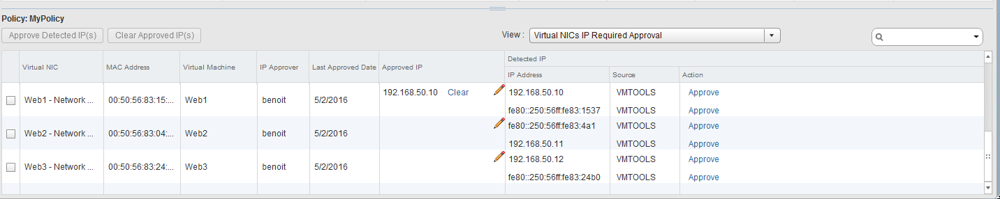
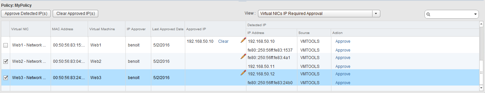

**This article will show you, how to configure NSX Spoofguard.**

You need to go to the *SpoofGuard* tab on **NSX Manager**, to configure your policy. You **do not need** any [Edge Gateway]({legacy}4161658) to configure NSX Spoofguard

{.thumbnail}

Create a SpoofGuard policy
--------------------------

Click the "*Add Policy*" ( {.thumbnail} ) icon to add a new policy.

Enter a name for the policy.

Select *Enabled*.

Select the Operation mode:

- Automatically Trust IP Assignments on Their First Use : to trust all IP assignments during initial registration.
- Manually Inspect and Approve All IP Assignments Before Us : to require manual approval of all IP addresses.
    - **WARNING : This will cause all your network traffic to be down until you validate all couples IP/MAC**

You can check the "*Allow local address as valid address in this namespace*" option to allow any local IP addresses in your setup (169.254.0.0/16, fe80::/64).

Click *Next*.

{.thumbnail}

Click the "*Add*" ( {.thumbnail} ) icon to select the vlan you want spoofguard to be enabled

{.thumbnail}

Select the networks, distributed port groups, or logical switches where the policy should apply to.

Click *OK*.

{.thumbnail}

Then click *Finish*.

And Click Publish Changes to push configuration to your NSX Manager.

{.thumbnail}

Approve IP Addresses
--------------------

In this screenshot, you can see **one IP** address **approved** and **two IP** adresses **not appproved**.

{.thumbnail}

To approve an IP click *Approve* on the *Action* tab.

You can also approve multiple IP adresses: select Virtual NICs and then click *Approve Detected IP(s)*.

{.thumbnail}

Click *Publish Changes*.

Then you are done.

