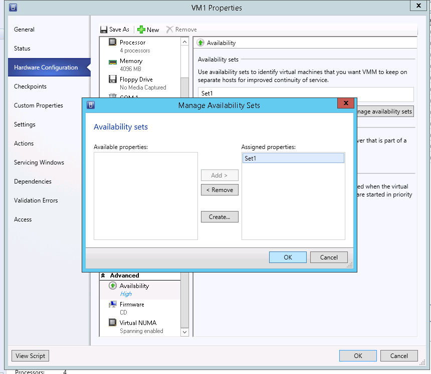

## OVH PRO Configuration
PRO includes Dynamic Optimization to automatically distribute the load of a cluster among different host servers. 
OVH offers a default configuration of PRO:

{.thumbnail}
Dynamic Optimization executes every 20 minutes and automatically migrates VMs from one host server to another to match the settings shown on the image above.

## Exclude a VM from PRO
If you don't want a VM to be automatically migrated by PRO, you can exclude it by ticking the following box in the VM's settings:

{.thumbnail}

## Anti-affinity rules
In VMM, you can set up  on each VM, and you can specify if you don't want certain VMs on the same host server.

To do this, go to the VM's rules, and then "Hardware Configuration" > "Availability" > "Aa propertyvailability Sets":

{.thumbnail}
Create a rule and add it to "Assigned Properties":

{.thumbnail}
Do the same on the other VMs that you wish to separate.

