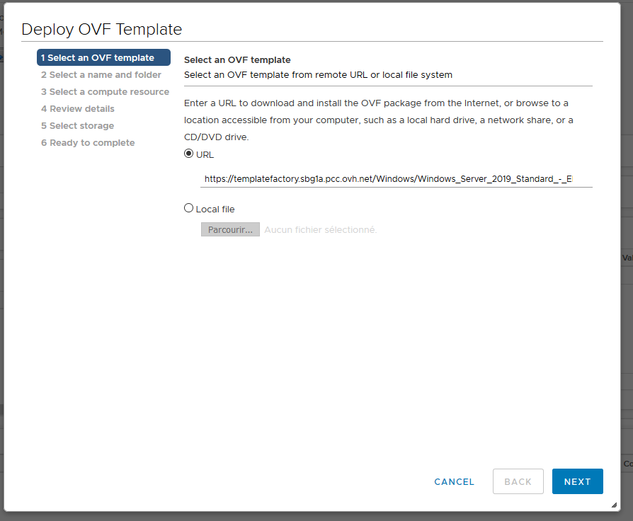

> [!primary]
> Diese Übersetzung wurde durch unseren Partner SYSTRAN automatisch erstellt. In manchen Fällen können ungenaue Formulierungen verwendet worden sein, z.B. bei der Beschriftung von Schaltflächen oder technischen Details. Bitte ziehen Sie im Zweifelsfall die englische oder französische Fassung der Anleitung zu Rate. Möchten Sie mithelfen, diese Übersetzung zu verbessern? Dann nutzen Sie dazu bitte den Button "Beitragen" auf dieser Seite.
>

**Stand 12.10.2020**

## Ziel

OVHcloud bietet Linux, Windows Server und Windows SQL Server Templates (im OVF Format) an, die Sie direkt über Ihren Web-Client (HTML 5) bereitstellen können.

Windows VMs, die von einem Template aus eingerichtet werden, verwenden automatisch die von OVHcloud bereitgestellten SPLA-Lizenzen. Die Inbetriebnahme einer Windows VM führt automatisch zu einer zusätzlichen Abrechnung.

**Hier erfahren Sie, wo Sie die Images finden und wie Sie für die Bereitstellung vorgehen.**

> [!primary]
> 
> Auf dieser Seite [finden](https://www.ovhcloud.com/de/enterprise/products/hosted-private-cloud/images-licenses/) Sie die Preise der von OVHcloud angebotenen Images.
>

## Voraussetzungen

- Sie haben Zugriff auf den Web Client (HTML5).
- [Sie haben die Windows Lizenzen](../manager-ovh-private-cloud/#windows-lizenz) über Ihr [OVHcloud Kundencenter](https://www.ovh.com/auth/?action=gotomanager&from=https://www.ovh.de/&ovhSubsidiary=de)  aktiviert.

## In der praktischen Anwendung

### Abrufen der URL der OVF Templates

Rufen Sie über Ihren Internetbrowser die Startseite Ihrer Private Cloud auf und klicken Sie auf `OVH Templates`{.action}.

{.thumbnail}

Im angezeigten `OVH Templates` Fenster finden Sie Details zu den angebotenen Linux-, Windows- und SQL-Templates. 

Wählen Sie das gewünschte Template aus, es öffnet sich ein Fenster und die Links, die Ihnen für die Inbetriebnahme in Abhängigkeit von Ihrer vSphere Version dienen.

{.thumbnail}

### Bereitstellung des OVF Templates

Gehen Sie in Ihrem vSphere Web Client auf `Hosts and clusters`{.action}und wählen Sie mit einem Rechtsklick Ihr Rechenzentrum aus und klicken Sie auf `Deploy OVF template...`{.action}:

{.thumbnail}

Das Kontextmenü öffnet sich und die Konfiguration der Bereitstellung beginnt. Fügen Sie in einem ersten Schritt bitte den zuvor kopierten Link ein:

{.thumbnail}

Wählen Sie als nächstes das Rechenzentrum aus:

{.thumbnail}

Und wählen Sie dann das Cluster aus, in dem die virtuelle Maschine bereitgestellt wird:

{.thumbnail}

Sie finden alle Informationen zur Vorlage und ein Standardpasswort. Aus Sicherheitsgründen ist es wichtig, dass Sie das Passwort bei Ihrer ersten Verbindung ändern:

{.thumbnail}

Wählen Sie den Speicherort für die virtuelle Maschine und das Festplattenformat aus:

{.thumbnail}

Wählen Sie im letzten Schritt das Netzwerk aus, das genutzt werden soll:

{.thumbnail}

Die Konfiguration ist fast beendet. Sie sehen nun einen Überblick aller vorgenommenen Einstellungen.

{.thumbnail}

Nachdem Sie auf `Finish`{.action} geklickt haben, wird ein Task erstellt, den Sie zur Nachverfolgung nutzen können.

{.thumbnail}

Nach Beendigung der Bereitstellung können Sie das Fenster schließen.

Sie finden die bereitgestellte virtuelle Maschine nun in Ihrer Umgebung.

{.thumbnail}

### Fertigstellung der Installation für SQL Server

Starten Sie Ihre dedizierte virtuelle Maschine und öffnen Sie die Konsole.

Öffnen Sie die Windows-Session und geben Sie im dafür vorgesehenen Fenster den Namen Ihrer SQL-Instanz, das Passwort und die gewünschten Zeichensätze ein.

{.thumbnail}

> [!primary]
> 
> Es wird empfohlen, ein Passwort zu verwenden, das diese Kriterien erfüllt:
> 
> - Es müssen mindestens acht Zeichen enthalten sein.
> - Es müssen mindestens drei Arten von Zeichen enthalten sein (Groß-, Klein-, Ziffern, Sonderzeichen).
> - Es darf kein Wort aus dem Wörterbuch sein.
> - Keine persönlichen Angaben enthalten (Vorname, Name oder Geburtsdatum).
>

Wenn Sie diese Informationen eingegeben haben, klicken Sie auf `OK`{.action}.

Ein Fenster öffnet sich, in dem die Inbetriebnahme dargestellt ist. Am Ende des Deployments öffnet sich ein letztes Fenster, in dem Sie über den Erfolg der Inbetriebnahme informiert werden.

Klicken Sie erneut auf `OK`{.action}, damit die Installation abgeschlossen und Ihre virtuelle Maschine neu gestartet wird.

Nach dem Neustart können Sie mit der Verwendung Ihrer virtuellen Maschine beginnen.

## Weiterführende Informationen

Für den Austausch mit unserer User Community gehen Sie auf <https://community.ovh.com/en/>.
