**Last updated 11th June 2018**

## Objective

OVH offers Windows and SQL Server templates (in OVF format) that you can deploy directly from your vSphere Thick Client (version 5.5 and 6.0) or from the Web Client (Flash and HTML 5 on version 6.5).

**This guide will show you where you can find the source files, and how to deploy them.**

> [!primary]
> 
> To view the prices for images offered by OVH, please go to our [Images & Licences](https://www.ovh.co.uk/private-cloud/options/images-licences.xml){.external} page.
>

## Requirements

- access to the Web Client or the Thick Client, depending on the version you use
- [active Windows licences](https://docs.ovh.com/gb/en/private-cloud/control-panel-ovh-private-cloud/#windows-licence){.external} (activate via the [OVH Control Panel](https://www.ovh.com/auth/?action=gotomanager){.external}, in the `Windows licence`{.action} tab for the datacentre)

## Instructions

### Find the URL of the OVF template

In your web browser, go to the Private Cloud page on the OVH website, and click on `OVH Templates`{.action}.

{.thumbnail}

In the `OVH Templates` page that pops up, you can view the details of the Windows and SQL templates available. 

Select the template you need. A window will open containing links that you can use to deploy the template, depending on which version of vSphere you use.

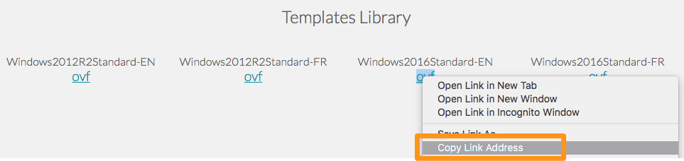{.thumbnail}

### Deploy the OVF template

Once you have logged in to your vSphere Web Client, go to the `Hosts and clusters`{.action} page, right-click on your datacentre and click `Deploy OVF template...`{.action}:

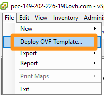{.thumbnail}

The context menu will open, and you can start configuring how the template is deployed. The first step is to add the OVH template URL:

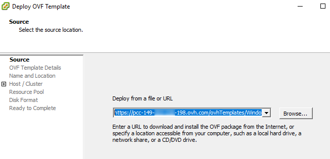{.thumbnail}

In the next step, you can choose the datacentre:

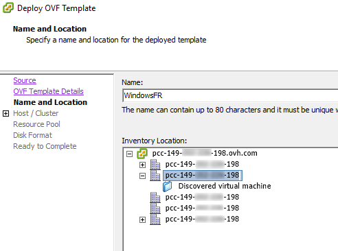{.thumbnail}

Now you can choose the cluster in which the virtual machine will be deployed:

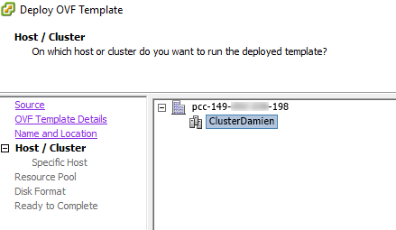{.thumbnail}

This page lists all of the template’s details, including its default password. For security reasons, it is important that you change your password as soon as you log in for the first time:

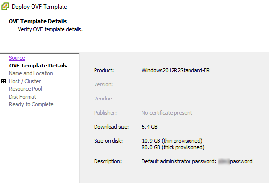{.thumbnail}

Select the datastore in which the virtual machine will be located, and the format of the disk:

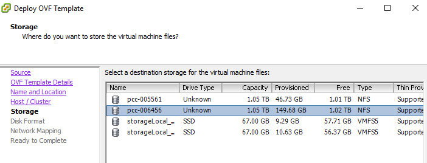{.thumbnail}

You now need to select the network that will be used: 

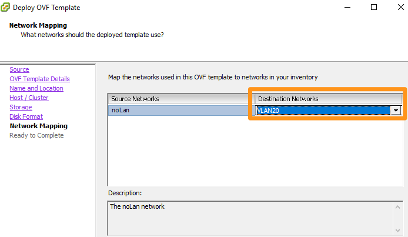{.thumbnail}

The configuration process is nearly complete, and you will see a summary of the configuration requested:

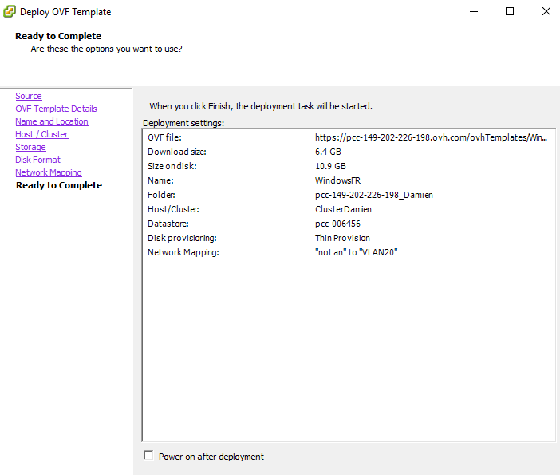{.thumbnail}

When you click on `Finish`{.action}, a task is created, and you can use it to track the progress of the deployment:

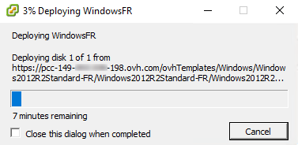{.thumbnail}

Once the deployment is complete, you can close this window.

You will now find the new virtual machine in your inventory:

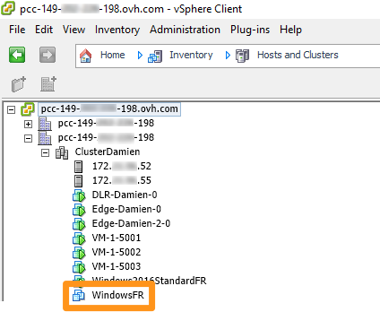{.thumbnail}

## Go further

Join our community of users on <https://community.ovh.com/en/>.