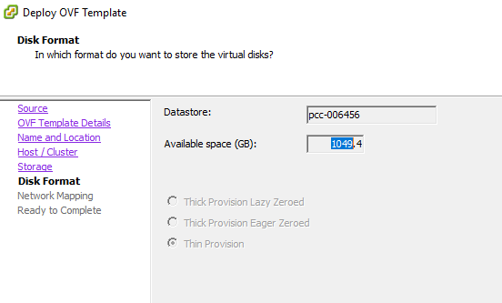

**Dernière mise à jour le 23/03/2018**

## Objectif

OVH propose des templates Windows (au format OVF) que vous pouvez déployer directement depuis votre client lourd vSphere.

> [!warning]
>
> Cette fonctionnalité n'est disponible qu'avec le client lourd de vSphere.
>

**Ce guide vous explique où trouver les sources et comment procéder au déploiement.**

## Prérequis

- Avoir accès au client lourd vSphere.

## En pratique

### Récupérer l'URL du template OVF

Depuis un navigateur internet, rendez-vous sur la page d'accueil de votre Private Cloud puis cliquez sur `OVH Template`{.action}.

{.thumbnail}

Dans l'écran `Templates Library` qui s'affiche, sélectionnez `Windows`{.action}. Vous accédez alors au détail des templates Windows proposés.

Il vous suffit maintenant de faire un clic droit sur le template de votre choix et de copier l'adresse du lien :

{.thumbnail}

### Déployer le template OVF

Une fois connecté au client lourd vSphere, rendez-vous dans `File`{.action} puis `Deploy OVH Template...`{.action} :

{.thumbnail}

Le menu contextuel s'ouvre, la configuration du déploiement va pouvoir commencer. Dans la première étape, il faut ajouter le lien que vous avez récupéré précédemment :

{.thumbnail}

Vous retrouvez tous les détails du template et, notamment, le mot de passe par défaut. Pour des raisons de sécurité, il est important de le changer dès votre première connexion :

{.thumbnail}

Choisissez le nom de votre machine virtuelle, ainsi que le datacentre dans lequel la déployer :

{.thumbnail}

Choisissez ensuite le cluster dans lequel la machine virtuelle va être déployée :

{.thumbnail}

Choisissez le datastore dans lequel la machine virtuelle va être stockée :

{.thumbnail}

Ici, nous avons le type de format de disque. Il n'est pas possible de le modifier sur une infrastructure Private Cloud :

{.thumbnail}

Vous devez maintenant choisir le réseau qui sera utilisé.

> [!warning]
>
> Le `Local PortGroup` est séléctionné par défaut. Il est important de le modifier car vous n'avez pas de droits sur celui-ci.
> 

{.thumbnail}

La configuration est quasiment terminée, vous avez accès à un résumé de la configuration souhaitée :

{.thumbnail}

Après avoir cliqué sur `Finish`{.action}, une fenêtre de chargement s'affiche et vous permet de suivre le déploiement :

{.thumbnail}

Une fois le déploiement terminé, vous pouvez fermer cette fenêtre.

Vous retrouvez alors la machine virtuelle déployée dans votre inventaire.

{.thumbnail}

## Aller plus loin

Échangez avec notre communauté d'utilisateurs sur <https://community.ovh.com>.