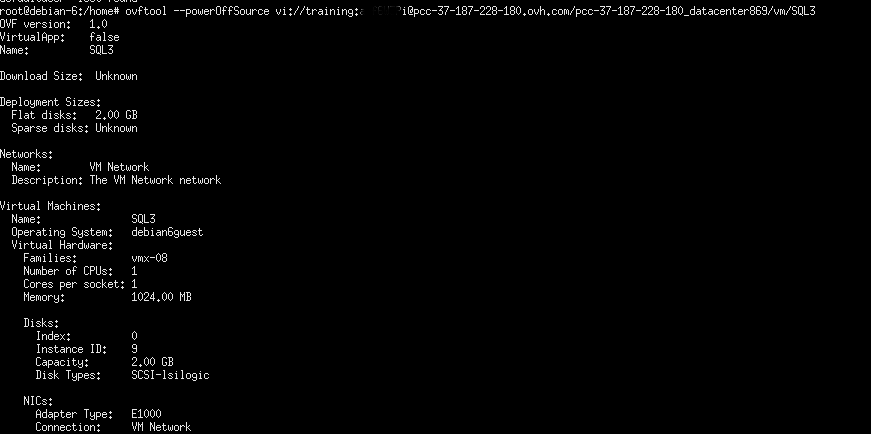
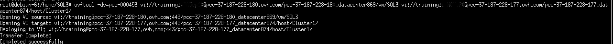

**Dernière mise à jour le 31/01/2022**

## Objectif

[OVFTOOL](https://www.vmware.com/support/developer/ovf/){.external-link} est un outil qui permet d'**exporter/importer** des machines virtuelles au format .OVF (compatible Windows, Linux et macOS).

**Ce guide est un cas d'étude de l'utilisation de cet outil**

## Prérequis

- Être contact administrateur de l'infrastructure [Hosted Private Cloud](https://www.ovhcloud.com/fr/enterprise/products/hosted-private-cloud/), afin de recevoir les identifiants de connexion.
- Avoir un identifiant utilisateur actif (créé dans l'[espace client OVHcloud](https://www.ovh.com/auth/?action=gotomanager&from=https://www.ovh.com/fr/&ovhSubsidiary=fr))

## En pratique

Nous utilisons l'application OVFTOOL en version 4.0 sous **Linux Debian**.

{.thumbnail}

Pour afficher de l'aide supplémentaire par rapport à cette application, utilisez la commande `ovftool --help` ou encore `ovftool --help examples` pour obtenir des exemples de cas précis.

{.thumbnail}

Voici un exemple d'export d'une machine virtuelle SQL3 provenant du pcc-37-187-228-180.ovh.com au format **.ovf**.

Avant l'export, la machine virtuelle doit être éteinte. Pour cela, utilisez la commande `ovftool powerOffSource`, comme indiqué dans la capture d'écran ci-dessous.

{.thumbnail}

Dans les tâches récentes du vCenter, on peut constater l'arrêt de la machine virtuelle concernée.

L'export de la machine virtuelle peut maintenant être réalisé via la commande suivante :

`ovftool vi://utilisateur:password@Dedicatedcloud/datacentre/vm/lenomdevotreVM /ladestination`

{.thumbnail}

On peut constater que l'export s'est déroulé correctement.

{.thumbnail}

Si vous souhaitez convertir votre fichier .OVF au format .VMX, utilisez la commande `ovftool -tt=vmx fichier.ovf /destination/`.

{.thumbnail}

{.thumbnail}

Pour importer, il est nécessaire de connaitre le data-store de destination : `ovftool -ds=datastore fichier.ovf`

{.thumbnail}

La machine virtuelle est maintenant déployée dans votre infrastructure.

Enfin, la migration à froid de la machine virtuelle « SQL3 » vers une autre infrastructure Hosted Private Cloud. Le transfert est réalisé sans machine tierce.

{.thumbnail}

## Aller plus loin

Échangez avec notre communauté d'utilisateurs sur <https://community.ovh.com>.

