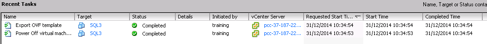

[OVFTOOL](https://www.vmware.com/support/developer/ovf/){.external-link} est un outil qui permet d'**exporter/importer** des machines virtuelles au format .OVF (compatible Windows, Linux et Mac).

Dans ce guide nous utilisons l'application OVFTOOL en version 4.0 sous **Linux Debian**.

{.thumbnail}

Pour afficher de l'aide supplémentaire par rapport à cette application utilisez la commande "**ovftool --help"** ou encore "**ovftool --help examples"** pour obtenir des exemples de cas précis.

{.thumbnail}

Voici un exemple d'**export** de la machine virtuelle SQL3 provenant du Dedicated Cloud pcc-37-187-228-180.ovh.com au format **.ovf**.

{.thumbnail}

Avant **export**, la machine virtuelle doit être éteinte pour cela nous utilisons la commande "**ovftool powerOffSource**" comme indiqué dans le **screenshot** ci-dessous.

{.thumbnail}

Sur le **vCenter** dans les tâches récentes nous voyons l'arrêt de la machine virtuelle concernée en l'occurrence SQL3.

{.thumbnail}

Maintenant nous pouvons exporter la machine virtuelle avec la commande suivante

"**ovftool vi://utilisateur:password@Dedicatedcloud/datacentre/vm/lenomdevotreVM /ladestination**"

{.thumbnail}

Nous constatons que l'**export** s'est déroulé correctement.

{.thumbnail}

Vous souhaitez convertir votre fichier .OVF au format .VMX, utilisez la commande "**ovftool -tt=vmx fichier.ovf /destination/**"

{.thumbnail}

{.thumbnail}

Pour **importer** il est nécessaire de connaitre le data-store de destination "**ovftool -ds=datastore fichier.ovf**"

{.thumbnail}

La machine virtuelle est **déployée** dans votre infrastructure.

{.thumbnail}

Enfin la **migration** à froid de la machine virtuelle "SQL3" vers une autre infrastructure Dedicated Cloud. (le transfert est réalisé sans machine tierce)

{.thumbnail}
