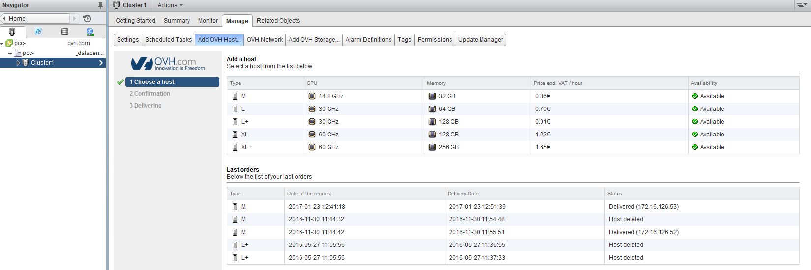
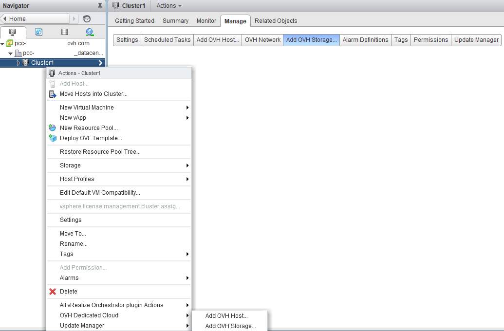

Le Plugin **Dedicated Cloud OVH** permet d'ajouter en quelques minutes (selon disponibilité) des **ressources dédiés** à votre infrastructure.

Il est nécessaire pour votre utilisateur vSphere d'[obtenir les droits d'ajout de ressources]({legacy}6094888) pour utiliser ce plugin.

Nous proposons deux ressources dédiés en facturation horaire :

- Hôtes
- Data-stores

La facturation de ces ressources ainsi que leur disponibilité sont des informations qui sont présentes dans le plugin, permettant ainsi de prévoir le délai de livraison ainsi que le prix estimé de la ressource selon sa durée de location.

Depuis le client web vSphere, il vous suffit de vous rendre dans la partie "Host and Cluster", de développer l'arborescence de gauche. Vous pourrez alors accéder aux onglets du plugin via le **Datacentre** ou le **Cluster**, onglet "Manage".

Le menu "Add OVH Host" est consacré aux **hôtes** affichant le détail technique, sa disponibilité et son prix avec la possibilité de commander cette ressource.

{.thumbnail}

La commande des **data-stores** supplémentaires se situe dans le menu "Add OVH Storage".

{.thumbnail}

Une alternative à l'accès de chaque plugin est de passer par un simple clic droit sur le **Datacentre** ou le **Cluster** de l'infrastructure, et de passer par le choix "OVH Dedicated Cloud".

{.thumbnail}
