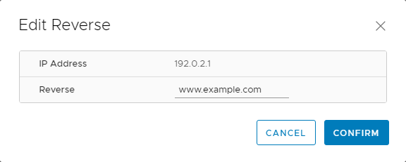
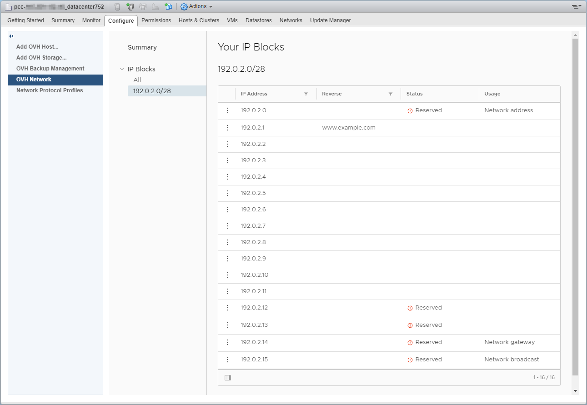

**Last updated on 02/10/2018**

## Objective

The OVH Network plugin was developed to allow for more focused management of the IP addresses linked to your [Private Cloud](https://www.ovh.co.uk/private-cloud/){.external} solution.

**This guide will show you how to use the OVH Network plugin with your Private Cloud solution.**

## Requirements

* a [Private Cloud](https://www.ovh.co.uk/private-cloud/){.external} solution
* an IP block linked to your [Private Cloud](https://www.ovh.co.uk/private-cloud/){.external} solution
* access to the vSphere interface

## Instructions

Click on the `Host and Cluster`{.action} menu, then choose a datacentre or a cluster from the infrastructure. Click on `Manage`{.action} and `OVH Network`{.action}.

{.thumbnail}

You will then see the `Summary` section, which lists your IP blocks, along with some basic information about each of them.

{.thumbnail}

The 'IP Blocks'{.action} section gives a list of all the IPs in your block. Make sure not to use the **five IPs that are reserved for the block's configuration and high availability**, namely:

* the first IP, which announces your block on the router
* the last IP, which is for **broadcast**
* the second to last IP, which is your **gateway**
* the two IPs before the gateway, which are used as  **HSRP** (Hot Standby Router Protocol) on the routers

{.thumbnail}

In order to show the OVH plugin that your public IPs are already being used, you must send an ARP request (_arping_) from the virtual machine(s) that use these addresses. Warning: some configurations with a virtual firewall don’t allow for tracing back MAC addresses if the ARP protocol isn’t authorised.

You can then configure your Reverse IPs for an email server, for example. This configuration process is also accessible via the [OVH Control Panel](https://www.ovh.com/auth/?action=gotomanager){.external} and the [OVH APIs](https://api.ovh.com/){.external}. Click on the three vertical dots to the left of the IP, then on `Edit Reverse`{.action} 

{.thumbnail}

Enter the Reverse, then validate by clicking `Confirm`{.action}.

{.thumbnail}

The Reverse is then displayed to the right of the IP, in the list of IP blocks.

{.thumbnail}

## Going further

Join our community of users on <https://community.ovh.com/en/>.
