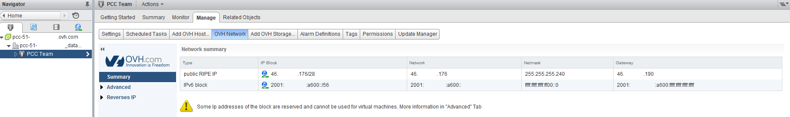
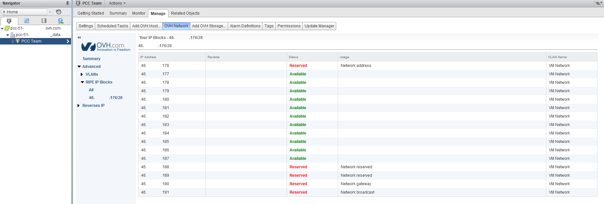
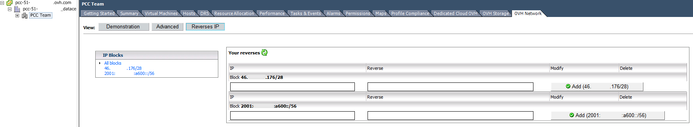

Le plugin OVH Network est **développé par OVH** pour une gestion plus fine de l'ensemble de vos IPs associé à votre Private Cloud.

Afin d'accéder au plugin, vous devez [accéder à l'interface de gestion vSphere]({legacy}1441941).

Il vous suffira ensuite de vous rendre dans le menu "Host and Cluster", de cliquer sur le datacentre ou le cluster de l'infrastructure puis "Manage" et "OVH Network".

Vous accéderez directement à la partie "Summary" qui récapitule les blocs d'IP possédés et les informations de base de chaque bloc.

{.thumbnail}

Le sous-menu **Advanced** liste l'ensemble des IPs de votre bloc, attention de ne pas utiliser les**5 IPs du bloc réservées** pour la configuration et la haute disponibilité de celui-ci.

- La première IP annonce votre bloc sur le routeur.
- La dernière IP est le **Broadcast**.
- L'avant dernière est votre **Gateway**.
- Les deux IPs avant la Gateway sont utilisées en tant que **HSRP** sur les routeurs (Hot Standby Router Protocol).

{.thumbnail}

Afin de remonter au plugin OVH que vos IP publiques sont déjà utilisés il est nécessaire de réaliser une requête ARP (arping) depuis la/les machines virtuelles utilisant vos IP publiques. Attention certaines configurations avec un firewall virtuel ne permettent pas la remontée des adresses MAC si le protocole ARP n'est pas autorisé.

Le dernier menu qui se nomme **Reverses IP** est utile pour configurer vos reverses IP, par exemple pour un serveur mail, dns et autres.. (ce paramétrage est aussi accessible depuis votre espace client et l'API de OVH.)

Cette partie n'est actuellement proposée que sur le client lourd vSphere et sera implémentée sous peu dans le client web.

{.thumbnail}

