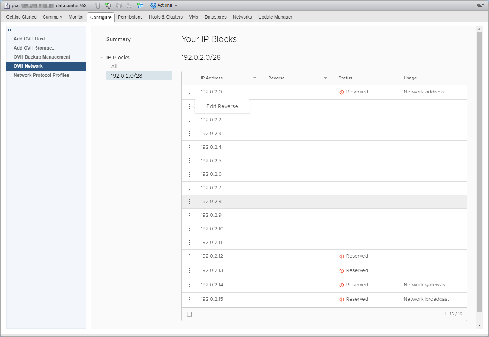

**Dernière mise à jour le 01/08/2018**

## Objectif

Le plugin OVH Network est développé par OVH pour une gestion plus fine de l’ensemble de vos IPs associé à votre Private Cloud.

## Prérequis

* Posséder un Private Cloud
* Avoir un Block d'IP associé au Private Cloud
* Accéder à l’interface de gestion vSphere

## En pratique

Vous devez sélectionner dans le menu "Host and Cluster", de cliquer sur le datacentre ou le cluster de l'infrastructure puis "Manage" et "OVH Network".

{.thumbnail}

Vous accéderez directement à la partie "Summary" qui récapitule les blocs d'IP possédés et les informations de base de chaque bloc.

{.thumbnail}

La partie **IP Blocks** liste l'ensemble des IPs de votre bloc, attention de ne pas utiliser les **5 IPs du bloc réservées** pour la configuration et la haute disponibilité de celui-ci.

- La première IP annonce votre bloc sur le routeur.
- La dernière IP est le **Broadcast**.
- L'avant dernière est votre **Gateway**.
- Les deux IPs avant la Gateway sont utilisées en tant que **HSRP** sur les routeurs (Hot Standby Router Protocol).

{.thumbnail}

Afin de remonter au plugin OVH que vos IP publiques sont déjà utilisés il est nécessaire de réaliser une requête ARP (arping) depuis la/les machines virtuelles utilisant vos IP publiques. Attention certaines configurations avec un firewall virtuel ne permettent pas la remontée des adresses MAC si le protocole ARP n'est pas autorisé.

Enfin vous pouvez configurer vos reverses IP, par exemple pour un serveur mail, dns et autres.. (ce paramétrage est aussi accessible depuis votre espace client et l'API de OVH.).
Cliquer sur les 3 points verticaux à gauche de l'IP. Puis cliquer sur **Edit Reverse**.

{.thumbnail}

Saisir le reverse puis valider avec **confirm**

{.thumbnail}

Celui-ci apparait alors à droite de l'IP dans la liste des IPs du bloc.

{.thumbnail}

## Aller plus loin

Échangez avec notre communauté d’utilisateurs sur <https://community.ovh.com/>.
