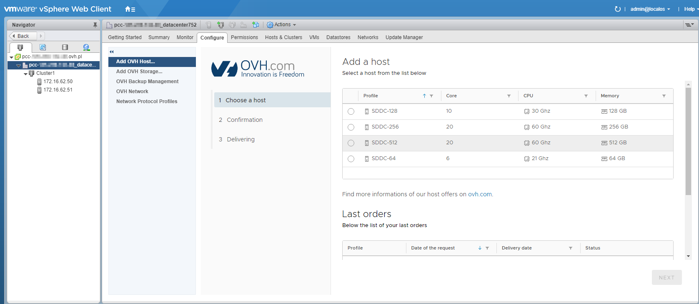

**Last updated 26th October 2018**

## Objective

With the OVH Private Cloud plugin, you can add dedicated resources to your infrastructure in just a few minutes.

**Find out how to use the OVH Private Cloud plugin.**

## Requirements

- an [OVH Private Cloud](https://www.ovh.co.uk/private-cloud/){.external} solution
- access to the vSphere interface

## Instructions

Two dedicated resources can be billed hourly as an option:
- host servers
- datastores

In the vSphere web client, simply go to the “Host and Cluster” section, and open the tree-view on the left-hand side. You can then access the plugin menus via the `Configure`{.action} tab for the datacentre or the cluster.

{.thumbnail}

The `Add OVH Host`{.action} menu is dedicated to host servers. You can view their technical details and order new host servers here.

{.thumbnail}

You can also order additional data stores from the `Add OVH Storage`{.action} menu.

{.thumbnail}

There is also another way to access these menus. You can right-click on the infrastructure’s datacentre or cluster, then choose `OVH Private Cloud`{.action}.

{.thumbnail}

## Go further

Join our community of users on <https://community.ovh.com/en/>.