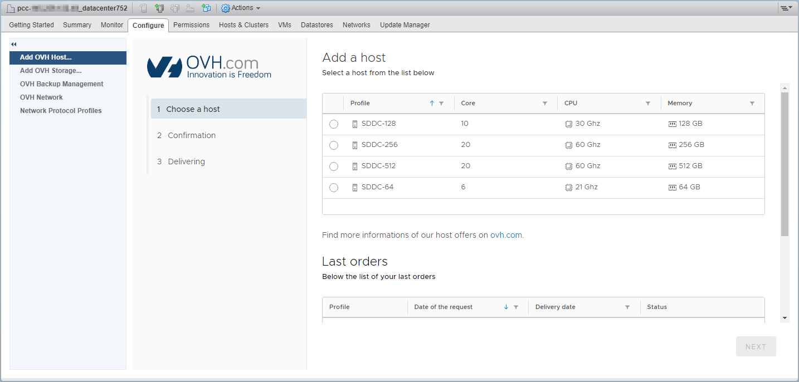
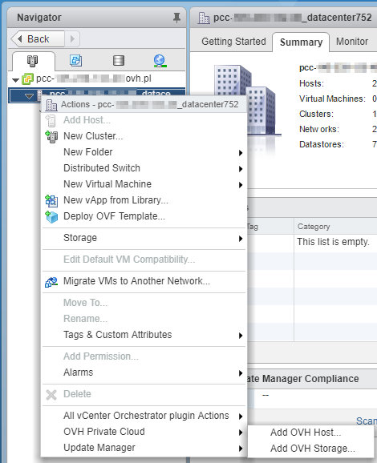

**Dernière mise à jour le 01/08/2018**

## Objectif

Le Plugin **Private Cloud OVH** permet d'ajouter en quelques minutes (selon disponibilité) des **ressources dédiés** à votre infrastructure.

## Prérequis

* Posséder un Private Cloud
* Accéder à l’interface de gestion vSphere*

## En pratique

Nous proposons deux ressources dédiés en facturation horaire :

- Hôtes
- Data-stores

Depuis le client web vSphere, il vous suffit de vous rendre dans la partie "Host and Cluster", de développer l'arborescence de gauche. Vous pourrez alors accéder aux onglets du plugin via le **Datacentre** ou le **Cluster**, onglet "Configure".

{.thumbnail} 

Le menu "Add OVH Host" est consacré aux **hôtes** affichant le détail technique avec la possibilité de commander cette ressource.

{.thumbnail}

La commande des **data-stores** supplémentaires se situe dans le menu "Add OVH Storage".

{.thumbnail}

Une alternative à l'accès de chaque plugin est de passer par un simple clic droit sur le **Datacentre** ou le **Cluster** de l'infrastructure, et de passer par le choix "OVH Dedicated Cloud".

{.thumbnail}

## Aller plus loin

Échangez avec notre communauté d’utilisateurs sur <https://community.ovh.com/>.