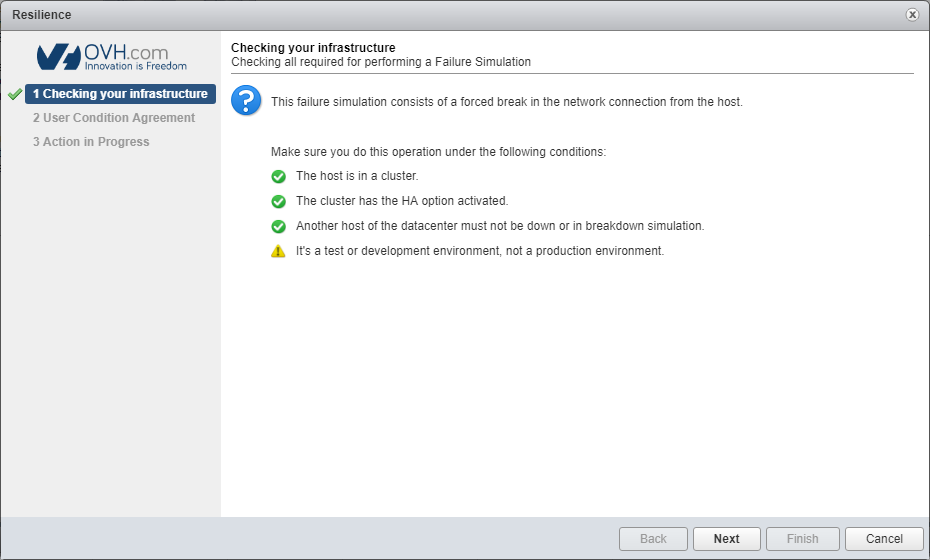
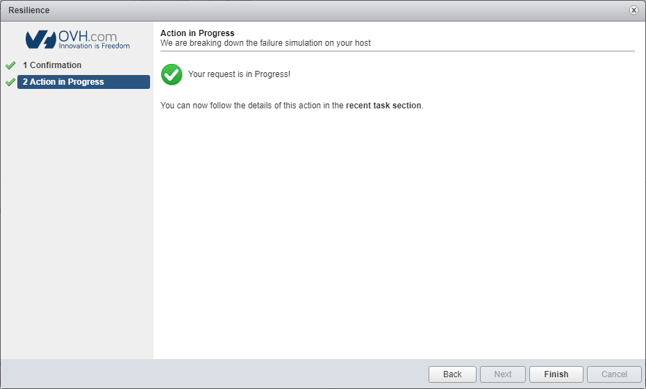

**Last updated 30th October 2018**

## Objective

Resilience mode is a tool developed by OVH, which simulates an outage on one of your host servers. You can use it to check that High Availability (HA) and Fault Tolerance (FT) systems work correctly in clusters that form **development environments**.

**This guide will show you how to use OVH resilience mode.**

## Requirements

* an [OVH Private Cloud](https://www.ovh.co.uk/private-cloud/){.external} solution
* access to the vSphere interface

## Instructions

Before you proceed, ensure that:

- the host server is in a cluster
- the High Availability (HA) option is activated
- another host server in the cluster is available and working properly

> [!warning]
>
> This is a test for a **development environment**. You should not carry out this test on a **production environment**.
> 

### Activate resilience mode.

Once you have logged in to the vSphere client, go to the inventory for your host servers and cluster. Select the server concerned by right-clicking on it, then click `OVH Dedicated Cloud`{.action}, and `Resilience`{.action}.

{.thumbnail}

Once you have checked that all the requirements are met, click `Next`{.action}.

{.thumbnail}

You will need to check the terms of use and confirm your agreement before launching the test. Once you have ticked the `I accept the terms of the failure simulation agreement`{.action} box, click `Next`{.action}.

{.thumbnail}

The activation request has now been processed.

{.thumbnail}

In a few minutes, the host server will become unavailable.

{.thumbnail}

### Deactivate resilience mode

To finish the simulation, click on resilience mode again.

{.thumbnail}

The deactivation request has now been processed.

{.thumbnail}

## Go further

Join our community of users on <https://community.ovh.com/en/>.
