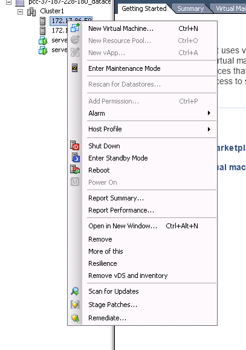
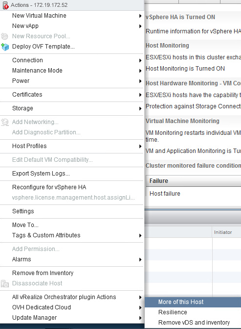
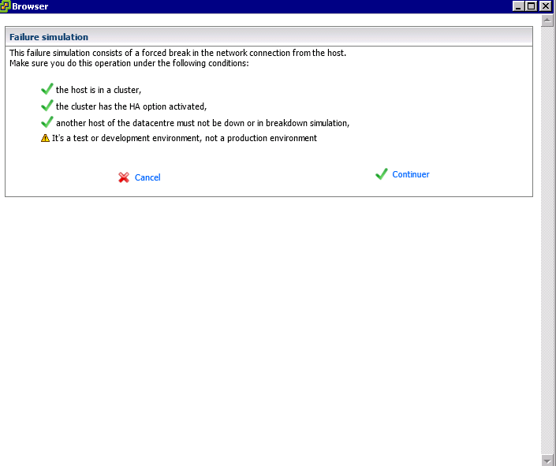
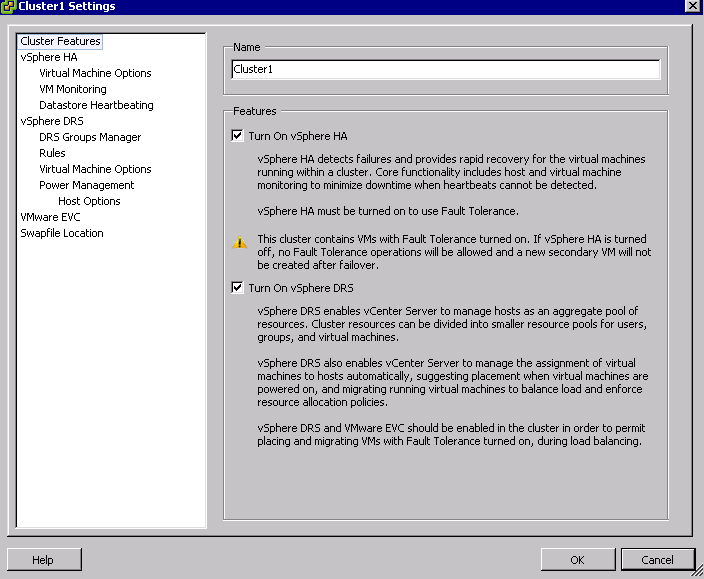

Le **mode résilience** est un outil développé par OVH pour simuler une panne sur l'un de vos hôtes et donc de vérifier que le système que vous avez mis en place de type High Availability (HA) et Fault Tolerance (FT) fonctionne correctement dans votre Cluster **en développement**.

Prérequis:
----------

1.  Le hôte doit être dans un **Cluster**.
2.  L'option **HA** (High Availability) doit être activée.
3.  Un **autre hôte** dans le Cluster doit être disponible et en état de fonctionnement.
4.  Attention c'est un test pour un **environnement de développement**, ne pas réaliser ce type d'opération en **production**.

Un simple "clic droit" sur un hôte et sélectionnez l'option qui se nomme **"OVH Dedicated Cloud"** puis "**Resilience**"

{.thumbnail}

Validation
----------

Il vous faudra ensuite cliquer sur le bouton "Next", après avoir préalablement vérifié que tous les prérequis sont respectés.

{.thumbnail}

conditions d'utilisation
------------------------

Il sera nécessaire de valider les conditions d'utilisations avant de lancer le test.

{.thumbnail}

Résultat
--------

Quelques minutes suffisent pour rendre indisponible votre hôte.

{.thumbnail}

Annulation
----------

Cliquez de nouveau sur le mode résilience pour finaliser la simulation.

{.thumbnail}
