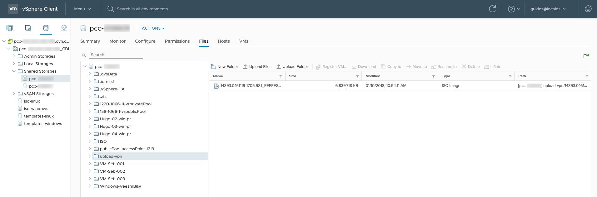

**Last updated 25th June 2020**

## Objective

Connecting to your datastores via Secure File Transfer Protocol (SFTP) allows you to add local backup files to your infrastructure. You can connect from a graphical interface with software such as FileZilla, available on Windows and Mac. You can also log in using the command line from your Linux operating system.

You will however only be able to access the "upload-vpn" folder of your datastores. Files outside this folder will not be accessible with this method.

**This guide explains how to log in via SFTP from a graphical or a command line interface.**

## Requirements

- a [Hosted Private Cloud infrastructure](https://www.ovhcloud.com/en-gb/enterprise/products/hosted-private-cloud/)
- a user account with access to vSphere (created in the [OVHcloud Control Panel](https://www.ovh.com/auth/?action=gotomanager))


## Instructions

### Logging in from a graphical interface

In your FTP client (FileZilla in this example) you need to enter the following credentials:

```
Host: [sftp://pcc-xxx-xxx-xxx-xxx.ovh.com] / Username: user / Password: password
```

{.thumbnail}

Once you are logged in, you will find your local machine on the left, and your datastores on the right:

{.thumbnail}


### Logging in from a command line interface

First, verify that the `sftp` command is installed by typing:

```sh
sftp
```

The command for your login is as follows:

```sh
sftp user@pcc-xxx-xxx-xxx-xxx.ovh.com
```

You will then be prompted for your user password. Once you are logged in, you can list your datastores using the `ls` command:

```sh
sftp> ls pcc-000714
```

Browse the list of datastores found with the previous command:

```sh
sftp> pcc-000714
```

Use the `put` command to export files from your datastore to your local machine.

```sh
sftp> put /home/ubuntu-18.04-server-amd64.iso
/datastore/pcc-000714/ubuntu-18.04-server-amd64.iso 
```

Use the `get` command to import files from your local machine to your datastore.

```sh
sftp> get /datastore/pcc-00714/ubuntu-18.04-server-amd64.iso /home/
```

You can log out using the `exit` command.


### Overview from vSphere

In your vSphere Client, you can see the contents that you have just sent in the Storage section: select your storage from the left-hand menu, switch to the `Folders`{.action} tab and click on the "upload-vpn" folder.

{.thumbnail}


## Go further

Join our community of users on <https://community.ovh.com/en/>.
