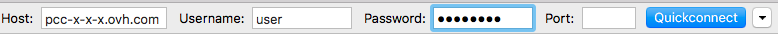
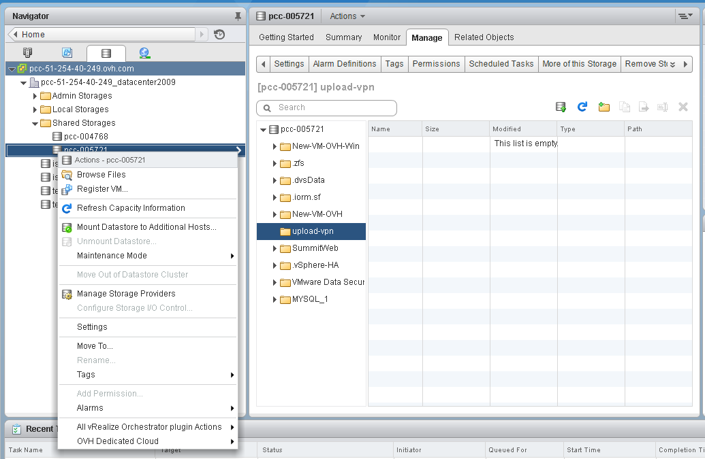

**Last updated 14th November 2018**

## Objective

Logging in to your datastores via SFTP enables you to add local files to your infrastructure. You can log in from a graphical interface with programs such as FileZilla, available on Windows and Mac, or you can log in via command line from your Linux operating system.

This system will only allow you to access the upload-vpn folder in your datastores. You cannot access files outside of this folder using this method.

**This guide explains how to log in via SFTP from a graphical interface or command line.**

## Requirements

* You must have an active user account created from the [OVH Control Panel](https://www.ovh.com/auth/?action=gotomanager){.external}.


## Instructions

### Logging in from a graphical interface

In your FTP client (FileZilla in this example) you need to enter the following information:

```
Host: [sftp://pcc-xxx-xxx-xxx-xxx.ovh.com] / Username: user / Password: password
```

{.thumbnail}

Once you are logged in, you will find your local mail on the left, and your datastores on the right:

{.thumbnail}


### Log in from a terminal

In a terminal, check that the `sftp` command is installed by writing:

```sh
sftp
```

The command for your login is as follows:

```sh
sftp user@pcc-xxx-xxx-xxx-xxx.ovh.com
```

It will then ask you for your user password.

Once you have logged in, you can list your datastores using the `ls` command:

```sh
sftp> ls pcc-000714
```

Browse the list of datastores found with the previous command:

```sh
sftp> pcc-000714
```

Use the `put` command to export files from your datastore to your local mail.

```sh
sftp> put /home/ubuntu-16.04.3-server-amd64.iso
/datastore/pcc-000714/ubuntu-16.04.3-server-amd64.iso  
```

Use the `get` command to import files from your local mail to your datastore.

```sh
sftp> get /datastore/pcc-00714/ubuntu-16.04.3-server-amd64.iso /home/
```

You can log out using the `exit` command.


### Overview from vSphere

In your vSphere, you can see the contents that you have just sent by browsing your datastore (right-click on the datastore of your choice) in the `upload-vpn` folder:

{.thumbnail}


## Go further

Join our community of users on <https://community.ovh.com/en/>.