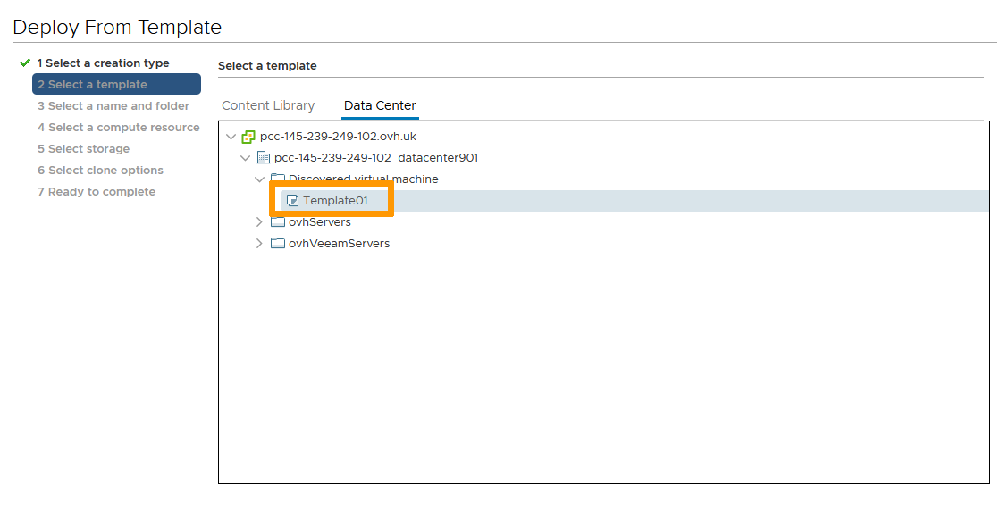

**Last updated 12th January 2022**

## Objective

VMWare offers the ability to manually take snapshots or clone VMs.

**This guide explains how to execute those tasks**

## Requirements

- Being an administrative contact of your [Hosted Private Cloud infrastructure](https://www.ovhcloud.com/asia/enterprise/products/hosted-private-cloud/) to receive login credentials
- A user account with access to vSphere (created in the [OVHcloud Control Panel](https://ca.ovh.com/auth/?action=gotomanager&from=https://www.ovh.com/asia/&ovhSubsidiary=asia))

## Instructions

### Take a Snapshot

A snapshot allows you to capture a VM state. 
It offers a layer of protection for your VM prior to executing changes as it offers the ability to come back to that state if needed.

In the vSphere interface menu, go to the `Hosts and Clusters`{.action} dashboard. 
Navigate to your VM, right click on it and in the `Snapshot`{.action} menu, select `Take Snapshot`{.action}.

{.thumbnail}

By default, the snapshot will be named after the current date and time. You may edit it to your preference. 
A description may also be added for reference. 
If your VM is running, the snapshot process offers two options:

- Snapshot the virtual machine's memory. This will save the VM Ram state, helping with certain applications that may not have commited changes to disk. It should also make your snapshot crash resistant, meaning it can be reverted to without powering off the VM.
- Quiesce guest file system (Needs VMware Tools installed). This will bring your VM to a state that is backup suitable: clearing buffers, committing changes to disks... 

If your VM is not running, those options are greyed out. 
*We recommend taking snapshots of a turned off VM and if it is not possible, preferably use the Quiesce option over the memory snapshot for added security.*

Click `OK`{.action} when ready.

{.thumbnail}

Your snapshot is done.

### Manage Snapshots

You can take multiple snapshots of a single VM repeating the process explained above. 
With time, snapshots will consume resources, especially storage, to be maintained and possibly will affect VM performance. 
Below is how to revert to or clear snapshots.

#### Revert to Snapshot

In the vSphere interface menu, go to the `Hosts and Clusters`{.action} dashboard. 
Navigate to your VM, right click on it and in the `Snapshots`{.action} menu, select `Manage Snapshots`{.action}.

{.thumbnail}

Check the snapshot tree and select the one you wish to go back to. 
Click on `Revert To`{.action}.

{.thumbnail}

Confirm by clicking `OK`{.action}.

{.thumbnail}

You can click `Done`{.action} as your VM has been reverted to the point chosen.

> [!primary]
>
> If you only have a single snapshot or wish to revert to the last taken snapshot, you can speed up the process by choosing `Revert to Latest Snapshot`{.action} in the `Snapshots`{.action} menu.

#### Clear Snapshot

In the vSphere interface menu, go to the `Hosts and Clusters`{.action} dashboard. 
Navigate to your VM, right click on it and in the `Snapshots`{.action} menu, select `Manage Snapshots`{.action}.

{.thumbnail}

Check the snapshot tree and select the one you wish to delete. 
Click on `Delete`{.action}. 
*You can also clear all snapshots by clicking `Delete All`{.action}.*

{.thumbnail}

Confirm by clicking `OK`{.action}.

{.thumbnail}

You can click `Done`{.action} as your snapshot was cleared.

> [!primary]
>
> If you wish to clear all snapshots, you can speed up the process by choosing `Delete All Snapshots`{.action} in the `Snapshots`{.action} menu.

### Clone a VM

Cloning allows for quick and efficient deployment of similar VMs. 
You can clone a VM into another one or clone it into a template. 
Cloning to a VM is a quick way to copy a full VM and its settings. 
Cloning to a template is a preferred way to create a master copy that will be used to deploy many VMs.

#### Clone to VM

In the vSphere interface menu, go to the `Hosts and Clusters`{.action} dashboard. 
Navigate to your VM, right click on it and in the `Clone`{.action} menu, select `Clone to Virtual Machine`{.action}.

{.thumbnail}

Name the clone VM and select its datacenter location. 
Click `Next`{.action}.

{.thumbnail}

Select the clone VM compute location. 
Click `Next`{.action}.

{.thumbnail}

Select the clone VM storage location. 
Click `Next`{.action}.

{.thumbnail}

Select the options for your clone VM.

- Customize the operating system will trigger sysprep on first use of the VM
- Customize this virtual machine's hardware allows for modification of VM capabilities (HDD size, network elements...)
- Power on virtual machine after creation is not recommended as you may have to apply changes before startup to prevent issues (network conflicts most notably if you use fixed IPs)

Click `Next`{.action}.

{.thumbnail}

Review and click `Finish`{.action}.

{.thumbnail}

The cloning process will go through and the new VM is ready for you.

> [!primary]
>
> If you cloned without any customization, make sure it is safe to boot the new VM. If it is cloned from a fixed IP VM, you should disable the Network Card to avoid IP conflicts for example.

#### Clone to Template

In the vSphere interface menu, go to the `Hosts and Clusters`{.action} dashboard. 
Navigate to your VM, right click on it and in the `Clone`{.action} menu, select `Clone to Template`{.action}.

{.thumbnail}

Name the template VM and select its datacenter location. 
Click `Next`{.action}.

{.thumbnail}

Select the template VM compute location. 
Click `Next`{.action}.

{.thumbnail}

Select the template VM storage location. 
Click `Next`{.action}.

{.thumbnail}

Review and click `Finish`{.action}.

{.thumbnail}

The cloning to template process will go through. 
No VM is directly visible but when deploying new VM, the clone will show in the "Deploy from Template" option.

{.thumbnail}

## Go further

Join our community of users on <https://community.ovh.com/en/>.
