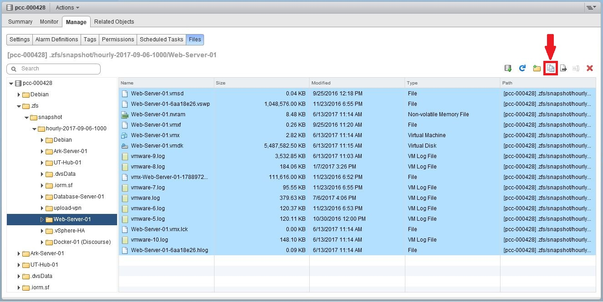
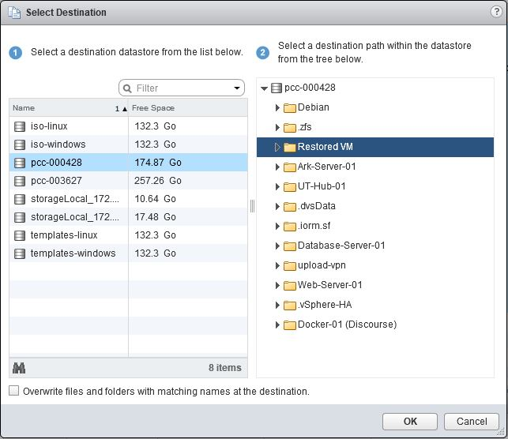
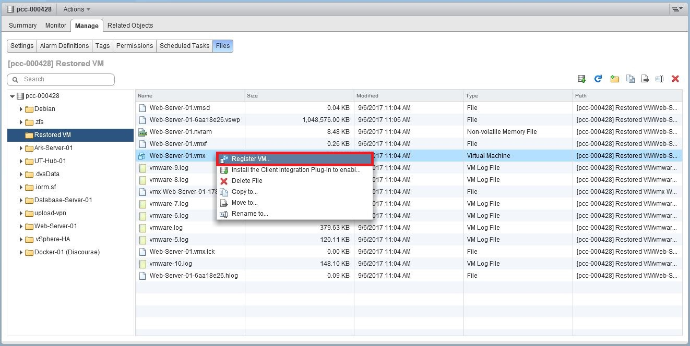

**Dernière mise à jour le 29/01/2019**

## Objectifs

Afin de vous assurer une continuité de service et éviter la perte de données, OVH réalise automatiquement des snapshots de votre baie de stockage (datastore) toutes les heures.

**Ce guide vous en explique le fonctionnement**

## En pratique

Un système de fichier est constitué de blocs accueillant des données. Au début du système de fichier, il y a un index qui contient les pointeurs, et ceux-ci permettent de retrouver l'emplacement des différents blocs.

Un fichier est souvent fragmenté en plusieurs blocs, alors l'index permets d'optimiser le temps d'accès à un fichier. L'index est comme le sommaire d'un livre, il permet de connaître le numéro de la page du chapitre que nous souhaitons lire.
 
Un snapshot ZFS est comme une photographie prise du système de fichier à un instant T. Elle sert généralement de base à une sauvegarde.
 
Lors de la création du snapshot, ZFS n'a pas besoin de recopier l'intégralité du disque dur car tous les fichiers y sont déjà présents. Le snapshot enregistre l'index contenant les pointeurs référençant les blocs libres et les blocs utilisés. Globalement, il stocke le positionnement des blocs et ZFS viendra y ajouter des blocs en fonction des modifications des données. Le snapshot prend très peu de place tant qu'aucune donnée n'est modifiée et il est très rapide à faire.
 
Après que le snapshot soit créé, ZFS va intercepter les demandes d'écriture. Il va effectuer les opérations suivantes si le pointeur de l'index fait référence a :
 
- Un bloc utilisé ; il va copier le bloc dans le snapshot et mettra à jours l'index pour qu’il pointe vers ce nouveau bloc, et non plus vers l'ancien bloc.
- Un bloc libre ; il va copier le bloc sur le système de fichier et ZFS mettra à jour l'index global du filesystem.
 
L’ajout de fichier ne fait pas grossir le snapshot, car ce dernier ne s'occupe pas des blocs libres. De même, les réécritures multiples de blocs n’ont pas d’impact sur la taille du snapshot, car ce dernier ne conserve qu’une version pour chaque bloc : celle qui date de l’instant T.
 
On peut donc dire que la taille d’un snapshot est approximativement égale à la taille des blocs utilisés à sa création et qui ont été modifiés depuis. Mais il faut surtout retenir que la taille d’un snapshot dépend de l’utilisation que l’on fait de son système de fichiers, et de la durée de vie du snapshot.
 
Dans la pratique, un snapshot créé à l'instant T ne fera que quelques kilo octets. La taille du snapshot grossira en fonction des modifications faites jusqu'au prochain snapshot. Si vous supprimez vos données, l'espace sera libéré uniquement lors de la suppression du snapshot.

## Snapshot à H-1

Vous avez la possibilité de récupérer le snapshot ZFS de la dernière heure (H-1) depuis le vSphere Web Client puisque celui-ci est directement stocké dans vos datastores. 

### Récupérer un snapshot à H-1

Depuis votre vSphere Web Client dirigez-vous dans la vue des datastores, puis dans le dossier `Shared Storages` sur le datastore comportant la machine virtuelle a restaurer.

Explorer le datastore en cliquant sur "Browse Files".

{.thumbnail}

Créez un dossier dans lequel vous allez plus tard copier les fichiers à restaurer.

{.thumbnail}

Dirigez-vous dans le dossier `.zfs` puis dépliez l'arborescence jusqu'au dossier de la machine virtuelle a restaurer puis copiez l'ensemble des fichiers présents dans ce dossier vers le nouveau dossier crée à l'étape précédente.

{.thumbnail}

{.thumbnail}

Les fichiers sont présents maintenant il suffit d'ajouter cette machine dans votre **inventaire** en effectuant un clic droit sur le fichier `.vmx` et `register VM`{.action} .

{.thumbnail}

Il ne vous reste plus qu'à suivre l'assistant de création de VM afin de terminer la procédure.

## Et pour les snapshots au-delà de la dernière heure ?

OVH conserve les 23 autres snapshots horaires (jusqu'à H-24) sur une baie de stockage (datastore) à laquelle vous n'avez pas directement accès. Il est néanmoins possible via une demande d'intervention faite au support technique (facturée 80€ HT) de demander la restauration d'un snapshot (au delà de H-1 donc) pour une VM en particulier. Nous ne pourrons restaurer le snapshot demandé que sur le même datastore et cette restauration ne peut en aucun cas être garantie.

Il s'agit là d'une sécurité normalement à usage interne d'OVH, les snapshots horaires ne sont **PAS** un système de backup et ne sont **PAS** garantis.

Il s'agit d'une sécurité supplémentaire à usage interne mise en place sur les datastores ne devant servir qu'en dernier recours afin de prévenir une perte de donnée éventuelle.

Nous vous recommandons l'utilisation d'une solution complète de sauvegarde comme notre service [Veeam Backup](https://docs.ovh.com/fr/private-cloud/veeam-backup-as-a-service/){.external-link} ou tout autre système réalisant un backup complet de vos machines virtuelles.

## Aller plus loin

Échangez avec notre communauté d'utilisateurs sur <https://community.ovh.com>.