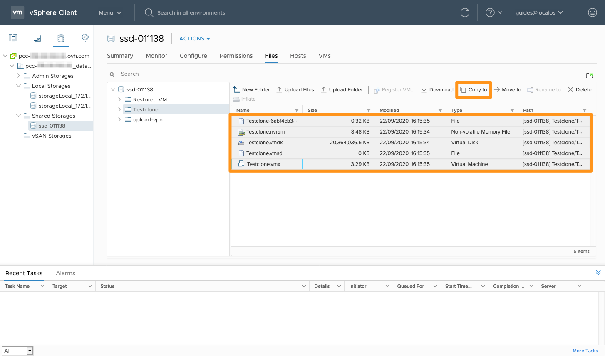

> [!primary]
> Questa traduzione è stata generata automaticamente dal nostro partner SYSTRAN. I contenuti potrebbero presentare imprecisioni, ad esempio la nomenclatura dei pulsanti o alcuni dettagli tecnici. In caso di dubbi consigliamo di fare riferimento alla versione inglese o francese della guida. Per aiutarci a migliorare questa traduzione, utilizza il pulsante "Contribuisci" di questa pagina.
>

**Ultimo aggiornamento: 15/03/2022**

## Obiettivi

Per assicurare continuità di servizio ed evitare perdite di dati, OVHcloud realizza automaticamente snapshot della tua rack di storage (datastore) ogni ora.

**Questa guida ti spiega come funziona**

## Prerequisiti

* Disporre di un’[infrastruttura Hosted Private Cloud](https://www.ovhcloud.com/it/enterprise/products/hosted-private-cloud/){.external} sul proprio account OVHcloud
* Accedere all'interfaccia di gestione vSphere Web Client HTML

## Procedura

Un file system è costituito da blocchi che contengono dati. All'inizio del file system, c'è un indice che contiene i puntatori, che permettono di ritrovare la posizione dei diversi blocchi.

Un file è spesso frammentato in più blocchi, quindi l'indice permette di ottimizzare la durata di accesso a un file. L'indice è come il sommario di un libro, permette di conoscere il numero della pagina del capitolo che vogliamo leggere.
 
Uno Snapshot ZFS è come una fotografia presa dal file system in un istante T. Serve generalmente come base per un backup.
 
Durante la creazione dello Snapshot, ZFS non deve copiare l'intero hard disk perché tutti i file sono già presenti. Lo Snapshot registra l'indice contenente i puntatori che indicano i blocchi liberi e i blocchi utilizzati. Complessivamente memorizza il posizionamento dei blocchi e ZFS vi aggiunge dei blocchi in base alle modifiche dei dati. Lo Snapshot non ha molto spazio fintanto che non viene modificato nessun dato ed è molto veloce da fare.
 
Una volta creato lo Snapshot, ZFS intercetta le richieste di scrittura. Se il puntatore dell'indice si riferisce a:
 
- blocco utilizzato copierà il blocco nello snapshot e aggiornerà l'indice in modo che punti verso questo nuovo blocco, non più verso il vecchio.
- Blocco libero copia il blocco sul file system e ZFS aggiorna l'indice globale del filesystem.
 
L'aggiunta del file non fa aumentare lo Snapshot, in quanto lo Snapshot non si occupa dei blocchi liberi. Allo stesso modo, le riscritture multiple di blocchi non hanno alcun impatto sulla dimensione dello Snapshot, perché quest'ultimo conserva solo una versione per ogni blocco: la data dell’ora T.
 
Si può quindi affermare che la dimensione di uno Snapshot è approssimativamente uguale alla dimensione dei blocchi utilizzati per la sua creazione e che sono stati modificati da allora. ma è importante ricordare che la dimensione di uno Snapshot dipende dall'utilizzo del suo file system e dalla durata di vita dello Snapshot.
 
In pratica, uno Snapshot creato al tempo T farà solo qualche chilo di byte. La dimensione dello Snapshot aumenterà in base alle modifiche effettuate fino al prossimo Snapshot. Se elimini i tuoi dati, lo spazio viene liberato solo al momento dell'eliminazione dello Snapshot.

## Snapshot ad h-1

> [!warning]
>
>La cartella .zfs non è più visibile sulle nuove generazioni di datastore. Per effettuare il ripristino di una VM, utilizza il supporto tecnico per effettuare lo Snapshot orario H-1.
>

È possibile recuperare lo Snapshot ZFS dell'ultima ora (H-1) dal vSphere Web Client HTML, in quanto è direttamente salvato nei tuoi datastore. 

### Recuperare uno snapshot ad h-1

Dalla tua vSphere Web Client HTML, vai nella vista dei datastore e poi nella cartella `Shared Storages` sul datastore con la macchina virtuale da ripristinare.

Esplora il datastore cliccando su `Browse Files`.

{.thumbnail}

Crea una cartella in cui potrai copiare i file da ripristinare.

{.thumbnail}

Clicca sulla cartella.`zfs` e apri il form fino allo schienale della macchina virtuale da ripristinare, poi copia tutti i file presenti in questa cartella verso il nuovo file creato allo step precedente.

{.thumbnail}

I file sono presenti adesso, è sufficiente aggiungere questa macchina nel tuo **inventario** cliccando sul file `.vmx` e poi sul `register VM`{.action} in alto.

{.thumbnail}

Per completare la procedura, non ti resta che seguire l'assistente alla creazione delle VM.

## E gli Snapshot dopo l'ultima ora?

OVHcloud conserva gli altri 23 snapshot orari (fino a H-24) su una rack di storage (datastore) a cui non hai accesso diretto. Tuttavia, è possibile richiedere il ripristino di uno Snapshot (al di là di H-1, quindi) per una determinata VM tramite una richiesta di intervento fatta al supporto tecnico (fatturata 80 € +IVA). Ripristinare lo Snapshot richiesto è possibile solo nello stesso datastore e questo ripristino non può essere garantito.

Si tratta di una sicurezza normalmente utilizzata da OVHcloud, gli Snapshot orari non sono un sistema di backup e non sono garantiti.

Si tratta di una sicurezza aggiuntiva per uso interno installata sui datastore che deve essere utilizzata solo come ultima risorsa per prevenire una possibile perdita di dati.

Ti consigliamo di utilizzare una soluzione completa di backup, come il servizio [Veeam Backup](/pages/cloud/private-cloud/veeam_backup_as_a_service){.external-link} o qualsiasi altro sistema che effettui un backup completo delle tue macchine virtuali.

## Per saperne di più

Contatta la nostra Community di utenti all’indirizzo <https://community.ovh.com/en/>.
