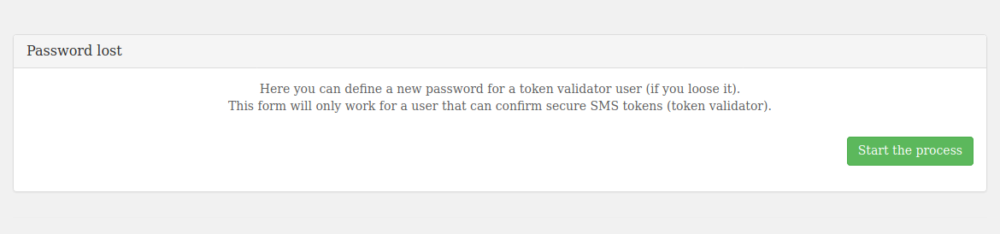

**Dernière mise à jour le 23/11/2021**

## Objectif

A la suite de la livraison de votre environnement vSphere SecNumCloud, vous devez configurer les accès à celui-ci
tout en maintenant le niveau de sécurité.

**Ce guide vous explique étape par étape les actions à effectuer.**

## Prérequis

* Posséder une offre [Hosted Private Cloud SecNumCloud](https://www.ovh.com/fr/private-cloud/){.external}.
* Être connecté à [l'espace client OVHcloud](https://www.ovh.com/auth/?action=gotomanager&from=https://www.ovh.com/fr/&ovhSubsidiary=fr).
* Être connecté aux [API OVHCloud](https://api.ovh.com/){.external}.
* Avoir [créé ses identifiants pour l'API OVHCloud](https://docs.ovh.com/gb/en/api/first-steps-with-ovh-api/){.external}.

## En pratique

Vous venez de recevoir une notification de livraison de votre service.

Celui-ci contient notamment vos informations de connexion, telles que dans l'exemple ci-dessous :

```console
- adresse IP/nom : pcc-192-0-2-1.ovh.com
- nom d'utilisateur : admin
- mot de passe : **********
```

Vous noterez qu'il n'y a pas de mot de passe dans l'email, celui-ci sera obtenu à l'issue de l'étape 2.

### Etape 1 : ajouter des adresses IP pour se connecter au vCenter

Pour des raisons de sécurité, les interfaces de gestion sont restreintes par défaut.
Vous devrez autoriser des adresses IP à se connecter au vCenter.

Le guide suivant vous décrit comment effectuer cette manipulation :

* [Autoriser des IP à se connecter au vCenter](../autoriser-des-ip-a-se-connecter-au-vcenter/)

### Etape 2 : configuration avancée de la sécurité

Les mesures de sécurité suivantes sont mises en place à la livraison de votre service :

* tous les utilisateurs existants de votre Private Cloud seront désactivés (lors de la livraison, seul l'utilisateur **admin** est présent);
* vous devrez modifier les mots de passe des utilisateurs afin que ceux-ci soient réactivés;
* vous devrez faire l'enrôlement 2FA au moment du changement des mots de passe des utilisateurs;
* la modification des mots de passe de vos utilisateurs devra être réalisée uniquement à partir de l’interface sécurisée. Vous ne pourrez plus effectuer cette manipulation à partir de votre espace client OVHcloud.

Pour cela, effectuez les actions suivantes :

* L'utilisateur « **admin** » doit avoir des informations à jour et disposer de l'autorisation nécessaire.
* Depuis l'onglet `Utilisateurs`{.action} , assurez-vous, pour l'utilisateur « **admin** », que le numéro de téléphone et l'adresse e-mail sont correctement renseignés.
* L'utilisateur « **admin** » doit aussi disposer de l'autorisation « **token validator** ».
* Si nécessaire, pour modifier l'utilisateur, cliquez sur le bouton `...`{.action} , puis sur `Modifier`{.action}.

N'hésitez pas à consulter notre guide [Présentation de l’espace client Hosted Private Cloud OVHcloud](../manager-ovh-private-cloud/).

Accédez à l’interface sécurisée du service, exemple : https://pcc-192-0-2-1.ovh.com/secure/ (attention à ne pas oublier le “/” final de l’adresse).

Cliquez sur le bouton `Password lost`{.action}.

{.thumbnail}

Un message indique que vous devez être en mesure de recevoir des messages SMS pour continuer.
Cliquez sur le bouton `start the process`{.action}.

{.thumbnail}

Renseignez les informations demandées pour le compte **admin** (elles doivent être identiques aux informations précédemment ajoutées dans le manager) et cliquez sur `Next step`{.action}.

{.thumbnail}

Au sein de l’interface, vous devez alors :

- entrer le code reçu par SMS;
- entrer le code reçu par courriel;
- renseigner un nouveau mot de passe;
- confirmer celui-ci;
- scanner le QRcode avec l’application d’authentification de votre choix;
- entrer le code obtenu.

Cliquez enfin sur le bouton `Define password`{.action}.

{.thumbnail}

Une fois le compte activé et sécurisé (2FA & mot de passe), il est nécessaire de confirmer ce compte comme **token validator**. Ceci afin de pouvoir valider les opérations sensibles sur l'infrastructure.

Pour cela il faut confirmer la poursuite des opérations via le call d'API suivant :

> [!api]
>
> @api {POST} /dedicatedCloud/{serviceName}/securityOptions/resumePendingEnabling
>

En spécifiant :

- {serviceName} : le nom du service (exemple: pcc-192-0-2-1)
- {option} : tokenValidation

Vous allez alors recevoir un SMS pour valider l'autorisation « **token validator** » sur le numéro de téléphone précédemment renseigné.

Voici un exemple de SMS envoyé:

```console
OVHcloud - Hosted Private Cloud - message destiné à l'utilisateur admin.
L'opération testTokenValidation (#1743283) sur pcc-192-0-2-1 a besoin d'une validation.
Id d'opération : 1743283.
Token de confirmation : 540427.
Interface de validation : https://pcc-192-0-2-1.ovh.com/secure/operation-validation?task=1743283&token=540427
Ce token est valide pour 15 minutes.
Si vous ne confirmez pas cette opération avant l'expiration, elle sera annulée et aucune action ne sera effectuée.
```

> [!warning]
>
> Le token généré n'est valide que pour 15 minutes.
> Les prochaines actions sont à effectuer dans ce temps imparti sinon la tâche sera annulée une fois ce temps écoulé.
>

Le guide suivant vous décrit comment effectuer cette manipulation :

* [Valider une opération avec un token](../interface-secure/#valider-une-operation-avec-un-jeton)

A l'issue de cette étape, vous serez en capacité d'ouvrir une session sur l'interface vSphere et valider toutes les opérations sensibles sur l'infrastructure lors les prochaines étapes.

### Etape 3 : configurer un VPN IPSec avec NSX-V

La mise en place d'un VPN est nécessaire pour vous permettre de vous connecter via Internet aux réseaux privés de votre environnement SecNumCloud.

Le guide suivant vous décrit comment effectuer cette manipulation :

* [Configurer un VPN IPSec via une Gateway Edge](../configurer-un-vpn-via-une-gateway-edge/#ipsec-vpn)

### Etape 4 : activer la private gateway

Nous allons maintenant basculer l'interface de management vSphere sur un des réseaux privés de l'environnement SecNumCloud.

A l'issue de cette étape, la connexion au vCenter et aux API vSphere ne pourra se faire qu'en passant par les réseaux privés et via le VPN IPSec configuré à l'étape précédente pour l'extérieur.

Le guide suivant vous décrit comment effectuer cette manipulation :

* [Activer la Private Gateway](../private-gateway/)

### Etape 5 : mettre en place le KMS pour le chiffrement

Nous passons ensuite à la mise en place du chiffrement pour les machines virtuelles qui seront hébergées.

Le prérequis est d'avoir un KMS compatible avec la solution VMware vSphere.

Le guide suivant vous décrit comment déployer la solution KMS Thales :

* [Mise en route du KMS CipherTrust Manager](../kms-cipher-trust/)

Configurez alors le KMS dans vSphere en vous aidant du guide suivant :

* [Activation du chiffrement des machines virtuelles (VM Encryption)](../vm-encrypt/)

### Etape  6: vérification de la conformité SecNumCloud

Après avoir effectué les démarches de sécurisation de l'infrastructure, vous devez finaliser l'activation SecNumCloud.

Pour cela, il faut lancer l'opération via le call d'API suivant :

> [!api]
>
> @api {POST} /dedicatedCloud/{serviceName}/securityOptions/resumePendingEnabling
>

En spécifiant :

- {serviceName} : le nom du service (exemple: pcc-192-0-2-1)
- {option} : snc

Retour (tronqué) :

```json
{
    "taskId": 4091062,
    "name": "enableSecurityOption",
    "progress": 0,
    "state": "todo"
}
```

Vous allez obtenir une tâche que vous pouvez suivre à l'aide de son **taskId** via le call d'API suivant :

> [!api]
>
> @api {GET} /dedicatedCloud/{serviceName}/task/{taskId}
>

En spécifiant :

- {serviceName} : le nom du service (exemple: pcc-192-0-2-1)
- {taskId} : le numéro de la tache (exemple: 4091062)

Une fois celle-ci terminée, vous pouvez contrôler qu'il ne reste pas d'action à faire via le call d'API suivant :

> [!api]
>
> @api {GET} /dedicatedCloud/{serviceName}/securityOptions/pendingOptions
>

Une liste vide en retour, comme ci-dessous, vous confirme que l'ensemble des actions ont été faites sur l'environnement et que celui est pleinement opérationnel :

```console
[ ]
```

## Aller plus loin

[Nos guides SecNumCloud Connectivity](https://docs.ovh.com/fr/network-ip/)

Échangez avec notre communauté d’utilisateurs sur <https://community.ovh.com/>.
