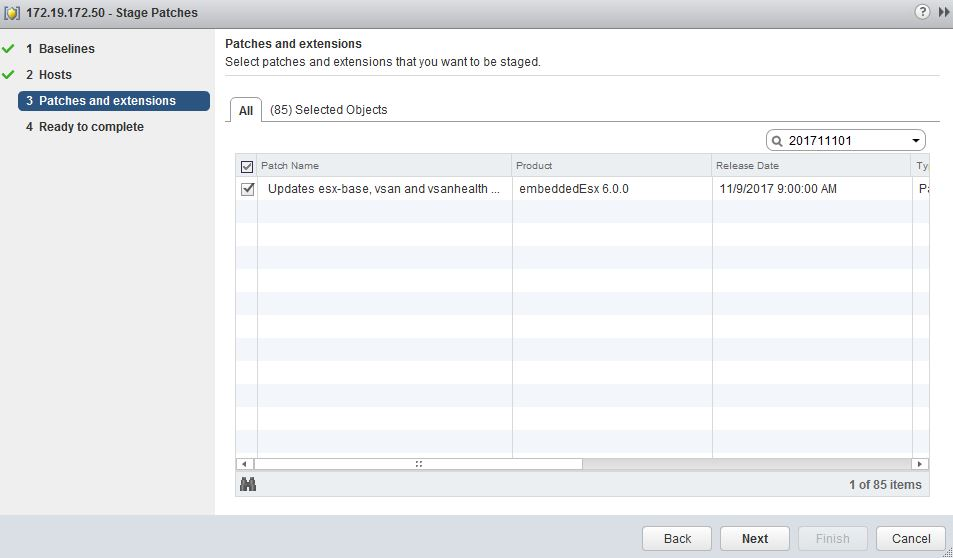

## Objective

To find general information on Spectre and Meltdown, please refer to our [detailed guide](https://docs.ovh.com/fr/dedicated/information-about-meltdown-spectre-vulnerability-fixes/){.external} and [our guide for each OS](https://docs.ovh.com/fr/dedicated/meltdown-spectre-kernel-update-per-operating-system/){.external}.

**This guide will explain how to apply patches for the Spectre and Meltdown vulnerabilities**.

## Requirements

- You must have a user account with access to vSphere.

## Instructions

As a reminder:

|Variant|Vulnerable?|Fixed by the patch?|
|---|---|---|
|Variant 1: bounds check bypass (CVE-2017-5753) - Spectre|YES|YES|
|Variant 2: branch target injection (CVE-2017-5715) - Spectre|YES|YES|
|Variant 3: rogue data cache load (CVE-2017-5754) - Meltdown|NO||

> [!primary]
>
> Meltdown (CVE-2017-5754) does not affect ESXI because ESXI does not run non-verified user codes.
> 

For **Private Cloud** solutions, there is planned scheduled maintenance to apply a patch for this vulnerability automatically on vulnerable hosts. You can find information about this scheduled maintenance on the [associated task](http://travaux.ovh.com/?do=details&id=29250){.external} (English translation below French text).

### Check the host version

To check your host version, log in to your [vSphere interface](https://docs.ovh.com/gb/en/private-cloud/login-vsphere-interface/){.external} and go to the host summary, in the `Configuration`{.action} section:

The corrected versions are as follows:

- **ESXi 6.5:** 7388607
- **ESXi 6.0:** 6921384
- **ESXi 5.5:** 6480324

If you have an older version of these *builds*, you will need to update your host. As a reminder, an automatic update will be scheduled by OVH. However, you can also perform this update manually.

### Update your host with the patch associated with the vulnerability

Update your host by switching it to maintenance mode (your host will be rebooted during the procedure), and use the [VMWare Update Manager plugin](https://www.vmware.com/support/pubs/vum_pubs.html){.external}.

The patches are as follows:

- **ESXi 6.0** – [ESXi600-201711101-SG](https://kb.vmware.com/s/article/2151132){.external}
- **ESXi 5.5** – [ESXi550-201709101-SG](https://kb.vmware.com/s/article/2150876){.external}

> [!warning]
>
> This version **5.5** patch is only for **CVE-2017-5715**, not CVE-2017-5753.
> 

In the list of patches, you can use the filter so that only the patch you are searching for appears. This way, you can just select this patch.

After the update is complete, your host will no longer be vulnerable, and you can use it again.

## Go further

Join our community of users on <https://community.ovh.com/en/>.