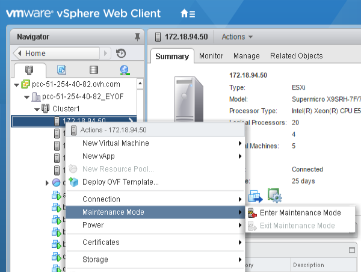
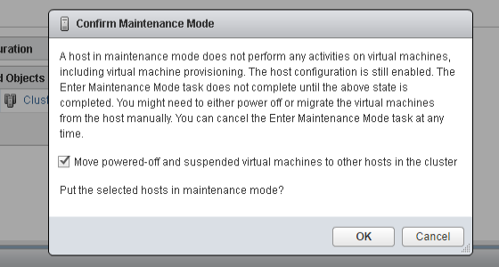
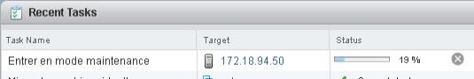
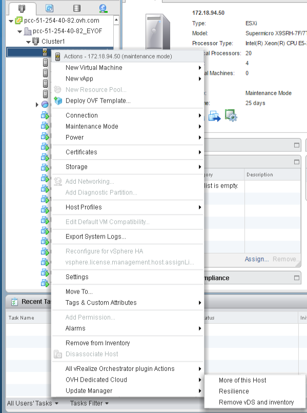
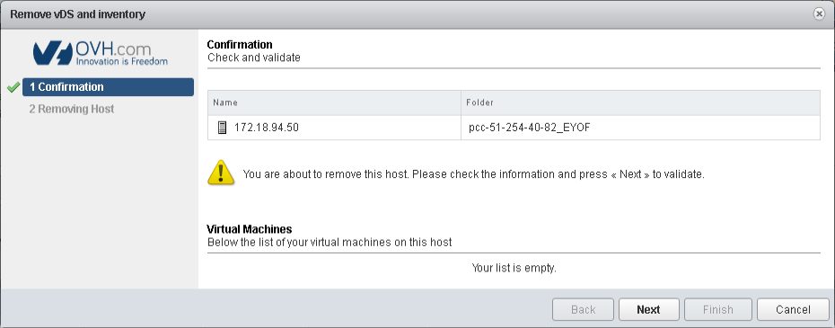

Potrebbe essere utile rimuovere un host dal Cluster per esempio per ottenere un host di sostituzione gratuito o per passare ad un host di gamma superiore.

L'eliminazione di un host avviene in due passaggi: l'impostazione dell'host in modalità di manutenzione e l'eliminazione automatica.

Modalità di manutenzione
-------------------

Accedi al tuo client vSphere, apri la lista degli host e del Cluster e seleziona l'host in questione con un semplice click destro, seleziona "modalità di manutenzione" e "Passa alla modalità di manutenzione". Non preoccuparti, se saranno presenti macchine virtuali in esecuzione su questo host, saranno automaticamente migrate su un altro host nel tuo Cluster (le modalità HA e DRS dovranno essere abilitate).

{.thumbnail}

#### ****

Avrai accesso ad una finestra che ti permetterà di confermare il passaggio alla modalità di manutenzione.

{.thumbnail}

****

È possibile seguire l'avanzamento della transizione in modalità di manutenzione nell'area "Attività recenti"

*{.thumbnail}*

La cancellazione
--------------

Ora che l'host è in modalità di manutenzione, hai due opzioni per rimuoverlo dalla tua infrastruttura.

Se non disponi di uno switch virtuale distribuito (VDS Nexus1000v) attivo sulla tua infrastruttura (generalmente sulle vecchie offerte), è sufficiente fare clic destro sull'host e cliccare sul pulsante "Cancella"

Se il Virtual Distributed Switch (VDS Nexus1000v) è attivo (a partire da tutte le infrastrutture 2014 e successive), in questo caso basterà un semplice click destro sull'host e cliccare su "Remove vDS and inventory" (presente anche nel menu "OVH Dedicated Cloud" (presente sia dal client web che dal client vSphere).

*{.thumbnail}*

Conferma la cancellazione

{.thumbnail}

L'host verrà rimosso automaticamente e non sarà più visibile dopo pochi minuti. Si prega di notare che la rimozione potrebbe andare in errore se è stata aggiunta una directory / file che non era inizialmente presente nello storage locale dell'host. Solo le home directory ed i file vSwap non bloccano la cancellazione dell'host.
