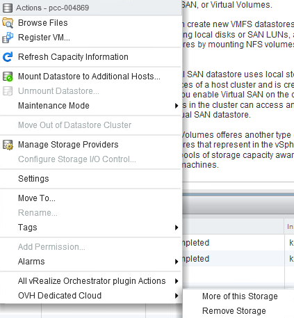
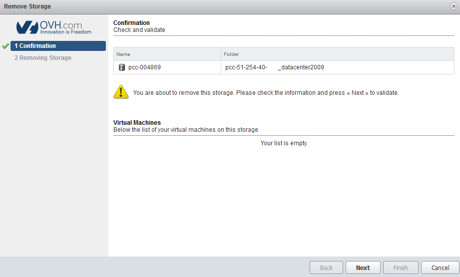
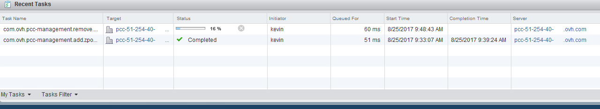

Attention il n'est pas possible de supprimer les **deux data-stores 300 Go** inclus dans votre pack. Pour des raisons de sécurité, la demande suppression échouera si vous avez des machines virtuelles présentes sur le data-store concerné.

Sélection
---------

Afin de supprimer un datastore, la première étape consiste à faite un "clic droit" sur le datastore en questions puis sélectionner "OVH Dedicated Cloud" puis "Remove storage"

{.thumbnail}

Validation
----------

Afin de valider la suppression du datastore il est nécessaire de cliquer sur le bouton "Next"

{.thumbnail}

Suivi de la tache
-----------------

Vous pouvez surveiller la progression de la suppression du datastore via les taches récentes.

{.thumbnail}
