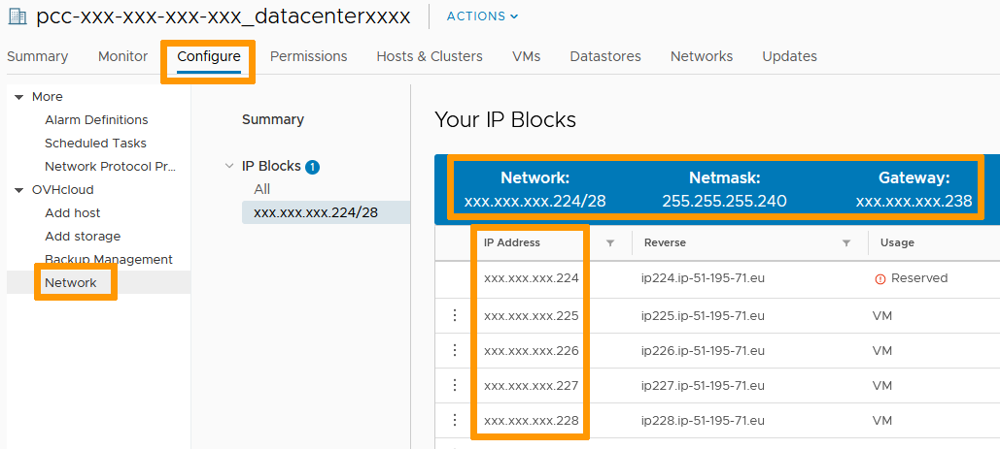
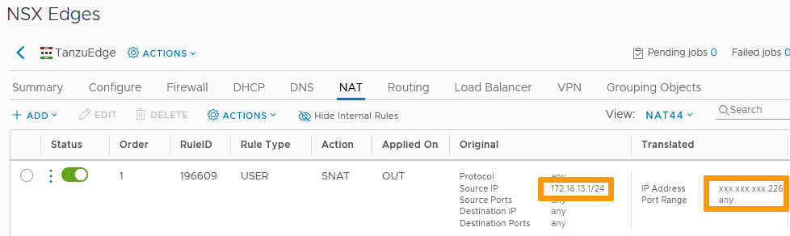
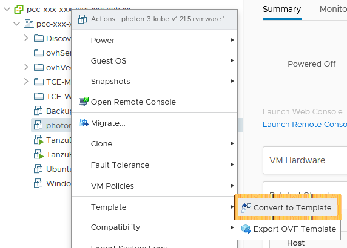
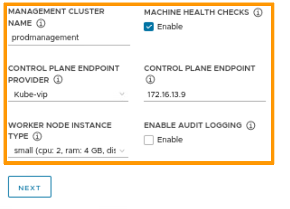
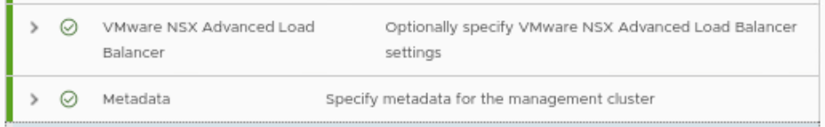
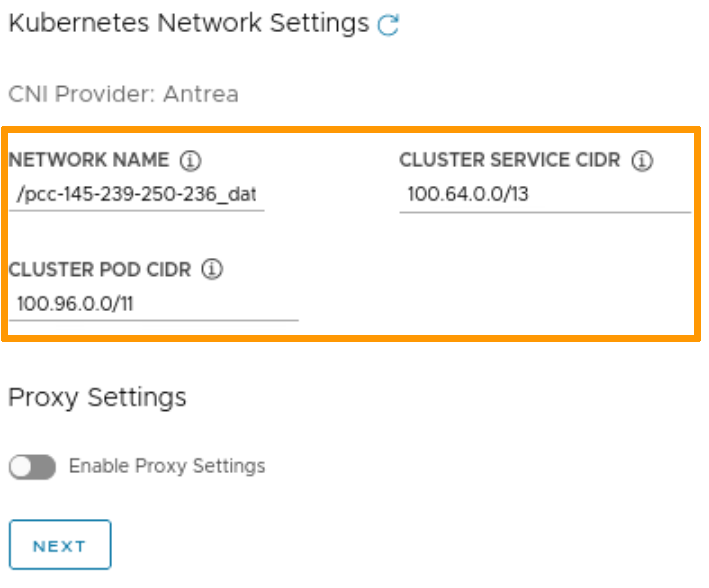
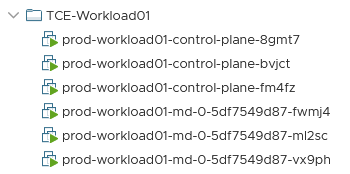

**Dernière mise à jour le 04/03/2022**

## Objectif

VMware Tanzu Community Edition (TCE) est une plate-forme Kubernetes complète et simple à gérer.<br>
Vous pouvez déployer ce produit sur votre infrastructure OVHcloud pour profiter de ses fonctionnalités et de son évolutivité.

**Ce guide est un exemple d'installation étape par étape de TCE.**

## Prérequis

- Être contact administrateur de l'infrastructure [Hosted Private Cloud](https://www.ovhcloud.com/fr-ca/enterprise/products/hosted-private-cloud/), afin de recevoir les identifiants de connexion.
- Avoir un identifiant actif dans l'[espace client OVHcloud](https://ca.ovh.com/auth/?action=gotomanager&from=https://www.ovh.com/ca/fr/&ovhSubsidiary=qc)
- Avoir un identifiant actif dans vSphere
- Avoir déployé une [NSX Edge Services Gateway](https://docs.ovh.com/ca/fr/private-cloud/comment-deployer-une-nsx-edge-gateway/)
- Configurer le service [DHCP](https://docs.ovh.com/ca/fr/private-cloud/configurer-le-dhcp-sur-une-edge-nsx/) sur la NSX Gateway

## En pratique

### Réseau

Comme indiqué dans les prérequis ci-dessus, nous utilisons une NSX Edge Gateway pour les services de firewall et de DHCP.<br>
D'autres composants réseau peuvent servir d'alternative, notament pfSense.<br>

Pour paramétrer votre réseau, définissez une adresse IP publique pour l'accès extérieur et un réseau interne avec le service DHCP activé pour l'infrastructure TCE.<br>
Votre datacenter est livré avec un certain nombre d'IPs publiques utilisables pour vos besoins. Elles sont visibles dans l'onglet `Configurer`{.action} du datacenter, dans la section `Réseau`{.action}. Vous verrez également les paramètres de masque et de passerelle sur la page.<br>
Consultez notre documentation pour [ajouter un bloc d'IP](https://docs.ovh.com/ca/fr/private-cloud/ajout-de-bloc-ip/) si vous n'avez plus d'IP publique utilisable.

{.thumbnail}

> [!warning]
>
> Les adresses IP marquées comme *Reserved* sont utilisées pour les services liés au datacenter et ne sont pas disponibles pour autre chose.
>

Pour notre exemple, la NSX Edge Services Gateway est paramétrée comme suit avec deux interfaces:

- une interface externe (*Uplink*) avec une IP publique principale et une secondaire (xxx.xxx.xxx.225 and xxx.xxx.xxx.226)
- une interface interne (*Internal*) avec une IP privée 172.16.13.1 sur le VLAN13<br>
{.thumbnail}
- le service DHCP distribue un pool d'adresses de 172.16.13.10 à 172.16.13.100 sur le VLAN13<br>
{.thumbnail}
- Une règle SNAT traduit le réseau 172.16.13.1/24 par l'adresse publique xxx.xxx.xxx.226 pour l'accès externe<br>
{.thumbnail}

Dans l'[espace client OVHcloud](https://ca.ovh.com/auth/?action=gotomanager&from=https://www.ovh.com/ca/fr/&ovhSubsidiary=qc), dans l'onglet `Sécurité`{.action} de votre Hosted Private Cloud, ajoutez les adresses IP publiques utilisées à la liste des adresses autorisées à se connecter.<br>
Les adresses apparaîtront comme « Autorisé et mis en place ».

{.thumbnail}

### Image de noeud

Les clusters TCE nécessitent l'utilisation d'une image pour créer les nœuds. Cette image peut être téléchargée depuis le site Web [VMware Customer Connect](https://customerconnect.vmware.com/downloads/get-download?downloadGroup=TCE-0100). Si vous ne possédez pas de compte, vous pouvez en créer un gratuitement.

Sélectionnez la dernière version du fichier OVA à utiliser et téléchargez-la localement.

{.thumbnail}

Dans vSphere, faites un clic-droit sur un hôte ou un cluster et sélectionnez `Déployer un modèle OVF`{.action}.

{.thumbnail}

Recherchez le fichier OVA téléchargé et déployez-le.

{.thumbnail}

Pour finir, faites un clic-droit sur la VM et, dans la section `Modèle`{.action}, sélectionnez `Convertir au modèle`{.action}.

{.thumbnail}


### VM de Bootstrap

Une fois le réseau et le modèle prêts, une VM de Bootstrap est nécessaire pour les composants logiciels (Docker et Kubectl) et le pilotage de l'installation de TCE.<br>
Nous utilisons une machine virtuelle sous Ubuntu, mais tout système d'exploitation permettant l'installation des éléments nécessaires est possible.<br>
Les prérequis pour TCE sont une VM avec 2 CPU et 6 Go de RAM.<br>
Vous pouvez déployer une VM [depuis un ISO](https://docs.ovh.com/ca/fr/private-cloud/deploiement-d-une-machine-virtuelle/) ou [depuis un modèle OVF](https://docs.ovh.com/ca/fr/private-cloud/deploiement-template-ovh/).<br>

Assurez-vous que la machine virtuelle utilise le VLAN défini pour les clusters TCE (VLAN13 dans notre cas).<br>

{.thumbnail}

Dans une fenêtre de terminal, commencez par entrer les commandes de mise à jour :

```bash
sudo apt update
```

puis :

```bash
sudo apt-get install build-essential
```

#### Installation de [NTP](https://vitux.com/how-to-install-ntp-server-and-client-on-ubuntu/)

```bash
sudo apt-get install ntp
```

#### Installation de [Homebrew](https://www.how2shout.com/linux/how-to-install-brew-ubuntu-20-04-lts-linux/)

Installez git :

```bash
sudo apt install git -y
```

Lancez le script d'installation de Homebrew :

```bash
/bin/bash -c "$(curl -fsSL https://raw.githubusercontent.com/Homebrew/install/HEAD/install.sh)"
```

Ajoutez Homebrew à votre path :

```bash
eval "$(/home/linuxbrew/.linuxbrew/bin/brew shellenv)"
```

Installez gcc :

```bash
brew install gcc
```

#### Installation de [Docker Engine](https://docs.docker.com/engine/install/)

Commencez par les paquets nécessaires :

```bash
sudo apt-get install \ 
ca-certificates \ 
curl \ 
gnupg \ 
lsb-release
```

Ajoutez la clé GPG officielle de Docker :

```bash
curl -fsSL https://download.docker.com/linux/ubuntu/gpg | sudo gpg --dearmor -o /usr/share/keyrings/docker-archive-keyring.gpg
```

Paramétrez le repository stable :

```bash
echo \ 
"deb [arch=$(dpkg --print-architecture) signed-by=/usr/share/keyrings/docker-archive-keyring.gpg] https://download.docker.com/linux/ubuntu \ 
$(lsb_release -cs) stable" | sudo tee /etc/apt/sources.list.d/docker.list > /dev/null
```

Paramétrez le moteur :

```bash
sudo apt-get install docker-ce docker-ce-cli containerd.io
```

Après l'installation, ajoutez votre utilisateur au groupe docker pour lui permettre d'exécuter l'application sans élévation de droits :

```bash
sudo usermod -aG docker $USER
```

#### Installation de [Kubectl](https://kubernetes.io/docs/tasks/tools/install-kubectl-linux/)

Téléchargez le dernier package :

```bash
curl -LO "https://dl.k8s.io/release/$(curl -L -s https://dl.k8s.io/release/stable.txt)/bin/linux/amd64/kubectl"
```

Lancez l'installateur :

```bash
sudo install -o root -g root -m 0755 kubectl /usr/local/bin/kubectl
```

#### SSH Key Pair

Lancez la commande de création :

```bash
ssh-keygen -t rsa -b 4096 -C "youremail@yourdomain.com"
```

Appuyez sur « Entrée » pour sauvegarder la clé dans le chemin par défaut (/root/.ssh/id_rsa).<br>
Entrez et confirmez un mot de passe pour la clé.<br>
Ajoutez la clé privée à l'agent SSH en cours d'exécution sur votre VM et entrez le mot de passe créé à l'étape précédente.

```bash
ssh-add ~/.ssh/id_rsa
```

Gardez le fichier .ssh/id_rsa.pub sous la main, il contient la clé publique nécessaire pour la configuration de TCE.

### Tanzu Management Cluster

La VM est maintenant prête pour le déploiement de TCE.

#### [Tanzu CLI](https://tanzucommunityedition.io/docs/latest/cli-installation/)

Dans un terminal, lancez la commande d'installation de la CLI :

```bash
brew install vmware-tanzu/tanzu/tanzu-community-edition
```

Notez le dossier d'installation et exécutez le script post-installation : 

```bash
{HOMEBREW-INSTALL-LOCATION}/configure-tce.sh
/home/linuxbrew/.linuxbrew/Cellar/tanzu-community-edition/v0.10.0/libexec/configure-tce.sh
```

{.thumbnail}

#### [Déploiement](https://tanzucommunityedition.io/docs/latest/vsphere-install-mgmt/)

Lancez le programme d'installation avec la commande suivante :

```bash
tanzu management-cluster create --ui
```

Dans la fenêtre du navigateur qui s'affiche, sélectionnez l'option vSphere.

{.thumbnail}

Entrez le FQDN du Hosted Private Cloud et remplissez les informations d'identification avant de cliquer sur `Connect`{.action}.

{.thumbnail}

Cliquez sur `Continue`{.action} pour verifier la SSL thumbprint.

{.thumbnail}

Sélectionnez votre datacenter et fournissez la clé publique SSH créée précédement (.ssh/id_rsa.pub).<br>
Cliquez sur `Next`{.action}.

{.thumbnail}

Choisissez un type de cluster (Development ou Production) et une taille pour les noeuds.

{.thumbnail}

Entrez un nom de cluster, choisissez un plane endpoint provider et une IP (en dehors du pool DHCP mais dans le même sous-réseau).<br>
Cliquez sur `Next`{.action}.

{.thumbnail}

NSX Advanced Load Balancer et Metadata sont des sections optionelles que nous n'éditerons pas.<br>
Cliquez sur `Next`{.action} pour les deux.

{.thumbnail}

Choisissez vos emplacements de ressource.<br>
Cliquez sur `Next`{.action}.

{.thumbnail}

Entrez les paramètres du réseau Kubernetes.<br>
Cliquez sur `Next`{.action}.

{.thumbnail}

Désactivez l'Identity Management.<br>
Cliquez sur `Next`{.action}.

{.thumbnail}

Selectionnez le modèle pour les noeuds.<br>
Cliquez sur `Next`{.action}.

{.thumbnail}

Cliquez sur `Review Configuration`{.action}.

{.thumbnail}

Cliquez sur `Deploy Management Cluster`{.action}.

{.thumbnail}

Une fois l'opération terminée, vérifiez que vous voyez le message de création et que les nœuds sont visibles dans vSphere.

{.thumbnail}

{.thumbnail}

Enregistrez les informations d'identification de l'administrateur du cluster :

```bash
tanzu cluster kubeconfig get "clustername" --admin
```

### Tanzu Workload Cluster

Pour déployer un cluster de workload, dupliquez et modifiez le fichier de configuration du cluster de management.<br>
Dans un terminal, dans la VM de bootstrap, allez dans le dossier contenant le fichier de configuration.<br>

```bash
cd .config/tanzu/tkg/clusterconfigs
```

Utilisez ls pour récupérer le nom du fichier yaml puis dupliquez-le avec un nouveau nom.<br>

```bash
cp existing.yaml new.yaml
```

{.thumbnail}

Utilisez un éditeur de texte pour modifier les champs clés :

- CLUSTER_NAME : choisissez un nom pour le nouveau cluster.
- VSPHERE_CONTROL_PLANE_ENDPOINT : choisissez une IP libre sur le même sous réseau mais hors du pool DHCP.
- VSPHERE_FOLDER : ce n'est pas obligatoire mais vous pouvez définir un dossier différent pour faciliter la gestion.<br>
Sauvegardez et fermez le fichier.

De retour dans le terminal, exécutez la commande de déploiement avec votre nouveau fichier yaml.<br>

```bash
tanzu cluster create --file .config/tanzu/tkg/clusterconfigs/new.yaml
```

Une fois l'opération terminée, vérifiez que vous voyez le message de création et que les nœuds sont visibles dans vSphere.

{.thumbnail}

{.thumbnail}

Enregistrez les informations d'identification de l'administrateur du cluster :

```bash
tanzu cluster kubeconfig get "clustername" --admin
```

TCE est maintenant prêt à recevoir vos applications.

## Aller plus loin

Échangez avec notre communauté d'utilisateurs sur <https://community.ovh.com>.
