**Dernière mise à jour le 01/09/2022**

## Objectif

**Ce guide vous permet d'installer Tanzu Kubernetes Grid sur votre cluster Hosted Private Cloud Powered by VMware**

> [!warning]
> OVHcloud vous met à disposition des services dont la configuration, la gestion et la responsabilité vous incombent. Il vous appartient donc de ce fait d’en assurer le bon fonctionnement.
>
> Ce guide a pour but de vous accompagner au mieux sur des tâches courantes. Néanmoins, nous vous recommandons de faire appel à un [prestataire spécialisé](https://partner.ovhcloud.com/fr/) si vous éprouvez des difficultés ou des doutes concernant l’administration, l’utilisation ou la mise en place d’un service sur un serveur.
>

## Présentation

VMware Tanzu Kubernetes Grid est est une plate-forme Kubernetes fournie par **VMware** et maintenue dans le cadre du support **Hosted Private Cloud Powered by VMware**.

Vous pouvez déployer ce produit sur votre infrastructure OVHcloud pour profiter de ses fonctionnalités et de son évolutivité.

## Prérequis

- Être contact administrateur de l'infrastructure [Hosted Private Cloud](https://www.ovhcloud.com/fr/enterprise/products/hosted-private-cloud/), afin de recevoir les identifiants de connexion.
- Avoir un identifiant actif dans l'[espace client OVHcloud](https://www.ovh.com/auth/?action=gotomanager&from=https://www.ovh.com/fr/&ovhSubsidiary=fr)
- Avoir un identifiant actif dans vSphere
- Avoir un VLAN qui possède un accès à internet et un serveur DHCP.
- Disposer de ces resources :
    - 8 GO de mémoire , 4vCPU et 250 Go de stockage pour la machine virtuelle **bootstrap**.
    - 16 Go de mémoire, 4vCPU, 40 Go de stockage par noeud kubernetes (Il faut 6 noeuds pour une installation du controleur en mode production).
    

## En pratique

Nous allons installer **VMware Tanzu Kubernetes Grid** dans un cluster **Hosted Private Cloud Powered by VMware** sur le VLAN10 avec ces paramètres :

* **Lan** : `192.168.0.0/24`.
* **Etendue DHCP** : `192.168.0.50 -> 192.168.0.100`.
* **Passerelle** : `192.168.0.254`.

### Importation du modèle OVA pour **Tanzu KUBERNETES Grid** dans votre infrastructure

VMware fourni une machine virtuelle sous forme de modèle OVA qui contient tous les éléments pour faire fonctionner un nœud du cluster **Tanzu Kubernetes Grid**. 

Télécharger le fichier sur ce lien [TKGm 1.5.4](https://plik.fromsync.net/file/yMsZyou6CyYCqlQn/Es4foCOnmvvWBMsq/photon-3-kube-v1.22.9+vmware.1-tkg.1-06852a87cc9526f5368519a709525c68.ova), ensuite suivez ces instructions :


Connectez-vous à votre console vSphere, faites un clic droit sur votre `cluster`{.action}, ensuite choisissez sur `Déployer un modèle OVF`{.action}.

{.thumbnail}

Sélectionnez `Fichier local`{.action} ensuite cliquez sur `TÉLÉCHARGER DES FICHIERS`{.action}.

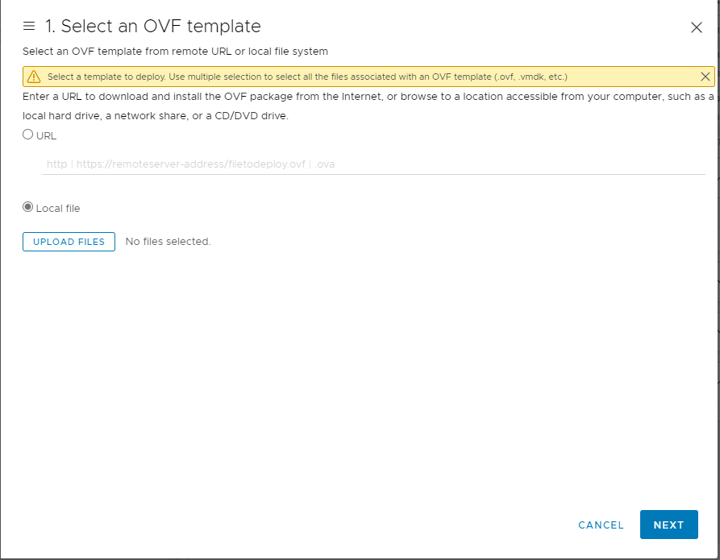{.thumbnail}

Choisissez le `fichier`{.action}, ensuite cliquez sur `Ouvrir`{.action}.

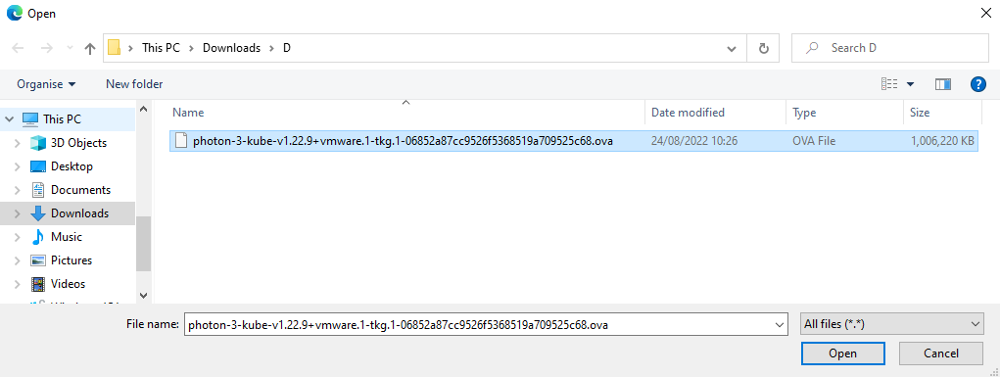{.thumbnail}

Cliquez sur `SUIVANT`{.action}.

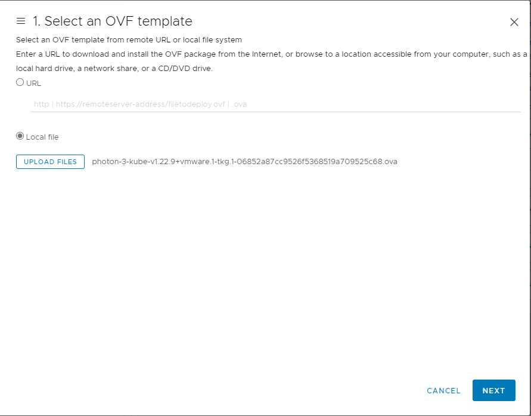{.thumbnail}

Laissez l'emplacement par défaut et cliquez sur `SUIVANT`{.action}.

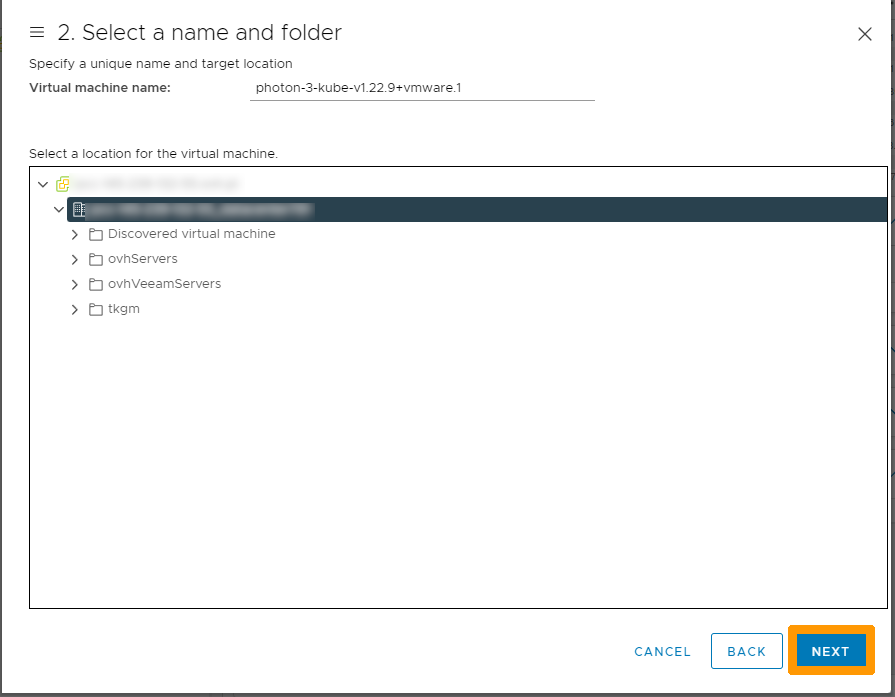{.thumbnail}

Choisissez le cluster et cliquez sur `SUIVANT`{.action}.

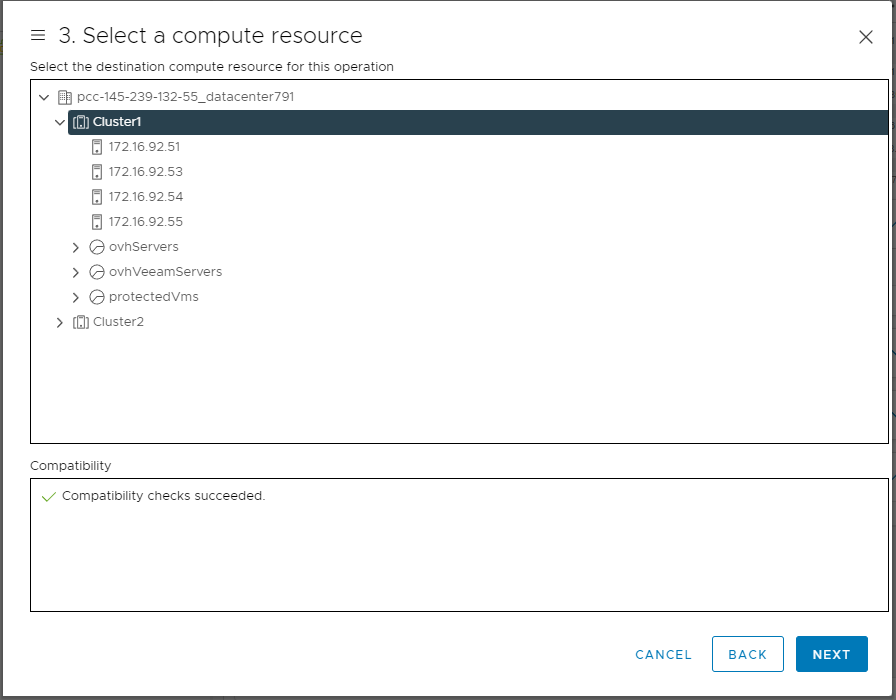{.thumbnail}

Vérifiez vos informations et cliquez sur `SUIVANT`{.action}.

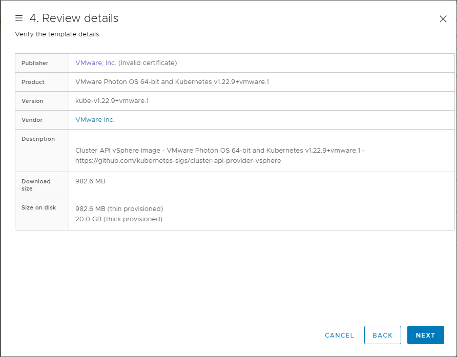{.thumbnail}

Cochez `J'accepte tous les contrats de licence`{.action} et cliquez sur `SUIVANT`{.action}.

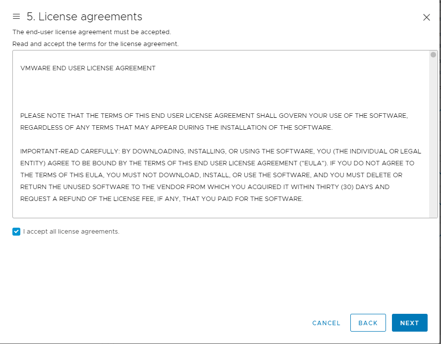{.thumbnail}

Sélectionnez un `Stockage partagé en NFS v3`{.action} ensuite cliquez sur `SUIVANT`{.action}.

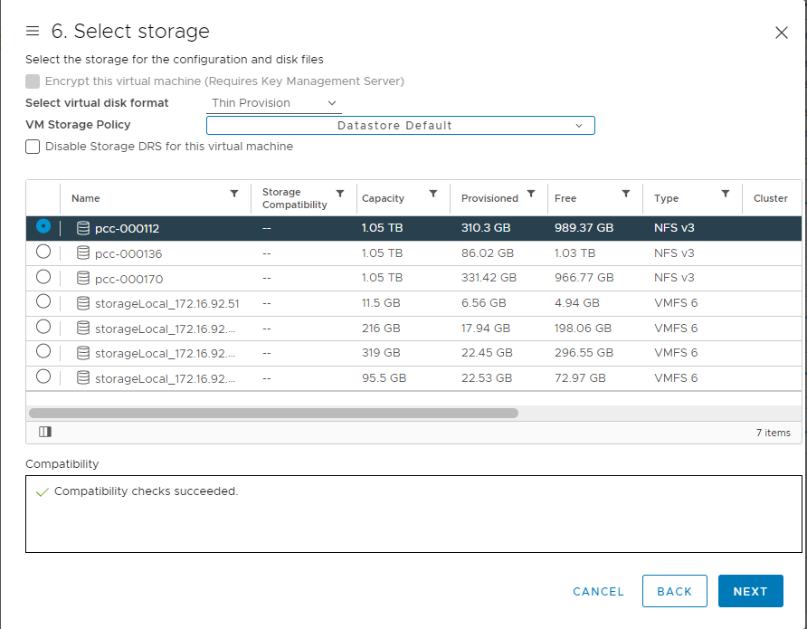{.thumbnail}

Choisissez le réseau de destination sur `VLAN 10`{.action} ensuite cliquez sur `SUIVANT`{.action}.

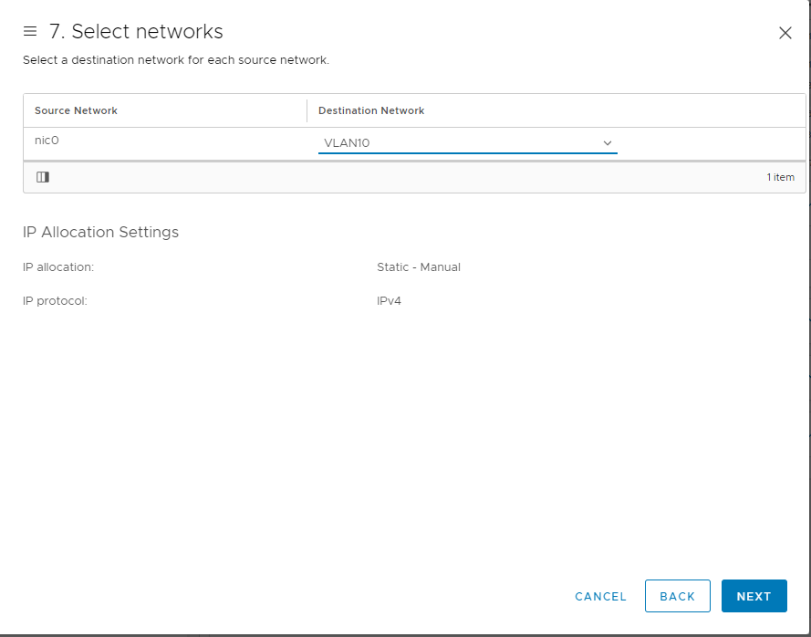{.thumbnail}

Cliquez sur `TERMINER`{.action}.

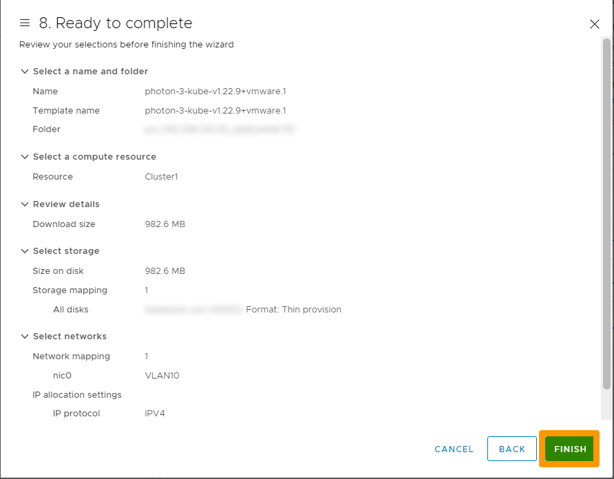{.thumbnail}

Allez sur l'onglet `Surveiller`{.action} et cliquez sur `Tâches`{.action}.

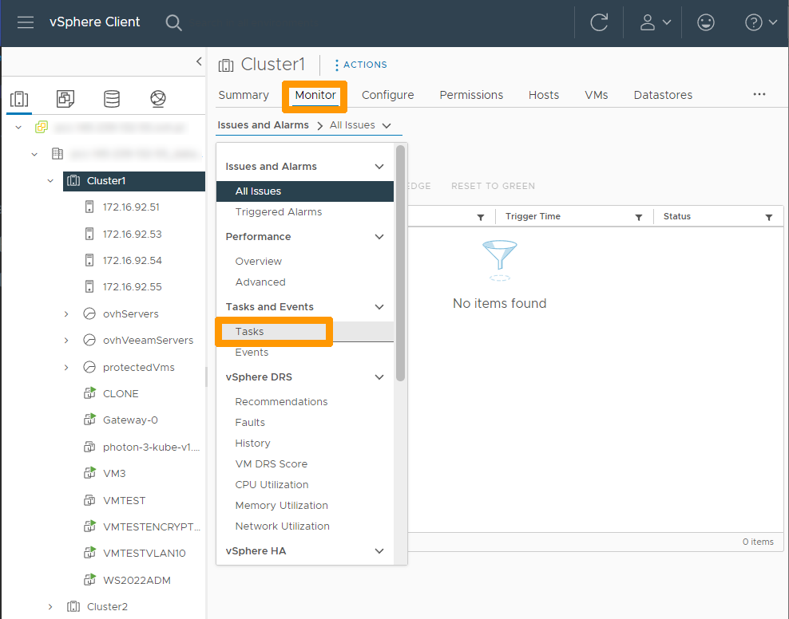{.thumbnail}

Attendez que Les tâches `Déployer un modèle OVF` et `Importer un modèle OVF` soient terminées.

{.thumbnail}

Faites un clic droit sur la `Machine virtuelle déployée`{.action} et choisissez l'option `Convertir au modèle`{.action} depuis le menu `Modèle`{.action}.

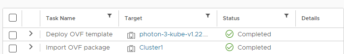{.thumbnail}

Répondez `OUI`{.action} pour convertir la machine virtuelle.

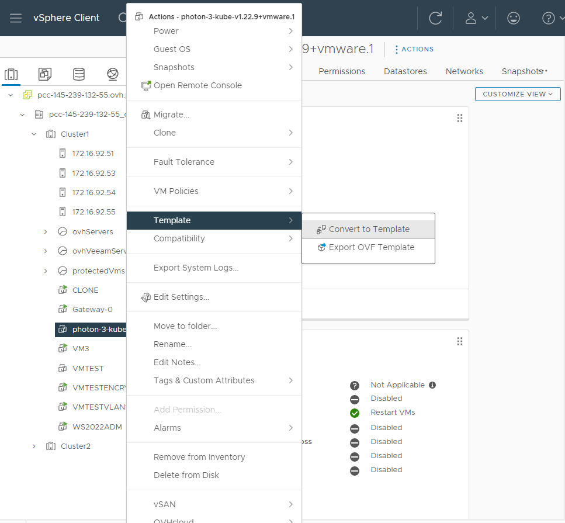{.thumbnail}

Allez dans `Machines virtuelles (et modèles)`{.action} pour voir le modèle créé. Ce modèle sera utilisé lors du déploiement du cluster **Tanzu Kubernetes Grid**.

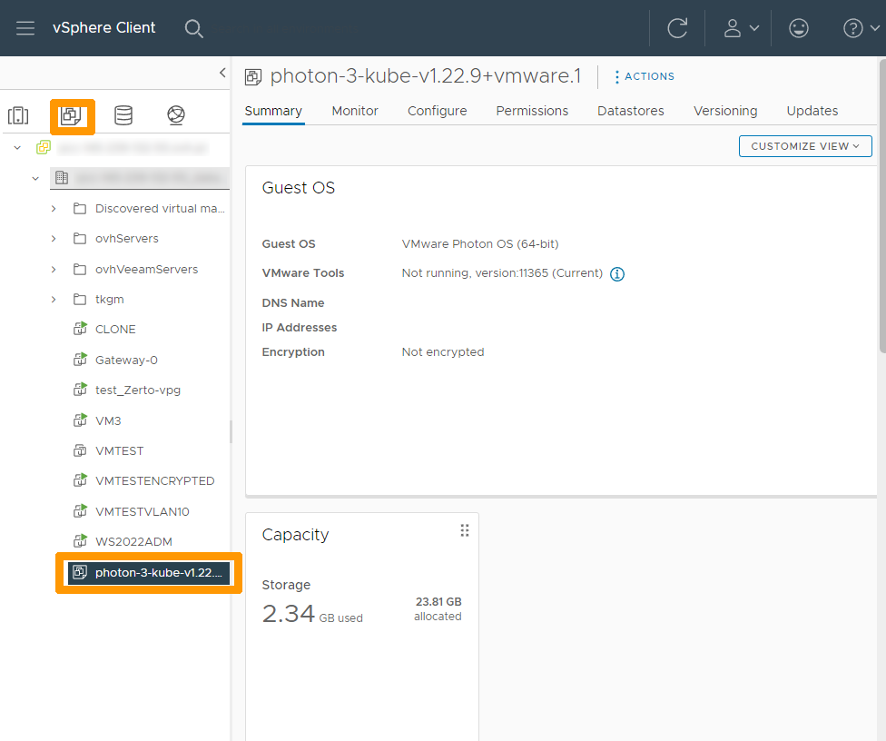{.thumbnail}

### Installation de la machine virtuelle **Bootstrap** fourni par OVHcloud

Suivez ces instructions pour déployer la machine virtuelle **Bootstrap**. 

Cette machine virtuelle a été créée par OVHcloud à partir de cette documentation [Installation manuelle de l'outil CLI pour le déploiement de **Tanzu Kubernetes GRID**](https://docs.vmware.com/en/VMware-Tanzu-Kubernetes-Grid/1.5/vmware-tanzu-kubernetes-grid-15/GUID-install-cli.html)

Télécharger le modèle OVA de cette machine virtuelle à partir de cette adresse [Ubuntu & TKGm with Gnome](https://plik.fromsync.net/file/kHp0z2X3lpTJi3RB/4M3KLcF9nJLT9Emm/Ubuntu-22.04_TKGm-1.5.4_with_x.ova)

Au travers de l'interface vSphere faites un clic droit sur le `cluster`{.action} et choisissez dans le menu `Déployer un modèle OVF`{.action}.

{.thumbnail}

Sélectionnez `Fichier local`{.action} ensuite cliquez sur `TÉLÉCHARGER DES FICHIERS`{.action}.

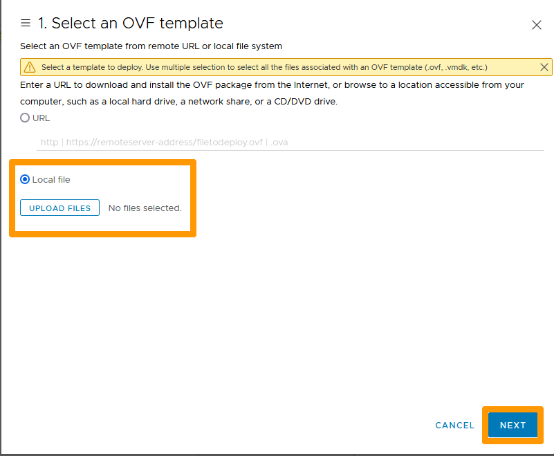{.thumbnail}

Choisissez le `fichier`{.action}, ensuite cliquez sur `Ouvrir`{.action}.

{.thumbnail}

Cliquez sur `SUIVANT`{.action}.

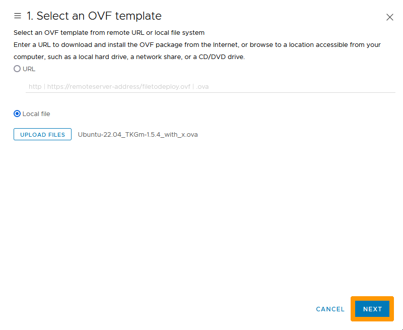{.thumbnail}

Laissez le positionnement par défaut et cliquez sur `SUIVANT`{.action}.

{.thumbnail}

Gardez le cluster1 et cliquez sur `SUIVANT`{.action}.

{.thumbnail}

Cliquez sur `SUIVANT`{.action} pour valider les choix.

{.thumbnail}

Sélectionnez un `Stockage partagé en NFS v3`{.action} et cliquez sur `SUIVANT`{.action}.

{.thumbnail}

Choisissez `VLAN10` pour le réseau de destination et cliquez sur `SUIVANT`{.action}.

{.thumbnail}

Ajoutez ces informations dans **Networking**

* **Hostname** : `bootstrap`
* **IP Address** : `192.168.0.199`
* **Network CIDR Prefix** : `24`
* **Gateway** : `192.168.0.254`
* **Dns** : `1.1.1.1,1.0.0.1`

Saisissez et confirmez le mot de passe dans **OS Credentials** ensuite cliquez sur `SUIVANT`{.action}.

{.thumbnail}

Cliquez sur `TERMINER`{.action}.

{.thumbnail}

Faites un clic droit sur la `Machine virtuelle créée`{.action} allez dans `Alimentation`{.action} et cliquez sur `Mettre sous tension`{.action}.

{.thumbnail}

Positionnez-vous sur la `Machine virtuelle créée`{.action} et cliquez sur `LANCER LA CONSOLE WEB`{.action}.

{.thumbnail}

La console de la machine virtuelle apparait.

{.thumbnail}

### Autorisation d'accès au cluster PCC depuis la machine virtuelle **Bootstrap**

Les outils de configuration et d'administration de **Tanzu Kubernetes Grid** sont installés sur la machine virtuelle nouvellement installée. Cette machine virtuelle doit pouvoir se connecter à Internet et au cluster vSphere.

Notez l'adresse **IP publique** que vous utilisez sur cette machine virtuelle et aidez-vous de ce guide [Autoriser des IP à se connecter au vCenter](https://docs.ovh.com/fr/private-cloud/autoriser-des-ip-a-se-connecter-au-vcenter/) pour donner accès au cluster vSphere depuis la nouvelle machine virtuelle.

### Déploiement du cluster **Tanzu Kubernetes Grid** sur votre infrastructure 

Connectez-vous sur la machine virtuelle `Ubuntu-22.04_TKGm-1.5.4_with_x` ouvrez un terminal et exécutez cette commande pour créer une clé **RSA**.

```bash
ssh-keygen -t rsa -b 4096 -C "youremail@yourdomain.com"
```

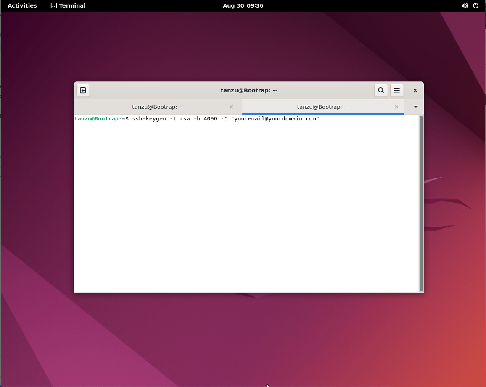{.thumbnail}

Deux fichiers sont créés dans le dossier **~/.ssh** :

* **id_rsa.pub** 
* **id_rsa** 

Restez sur la console et lancer cette commande :

```bash
tanzu management-cluster create --ui --bind 192.168.0.199:8080
```

Le navigateur WEB va se lancer.

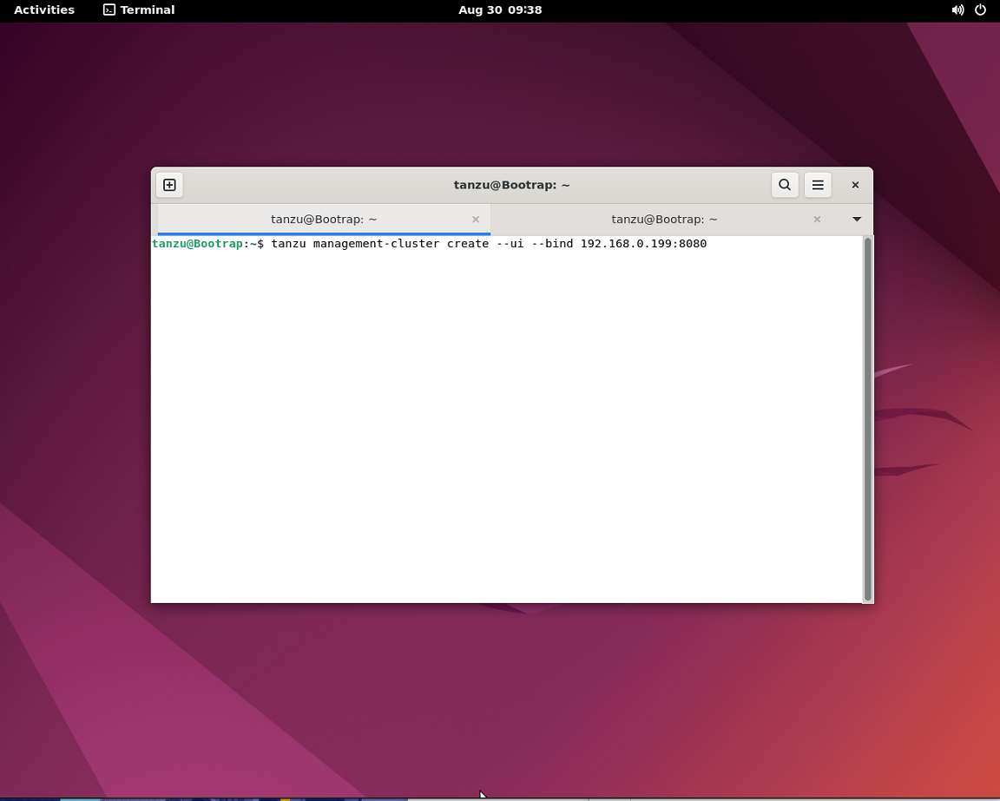{.thumbnail}

En dessous de **VMware vSphere** cliquez sur `Deploy`{.action}

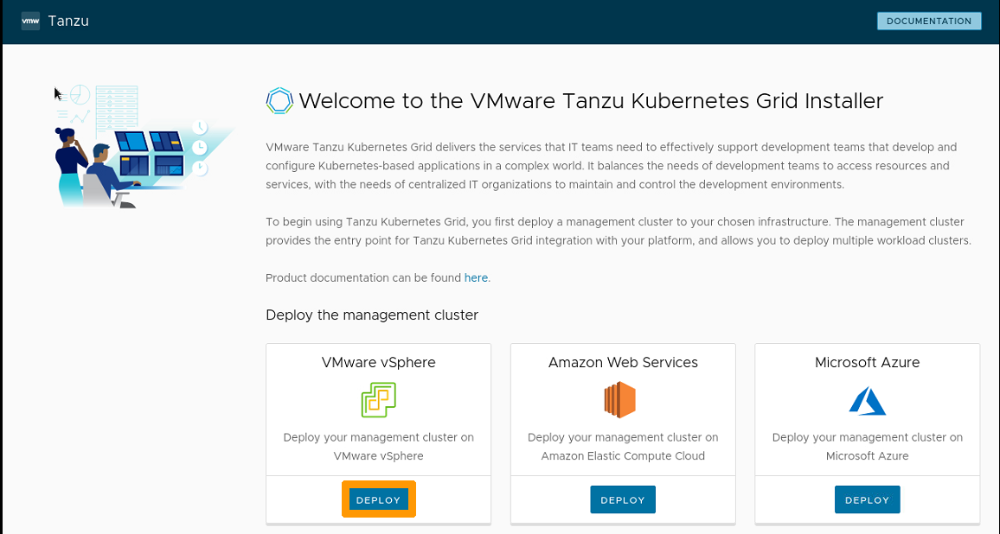{.thumbnail}

Saisissez ces informations 

* **VCENTER SERVER** : `nom FQDN du cluster VMware`.
* **USERNAME** : `utilisateur du cluster VMware`.
* **PASSWORD** : `mot de passe de l'utilisateur du cluster VMware`.

Ensuite cliquez sur `CONNECT`{.action}

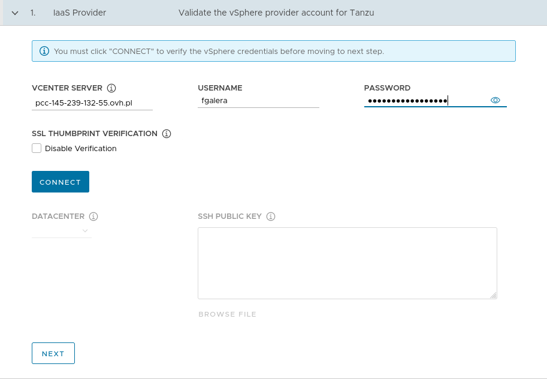{.thumbnail}

Lors de la vérification du **SSL Thumbprint** cliquez sur `CONTINUE`{.action}.

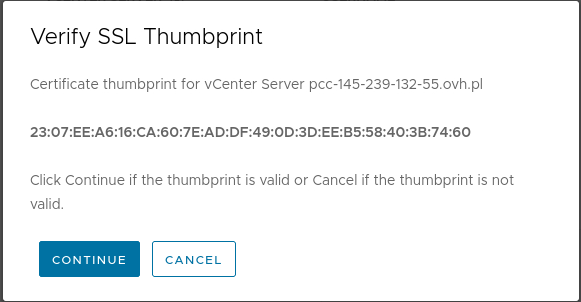{.thumbnail}

Cliquez sur la `croix`{.action} pour fermer la fenêtre **vSphere 7.0.3 Environnement Detected**.

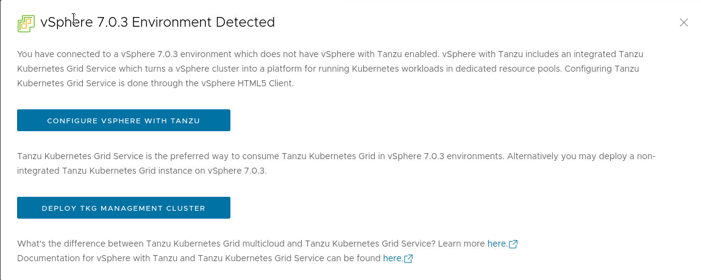{.thumbnail}

Copiez le contenu du fichier **~.ssh/id_rsa.pub** dans **SSH PUBLIC KEY** et cliquez sur `NEXT`{.action}.

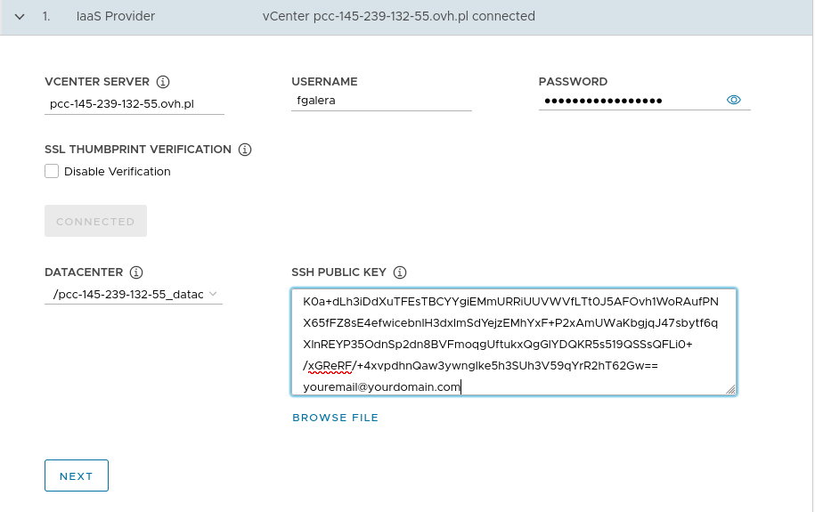{.thumbnail}

Choisissez à droite `Production`{.action}, prenez dans **INSTANCE TYPE** `large etc...`.

Ensuite saisissez ces valeurs :

* **MANAGEMEMENT CLUSTER NAME (OPTIONAL)** : `tkgm-management-cluster`.
* **CONTROL PLANE ENDPOINT** : `192.168.0.10`.

Cliquez sur `NEXT`{.action} pour passer à l'étape suivante.

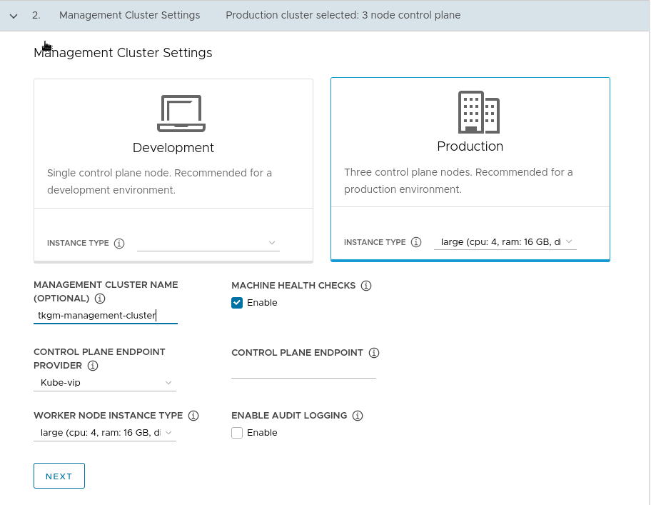{.thumbnail}

Cliquez sur `NEXT`{.action} 

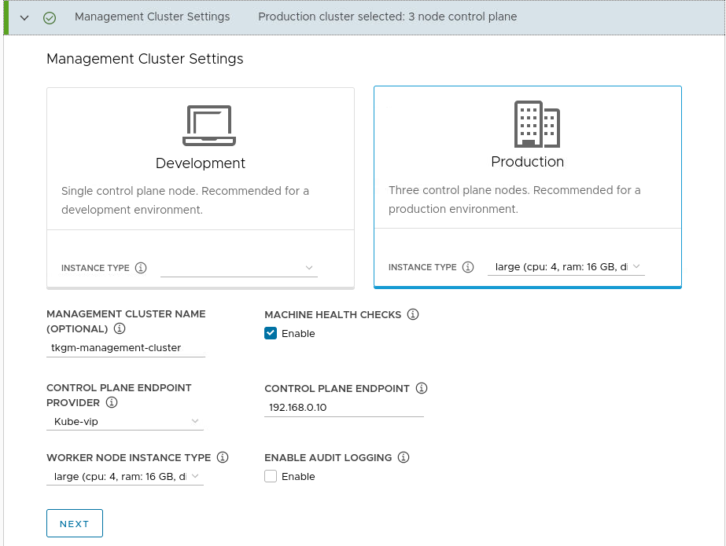{.thumbnail}

Cliquez sur `NEXT`{.action} 

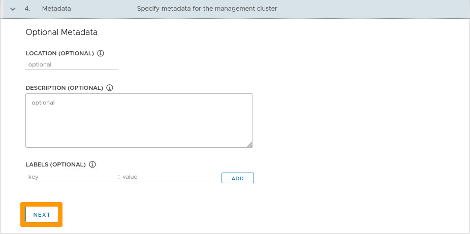{.thumbnail}

Choisissez ces options :

* **VM FOLDER** : `Dossier de rangement des machines virtuelles`.
* **DATASTORE** : `Stockage des machines virtuelles à mettre sur un stockage partagé`.
* **CLUSTERS , HOSTS,  AND RESOURCE POOLS** : `Cluster1`.

Ensuite cliquez sur `NEXT`{.action} 

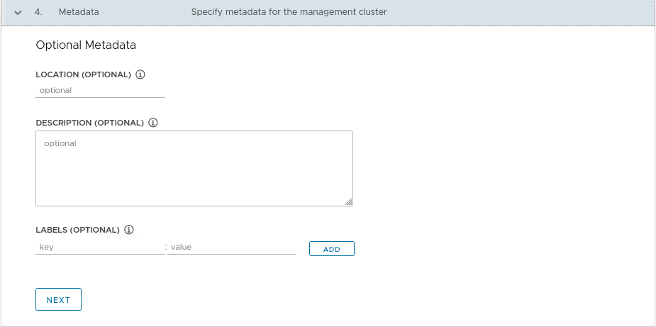{.thumbnail}

Sélectionnez dans **NETWORK NAME** le `VLAN10`{.action}

Ensuite cliquez sur `NEXT`{.action} 

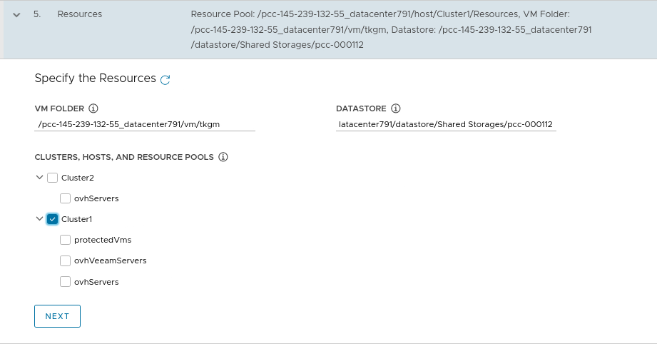{.thumbnail}

Désactivez l'option `Enable Identity Management Settings`{.action} et cliquez sur `NEXT`{.action} 

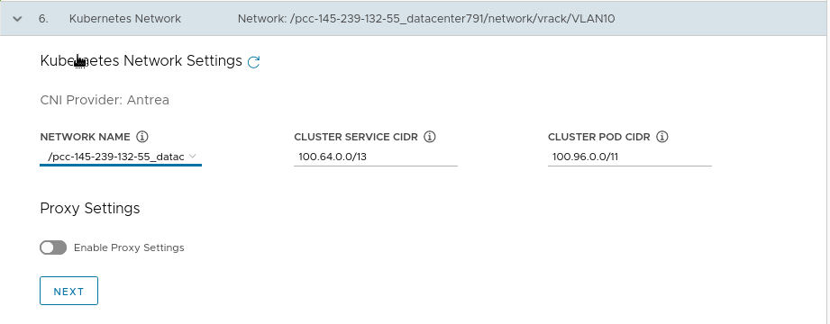{.thumbnail}

Sélectionnez l'image OVA intégrée au cluster `photon-3-kube-v1.22.9+vmware.1dans` **OS Image** et cliquez sur `NEXT`{.action} 

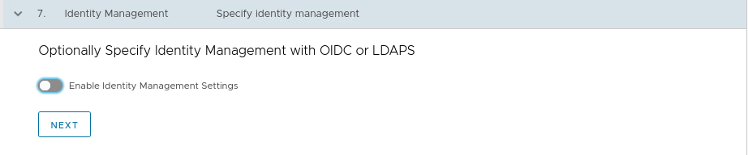{.thumbnail}

Décochez `Participate in the Customer Experience Improvement Program`{.action} et cliquez sur `NEXT`{.action} 

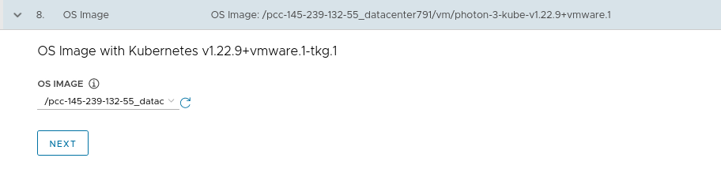{.thumbnail}

Cliquez sur `REVIEW CONFIGURATION`{.action} 

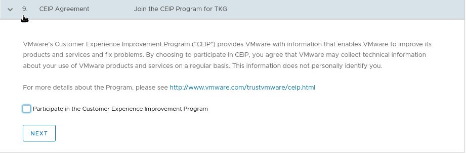{.thumbnail}

> [!primary]
> Notez le nom du fichier yaml qui set trouve en dessous de **CLI Command Equivalent** il servira de modèle pour le deploiement d'un cluster de **WorkLoad**.
>

Vérifiez tous vos paramètres et cliquez sur `DEPLOY MANAGEMENT CLUSTER`{.action} 

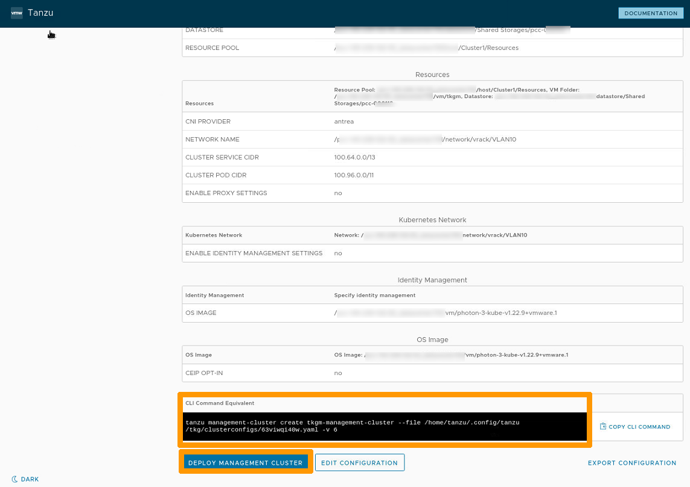{.thumbnail}

Le déploiement du cluster **Tanzu Kubernetes Grid** est lancé veuillez attendre qu'il soit terminé.

{.thumbnail}

Le cluster d'administration est déployé quand toutes les étapes du déploiement sont au vert.

### Déploiement d'un cluster de **WORKLOAD**

Maintenant que le cluster d'administration est installé il faut déployer un cluster de *Workload** qui contiendra les applications KUBERNETES.

copiez le fichier qui a servi pour la creation du cluster d'administration dans un fichier nommé tkg-workload-cluster.yaml.

```bash
cp ~/.config/tanzu/tkg/clusterconfigs/tkgmfile.yaml ~/tkg-workload-cluster.yaml
```

Modifiez le contenu du fichier **~/tkg-workload-cluster.yaml** avec ces valeurs :

```yaml
CLUSTER_NAME: tkg-workload-cluster
VSPHERE_CONTROL_PLANE_ENDPOINT: 192.168.0.11
```

Lancez cette commande

```bash
tanzu cluster create --file tkg-workload-cluster.yaml
```

### Installation du Load-Balancer

### Installation d'une application

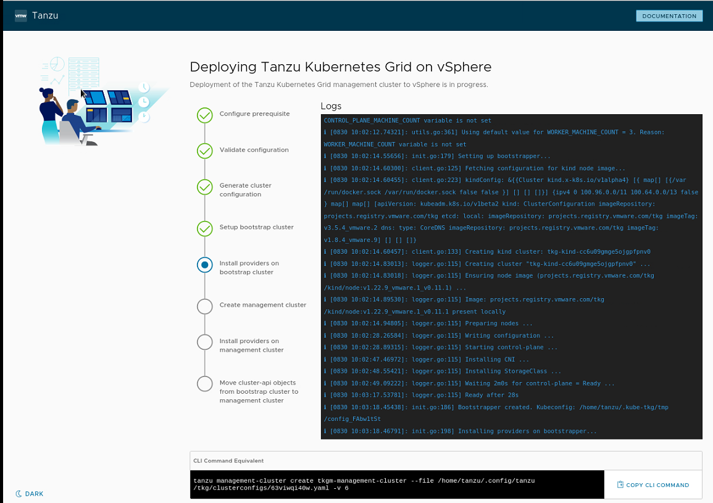{.thumbnail}

## Aller plus loin

[Présentation de VMware Tanzu Kubernetes Grid](https://tanzu.vmware.com/kubernetes-grid)

[Documentation de VMware Tanzu Kubenetes Grid](https://https://docs.vmware.com/en/VMware-Tanzu-Kubernetes-Grid/index.html)

[Installation manuelle de l'outil CLI pour le déploiement de Tanzu Kubernetes GRID](https://docs.vmware.com/en/VMware-Tanzu-Kubernetes-Grid/1.5/vmware-tanzu-kubernetes-grid-15/GUID-install-cli.html)

Échangez avec notre communauté d'utilisateurs sur <https://community.ovh.com>.

