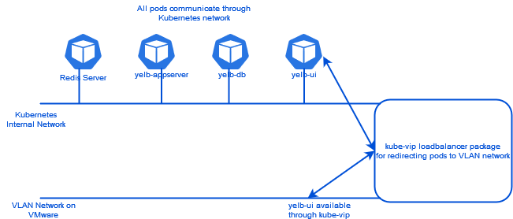

**Last updated 15th November 2022**

## Objective

**This guide introduces Tanzu Kubernetes Grid and the possibilities for its integration into your Hosted Private Cloud powered by VMware solution.**

> [!warning]
> OVHcloud provides services for which you are responsible, with regard to their configuration and management. It is therefore your responsibility to ensure that they work properly.
>
> This guide is designed to assist you as much as possible with common tasks. However, we recommend contacting a [specialist provider](https://partner.ovhcloud.com/en-gb/) if you experience any difficulties or doubts when it comes to managing, using or setting up a service on a server.
>

## Requirements

- Being an administrative contact of your [Hosted Private Cloud infrastructure](https://www.ovhcloud.com/en-gb/enterprise/products/hosted-private-cloud/) to receive login credentials
- A user account with access to the [OVHcloud Control Panel](https://www.ovh.com/auth/?action=gotomanager&from=https://www.ovh.co.uk/&ovhSubsidiary=GB)
- A user account with access to vSphere

## Step-by-step introduction to the Tanzu Kubernetes Grid solution

VMware Tanzu Kubernetes Grid is a Kubernetes platform provided by **VMware** and maintained as part of the **Hosted Private Cloud powered by VMware** solution.

You can deploy this product on your OVHcloud infrastructure to take advantage of its features and scalability.

Tanzu Kubernetes Grid enables you to deploy and manage one or more Kubernetes clusters within your VMware infrastructure. The administration tool for these clusters is itself based on Kubernetes.

### Initial installation of Tanzu Kubernetes Grid

Please refer to the [Install Tanzu Kubernetes Grid](https://docs.ovh.com/gb/en/private-cloud/tanzu-tkgm-installation) documentation for installation.

Running **Tanzu Kubernetes Grid** on the VMware cluster requires six new virtual machines to run the management cluster. Another virtual machine is required for administration, this virtual machine is provided by OVHcloud and is called **Bootstrap**. 

{.thumbnail}

> [!warning]
>
> The management cluster must be used exclusively for **Tanzu Kubernetes Grid** administration.
>

### Deploying a *Workload* cluster and installing an application

To deploy an application, you need to create *WorkLoad* clusters that are dedicated to applications.

All *WorkLoad* clusters are independent from one another, which means you can have different versions of Kubernetes on each of these *Workload* clusters.

When installing **Tanzu Kubernetes Grid**, we chose **kube-vip** for interconnections between a *Workload* cluster and the VMware cluster network. You can also use the **Nsx Advanced Load Balancer**.

Read the [Managing Tanzu Kubernete Grid](https://docs.ovh.com/gb/en/private-cloud/tanzu-tkgm-installation) guide to deploy a *Workload* cluster and application. 

For each new *WorkLoad* cluster installed in production mode, six new virtual machines are added to your VMware infrastructure.

{.thumbnail}

An application can consist of multiple **pods** that communicate with each other through the internal network of the *workload* cluster. Some ports are opened on the **VMware** cluster network using the **kube-vip** module.

{.thumbnail}

### Managing persistent volumes

By default, when stopping a **pod** of if it crashes, the data in that **pod** is lost. To store data permanently, you need to create persistent volumes and associate them with applications.

Persistent volumes are stored by default on VMware storage (vSAN or NFS) that was used for the *WorkLoad* cluster deployment, using VMware APIs (vSphere Cloud Native Storage).

You can create **Custom Storage Classes** to define another location.

Read the [Managing Persistent Volumes in Tanzu Kubernetes Grid](https://docs.ovh.com/gb/en/private-cloud/tanzu-tkgm-persistent-volumes) guide to add an application that uses an external persistent volume.

### Application backup 

Various backup solutions compatible with **Tanzu Kubernetes Grid** exist, including **Kasten** from **Veeam**.

## Go further

[Installing a Tanzu Kubernetes GRID cluster](https://docs.ovh.com/gb/en/private-cloud/tanzu-tkgm-installation)

[Managing a Tanzu Kubernetes GRID cluster](https://docs.ovh.com/gb/en/private-cloud/tanzu-tkgm-management)

[Managing volumes on a Tanzu Kubernetes GRID cluster](https://docs.ovh.com/gb/en/private-cloud/tanzu-tkgm-persistent-volumes)

[Introducing VMware Tanzu Kubernetes Grid](https://tanzu.vmware.com/kubernetes-grid)

[VMware Tanzu Kubenetes Grid documentation](https://docs.vmware.com/en/VMware-Tanzu-Kubernetes-Grid/index.html)

[Manual installation of the CLI tool for the deployment of Tanzu Kubernetes GRID](https://docs.vmware.com/en/VMware-Tanzu-Kubernetes-Grid/1.5/vmware-tanzu-kubernetes-grid-15/GUID-install-cli.html)

Join our community of users on <https://community.ovh.com/en/>.
