**Last updated 10th November 2022**

## Objective

**This guide documents how to install Tanzu Kubernetes Grid on your Hosted Private Cloud powered by VMware cluster**

> [!warning]
> OVHcloud provides services for which you are responsible, with regard to their configuration and management. It is therefore your responsibility to ensure that they work properly.
>
> This guide is designed to assist you as much as possible with common tasks. However, we recommend contacting a [specialist provider](https://partner.ovhcloud.com/en-gb/) if you experience any difficulties or doubts when it comes to managing, using or setting up a service on a server.
>

## Introduction

VMware Tanzu Kubernetes Grid is a Kubernetes platform provided by **VMware** and maintained as part of the **Hosted Private Cloud powered by VMware** solution.

You can install this product on your OVHcloud infrastructure to take advantage of its features and scalability.

## Requirements

- Being an administrative contact of your [Hosted Private Cloud infrastructure](https://www.ovhcloud.com/it/enterprise/products/hosted-private-cloud/) to receive login credentials
- A user account with access to the [OVHcloud Control Panel](https://www.ovh.com/auth/?action=gotomanager&from=https://www.ovh.it/&ovhSubsidiary=it)
- A user account with access to vSphere
- A VLAN with internet access and a DHCP server
- You must have these resources:
    - 8 GB of memory, 4 vCPUs, and 250 GB of storage for the management virtual machine named **Bootstrap**.
    - 16 GB of memory, 4 vCPU, 40 GB of storage per Kubernetes node (it takes 6 nodes to install the management cluster in production mode and 6 nodes per **Workload** cluster in the same mode).

## Instructions

We will install **VMware Tanzu Kubernetes Grid** on a **Hosted Private Cloud powered by VMware** cluster and use VLAN 10 with these settings:

- **LAN**: `192.168.0.0/24`.
- **DHCP Range**: `192.168.0.50 -> 192.168.0.100`.
- **Gateway**: `192.168.0.254`.

> [!primary]
> This information is given as an example, it is quite possible to use another range and another VLAN.
>

At the end of the installation, seven additional virtual machines will be on your VMware cluster, six for running the **TKG** management cluster and one for managing it.

{.thumbnail}

### Importing OVA model for **Tanzu KUBERNETES Grid** into your infrastructure

VMware provides a virtual machine as an OVA template, which contains all the elements to run a node of the **Tanzu Kubernetes Grid** cluster. This virtual machine is available in **OVH Templates**.

Log in to the OVHcloud homepage for your VMware cluster, and click `OVH Templates`{.action} to the right.

{.thumbnail}

In the **Select a template** window, choose the fourth template from the top that has this information:

- **Family**: Linux
- **Distribution**: not specified
- **Version**: 3

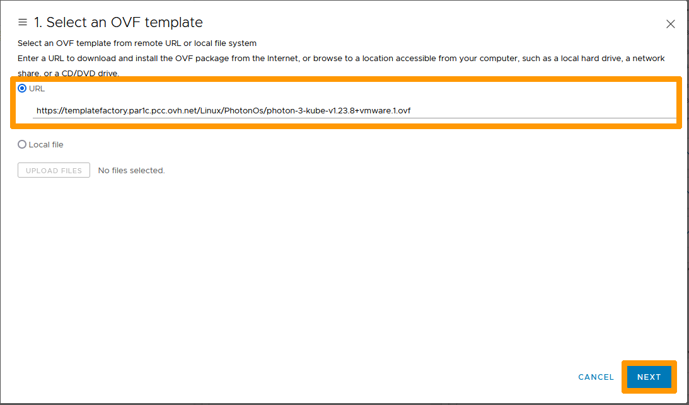{.thumbnail}

Click the `Copy`{.action} icon to the right to copy the URL which name must end in **photon-3-kube-v1.23.8+vmware.1.ovf**. Then click `Close`{.action}.

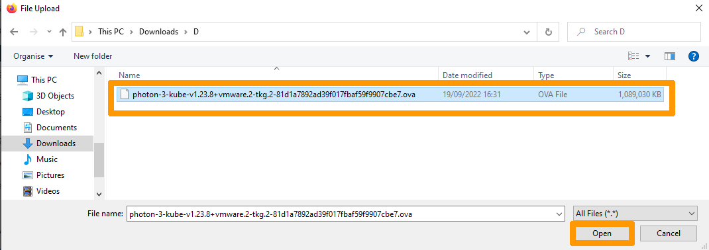{.thumbnail}

Log in to your vSphere console, right-click your cluster and choose `Deploy an OVF Template`{.action}.

{.thumbnail}

Select `URL`{.action}, paste the previously copied URL and click `NEXT`{.action}.

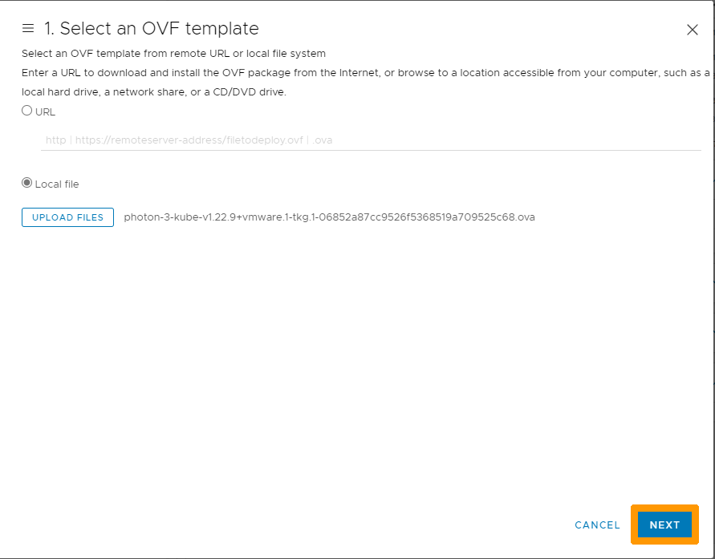{.thumbnail}

Leave the default location and click `NEXT`{.action}.

{.thumbnail}

Choose the cluster and click `NEXT`{.action}.

{.thumbnail}

Review your information and click `NEXT`{.action}.

{.thumbnail}

Check `I accept all licence agreements`{.action} and click `NEXT`{.action}.

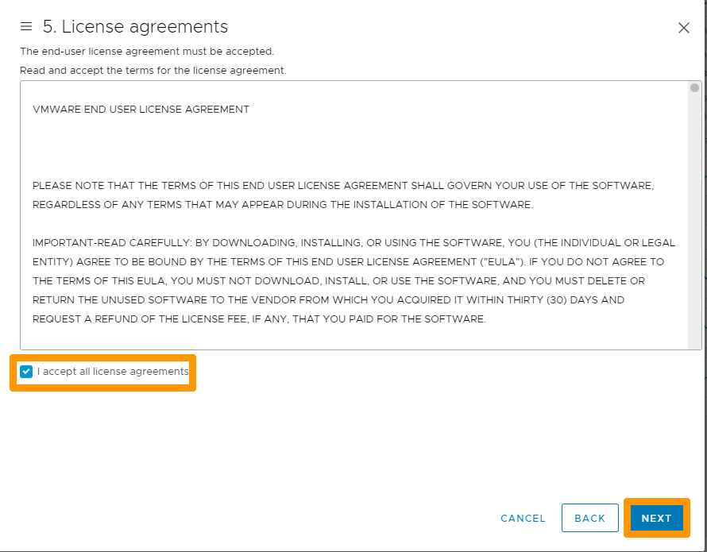{.thumbnail}

Select a shared storage in NFS v3, then click `NEXT`{.action}.

{.thumbnail}

Choose the destination network on `VLAN 10`{.action} and click `NEXT`{.action}.

{.thumbnail}

Click `FINISH`{.action}.

{.thumbnail}

Select the `Monitor`{.action} tab and click `Tasks`{.action}.

{.thumbnail}

Wait for the `Deploy OVF template` and `Import OVF package` tasks to complete.

{.thumbnail}

Right-click the deployed VM and choose `Convert to Template`{.action} from the `Template`{.action} menu.

{.thumbnail}

Answer `YES`{.action} to convert the virtual machine.

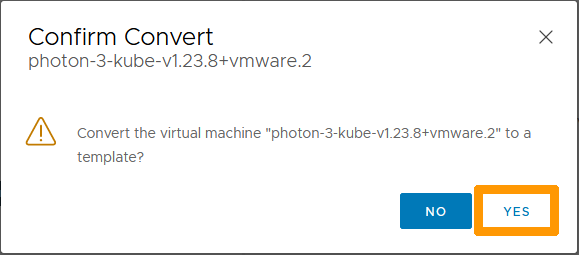{.thumbnail}

Go to `Virtual Machines (and templates)`{.action} to see the template you have created.

> [!primary]
>
> This template will be used when deploying **Tanzu Kubernetes Grid** clusters. It is used for the initial deployment of the administration cluster and for the installation of additional *WorkLoad* clusters. It should not be deleted from the **VMware** cluster.
>

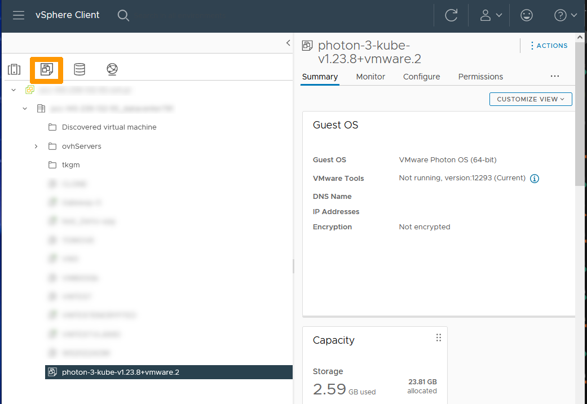{.thumbnail}

### Installation of the virtual machine **Bootstrap** provided by OVHcloud

This virtual machine was created by OVHcloud from the documentation [Installing the CLI tool manually for deploying **Tanzu Kubernetes GRID**](https://docs.vmware.com/en/VMware-Tanzu-Kubernetes-Grid/1.5/vmware-tanzu-kubernetes-grid-15/GUID-install-cli.html). It is available as a template in **OVH Templates**.

Log in to the OVHcloud homepage for your VMware cluster, and click `OVH Templates`{.action} to the right.

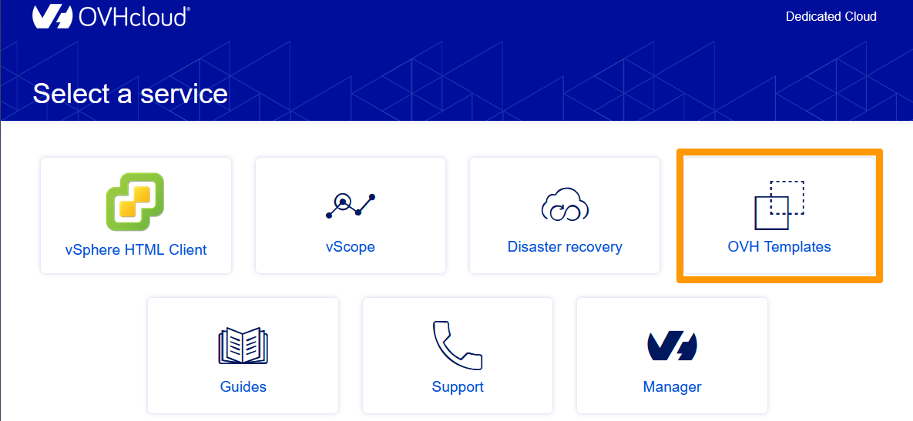{.thumbnail}

In the **Select a template** window, choose the third template from the top that contains this information:

- **Family**: Linux
- **Distribution**: Ubuntu
- **Version**: 22

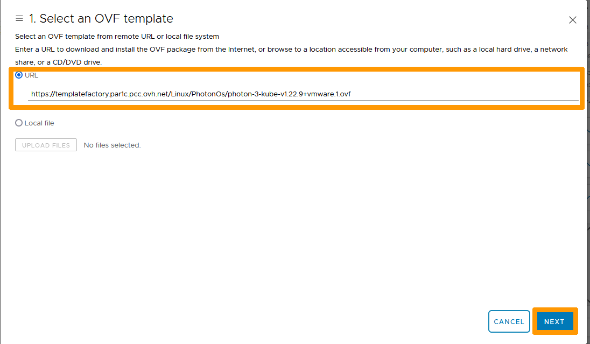{.thumbnail}

Click the `Copy`{.action} icon to the right to copy the URL, the URL should end with **Ubuntu-22.04_TKGm-1.6_with_x.ovf**. Then click `Close`{.action}.

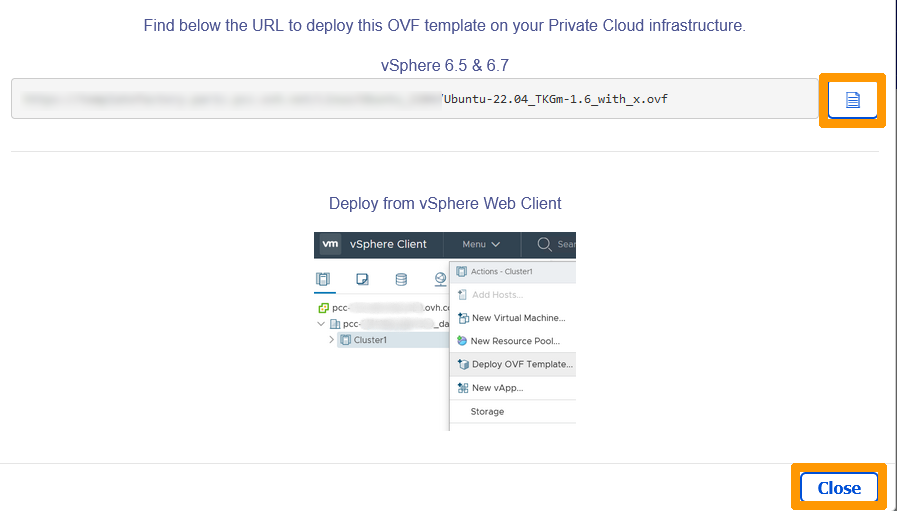{.thumbnail}

In the vSphere interface, right-click the cluster and choose `Deploy an OVF Template`{.action} from the menu.

{.thumbnail}

Select `URL`{.action}, paste the previously copied URL and click `NEXT`{.action}.

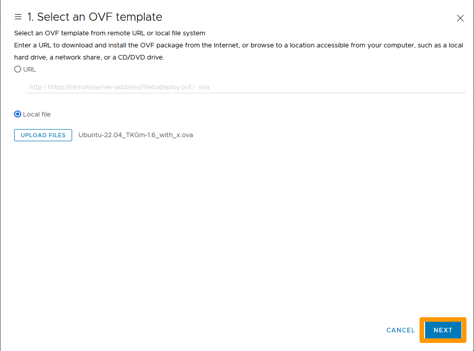{.thumbnail}

Leave the default positioning and click `NEXT`{.action}.

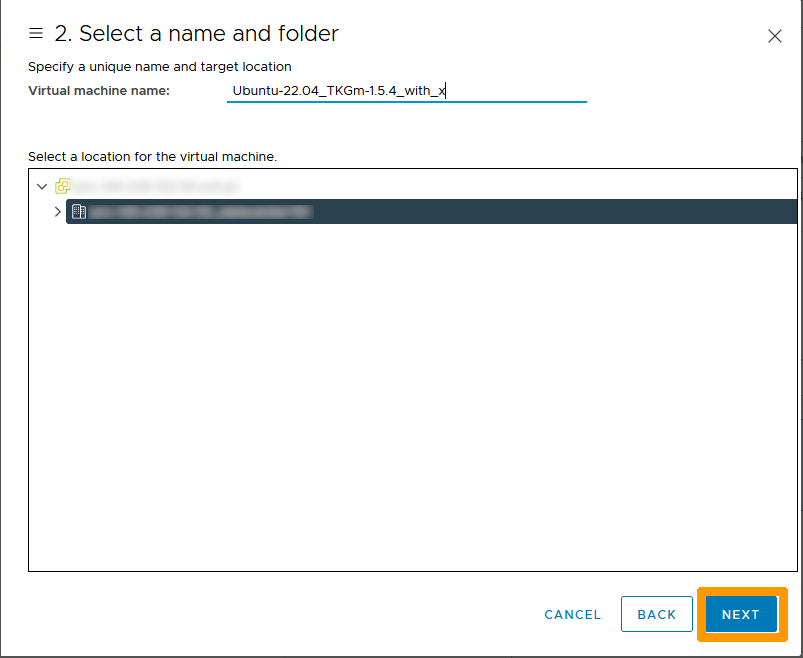{.thumbnail}

Leave `Cluster1` and click `NEXT`{.action}.

{.thumbnail}

Click `NEXT`{.action} to validate your choices.

{.thumbnail}

Select a shared storage in NFS v3 and click `NEXT`{.action}.

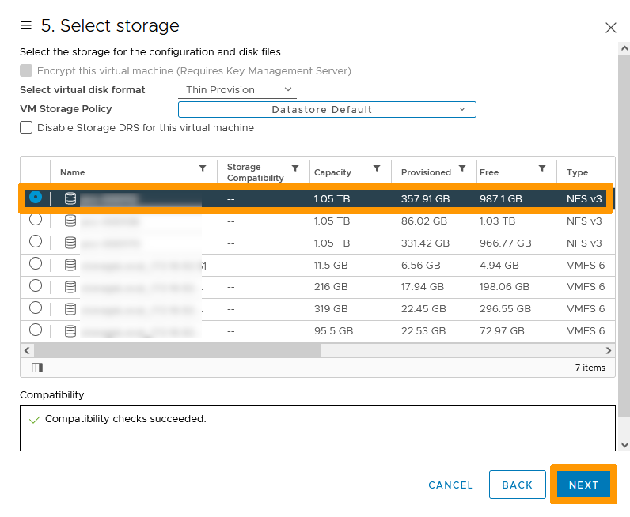{.thumbnail}

Choose `VLAN10` for the destination network and click `NEXT`{.action}.

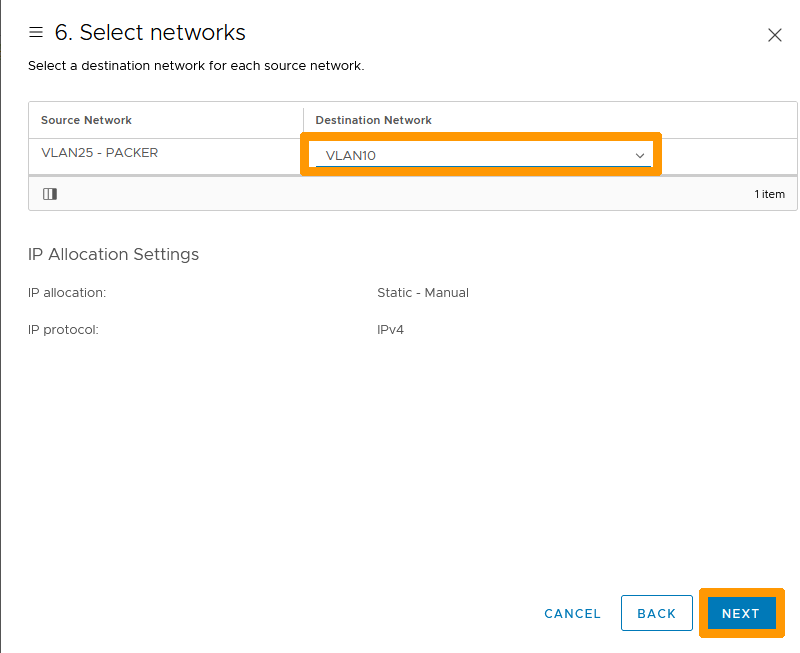{.thumbnail}

Add this information in **Networking**:

- **Hostname**: `bootstrap`
- **IP Address**: `192.168.0.199`
- **Network CIDR Prefix**: `24`
- **Gateway**: `192.168.0.254`
- **DNS**: `213.186.33.99`

> [!primary]
>
> The DNS server chosen in this guide is the OVHcloud server.
>

Enter and confirm the password in **OS Credentials** and click `NEXT`{.action}.

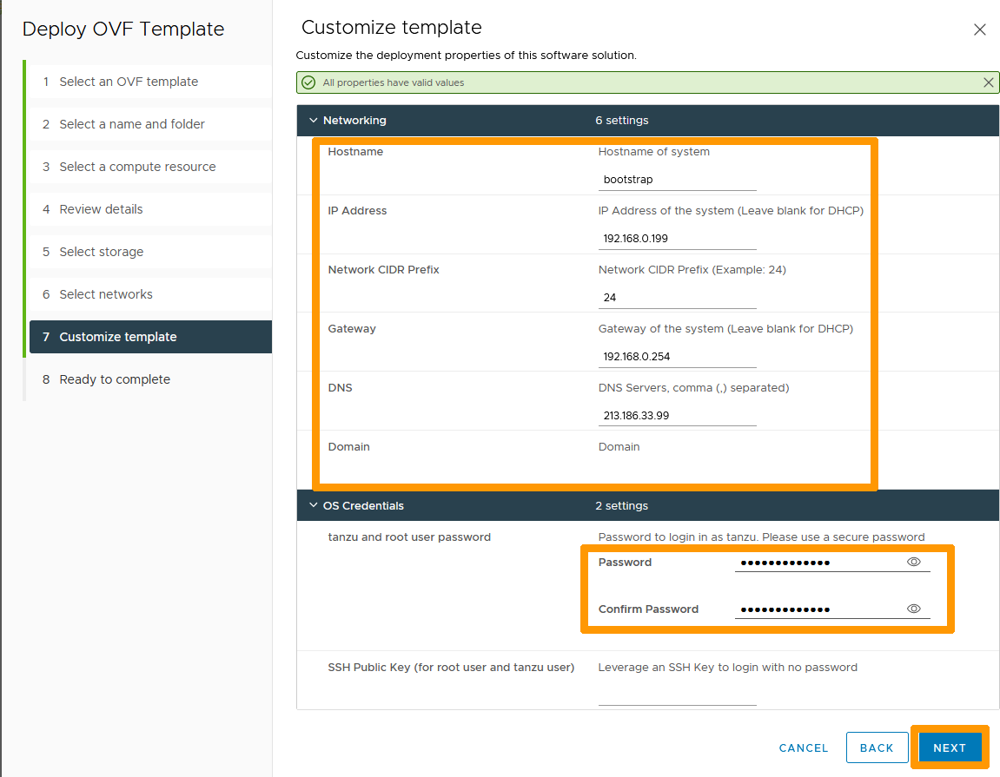{.thumbnail}

Click `FINISH`{.action}.

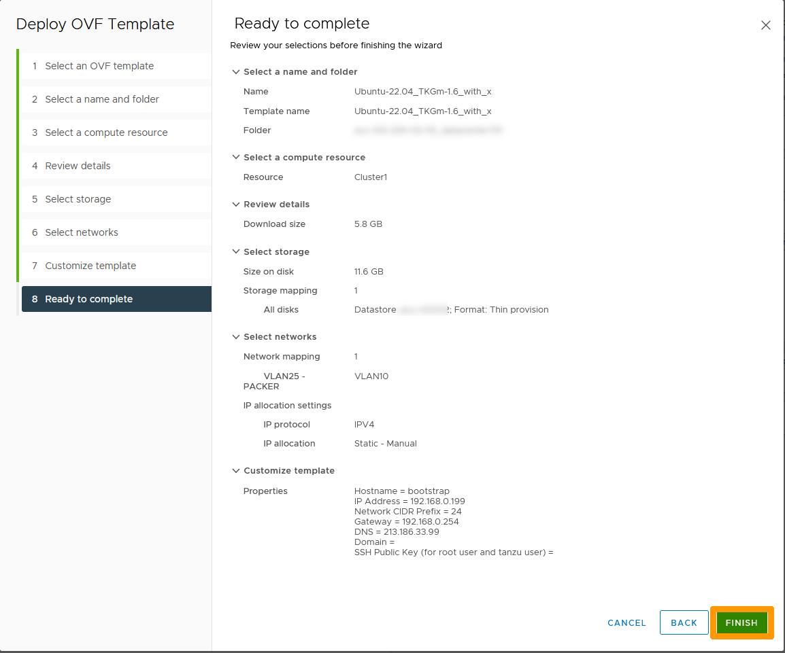{.thumbnail}

Right-click the virtual machine you created, go to `Power`{.action} and click `Power On`{.action}.

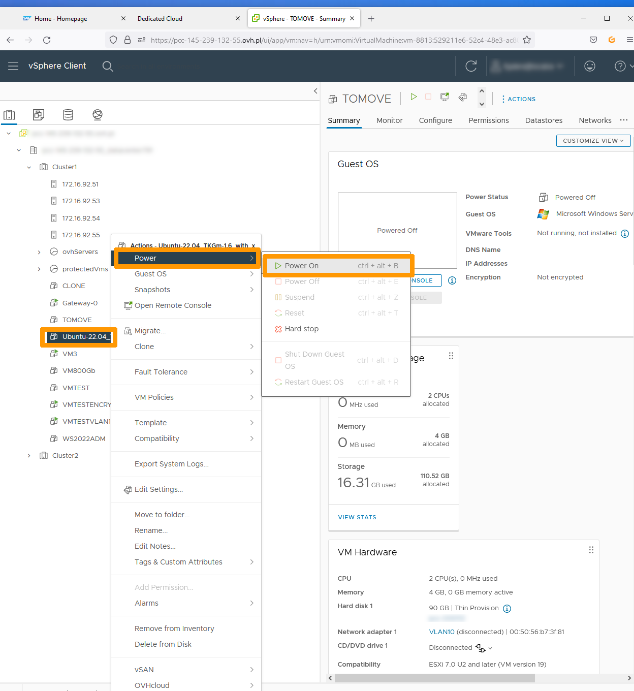{.thumbnail}

The booted virtual machine can be accessed via the console with the graphical interface or via **SSH**.

Go to the virtual machine you have created, and click `LAUNCH WEB CONSOLE`{.action}.

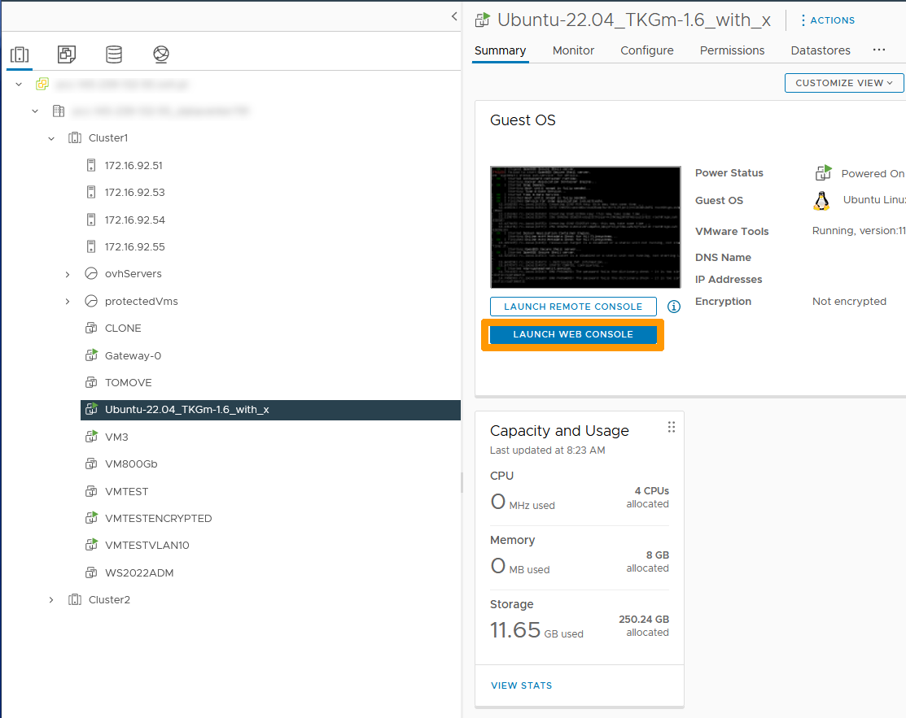{.thumbnail}

The graphical interface for the Linux virtual machine is then available.

{.thumbnail}

### Allowing access to the PCC cluster from the **Bootstrap** virtual machine

The configuration and administration tools for **Tanzu Kubernetes Grid** are installed on the **Bootstrap** virtual machine. This virtual machine must be able to connect to the Internet and to the vSphere cluster.

Write down **the public IP address** you use on this virtual machine and use this guide [Authorise IP addresses to connect to vCenter](https://docs.ovh.com/it/private-cloud/autorizzare-ip-ad-accedere-al-vcenter/) to grant access to the vSphere cluster to the new virtual machine.

### Deploying the **Tanzu Kubernetes Grid** cluster on your infrastructure 

Log in to the `Ubuntu-22.04_TKGm-1.5.4_with_x` virtual machine, open a terminal, and run this command to create an **RSA** key:

```bash
ssh-keygen -t rsa -b 4096 -C "youremail@yourdomain.com"
```

{.thumbnail}

Two files are created in the **~/.ssh** folder:

- **id_rsa.pub** 
- **id_rsa** 

Stay on the console and run this command:

```bash
tanzu management-cluster create --ui --bind 192.168.0.199:8080
```

> [!primary]
>
> When you run this command from the Linux console with the graphical interface, the web browser launches and connects to `https://192.168.0.199:8080`. If you have run this command from an **SSH** connection, you will need to connect to `https://192.168.0.199:8080` from a virtual machine on the same network with a graphical interface and an operational web browser.
>

{.thumbnail}

Click `Deploy`{.action} below **VMware vSphere**.

{.thumbnail}

Enter this information:

- **VCENTER SERVER**: `VMware cluster FQDN`
- **USERNAME**: `VMware cluster user`
- **PASSWORD**: `VMware cluster user password`

Then click `CONNECT`{.action}.

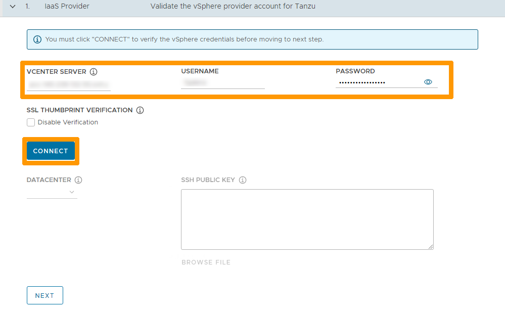{.thumbnail}

At the verification step of the **SSL Thumbprint**, click `CONTINUE`{.action}.

{.thumbnail}

Click the cross in the top right to close the **vSphere 7.0.3 Environment Detected** window.

{.thumbnail}

Paste the contents of the **~.ssh/id_rsa.pub** file into **SSH PUBLIC KEY** and click `NEXT`{.action}.

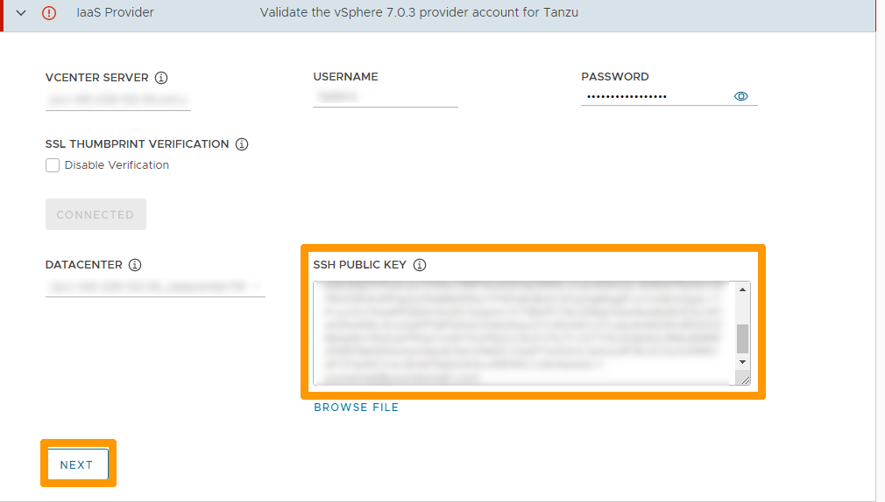{.thumbnail}

Select `Production`{.action} on the right and select the `large etc...` **INSTANCE TYPE**.

Enter these values:

- **MANAGEMENT CLUSTER NAME (OPTIONAL)**: `tkgm-management-cluster`.
- **CONTROL PLANE ENDPOINT**: `192.168.0.10`.

Click `NEXT`{.action} to proceed to the next step.

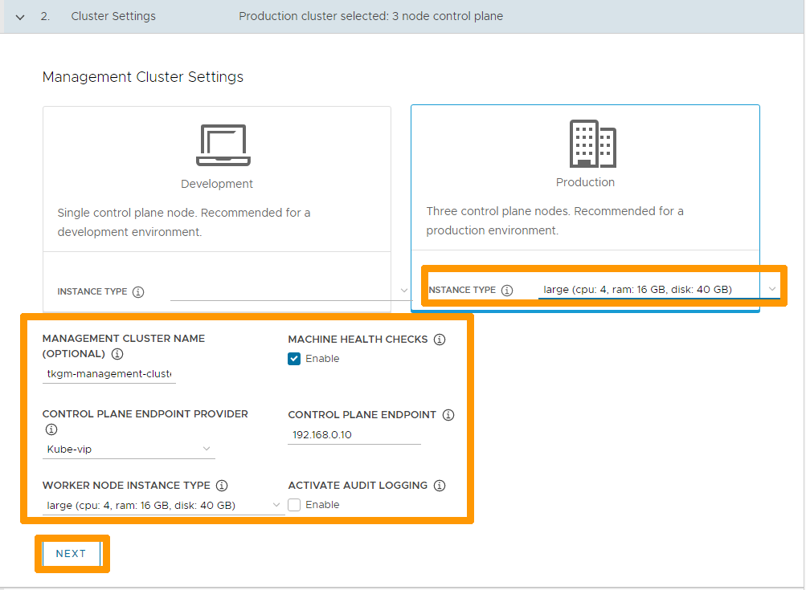{.thumbnail}

Click `NEXT`{.action}.

{.thumbnail}

In the **Metadata** option and then in the **LABELS (OPTIONAL)** section, type `tkgm` for the name and its value.

Click `NEXT`{.action}.

{.thumbnail}

Enter these options:

- **VM FOLDER**: `Storage folder for virtual machines`.
- **DATASTORE**: `Storage of virtual machines to be placed on a shared storage` .
- **CLUSTERS, HOSTS, AND RESOURCE POOLS**: `Cluster1`.

Click `NEXT`{.action}.

{.thumbnail}

In **NETWORK NAME** select `VLAN10`{.action}.

Click `NEXT`{.action}.

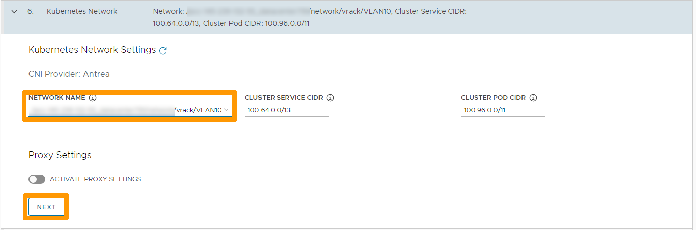{.thumbnail}

Disable the `Activate Identity Management Settings`{.action} option and click `NEXT`{.action}. 

{.thumbnail}

Select the OVA image integrated into the `photon-3-kube-v1.22.9+vmware.1` cluster from the **OS Image** menu and click `NEXT`{.action}.

{.thumbnail}

Uncheck `Participate in the Customer Experience Improvement Program`{.action} and click `NEXT`{.action}.

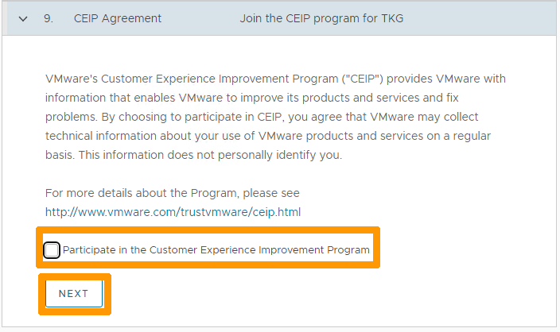{.thumbnail}

Click `REVIEW CONFIGURATION`{.action}.

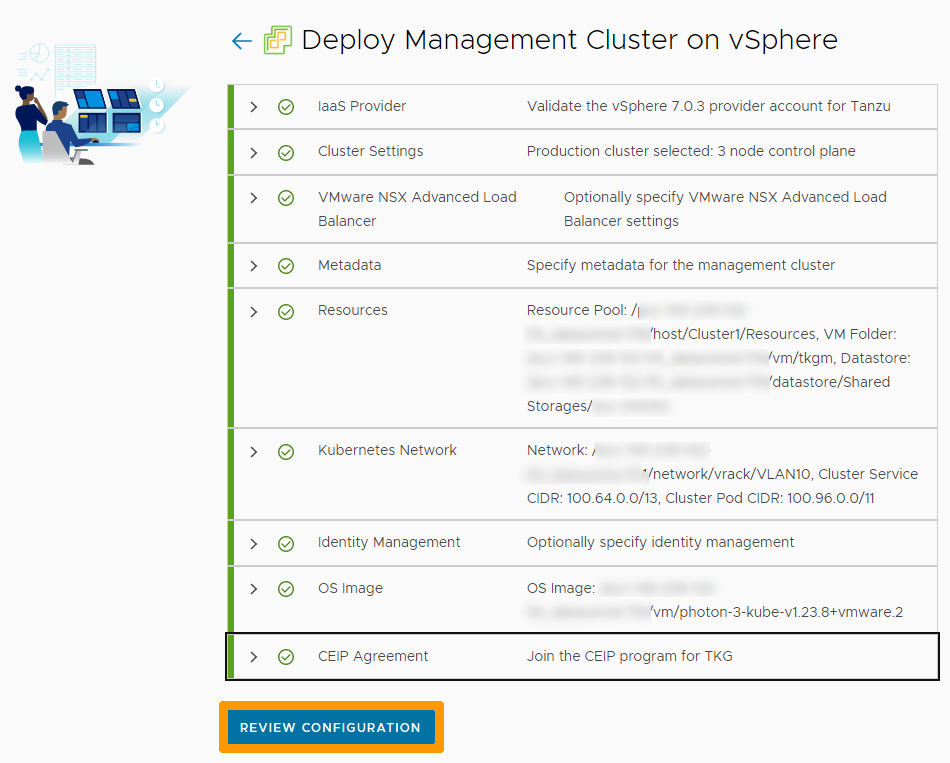{.thumbnail}

> [!primary]
> Take note of the name of the yaml file below **CLI Command Equivalent**, it will serve as a template for deploying a **WorkLoad** cluster.
>

Scroll through the window and click `DEPLOY MANAGEMENT CLUSTER`{.action} 

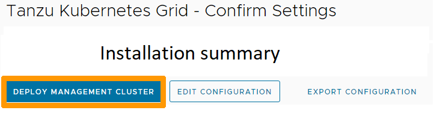{.thumbnail}

The **Tanzu Kubernetes Grid** cluster deployment is started, please wait for it to complete.

> [!primary]
> The deployment will be completed when you see the **Management cluster created** and **Successfully installed all required plugins** messages in the window.
>
> {.thumbnail}
>
> Another indication that the installation is complete can be found in the console of the **Bootstrap** virtual machine in which will appear the **Management cluster created** and **You can now create your first workload cluster etc...** messages.

> [!warning]
> 
> Write down or copy the name of the **yaml** file in the `/home/tanzu/.config/tanzu/tkg/clusterconfigs` folder, it will be used to create a configuration file for installing a *WorkLoad cluster*
>

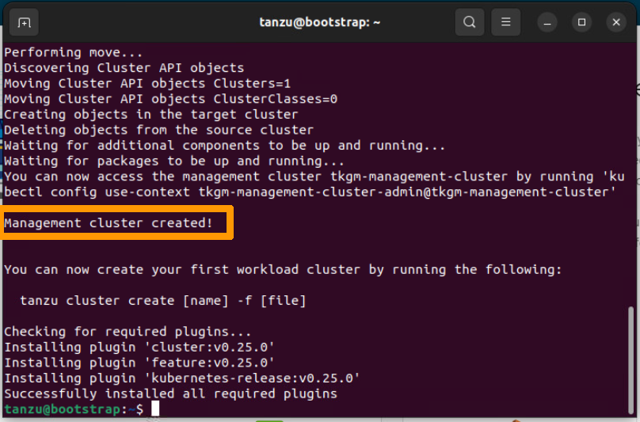{.thumbnail}

Go to the vCenter interface to see the seven virtual machines created.

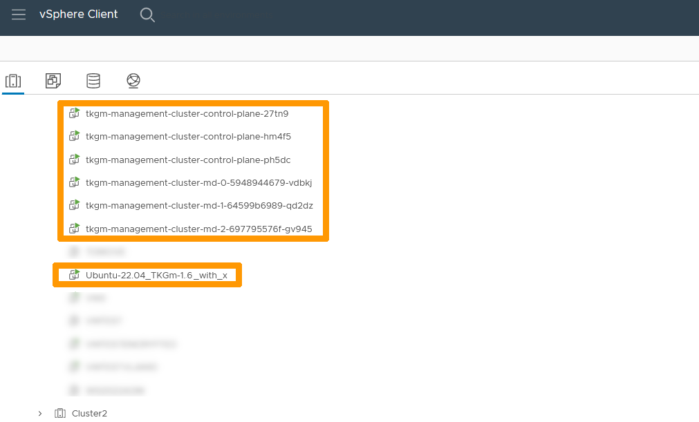{.thumbnail}

## Go further

[Administrating a TKG cluster](https://docs.ovh.com/it/private-cloud/tanzu-tkgm-management)

[Introducing VMware Tanzu Kubernetes Grid](https://tanzu.vmware.com/kubernetes-grid)

[Documentation de VMware Tanzu Kubenetes Grid](https://docs.vmware.com/en/VMware-Tanzu-Kubernetes-Grid/index.html)

[Manual installation of the CLI tool for the deployment of Tanzu Kubernetes GRID](https://docs.vmware.com/en/VMware-Tanzu-Kubernetes-Grid/1.5/vmware-tanzu-kubernetes-grid-15/GUID-install-cli.html)

Join our community of users on <https://community.ovh.com/en/>.
