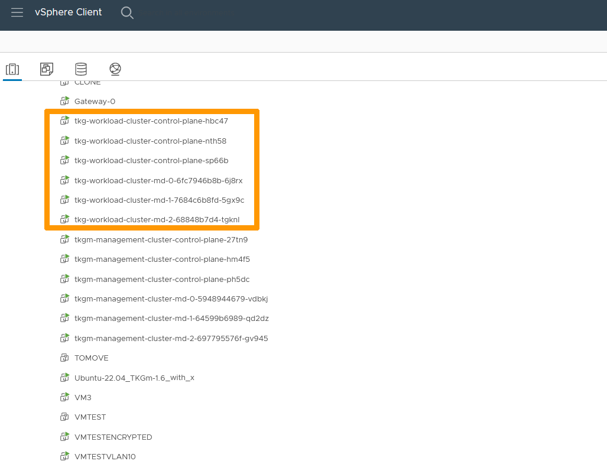

**Dernière mise à jour le 10/11/2022**

## Objectif

**Ce guide vous permet de créér un cluster de *Workload* et ajouter des applications dans ce cluster.**

> [!warning]
> OVHcloud vous met à disposition des services dont la configuration, la gestion et la responsabilité vous incombent. Il vous appartient donc de ce fait d’en assurer le bon fonctionnement.
>
> Ce guide a pour but de vous accompagner au mieux sur des tâches courantes. Néanmoins, nous vous recommandons de faire appel à un [prestataire spécialisé](https://partner.ovhcloud.com/fr/) si vous éprouvez des difficultés ou des doutes concernant l’administration, l’utilisation ou la mise en place d’un service sur un serveur.
>

## Prérequis

- Être contact administrateur de [l'infrastructure Hosted Private Cloud](https://www.ovhcloud.com/fr-ca/enterprise/products/hosted-private-cloud/), afin de recevoir les identifiants de connexion.
- Avoir un identifiant actif dans l'[espace client OVHcloud](https://ca.ovh.com/auth/?action=gotomanager&from=https://www.ovh.com/ca/fr/&ovhSubsidiary=qc).
- Avoir un identifiant actif dans vSphere.
- Avoir installé le cluster d'administration **Tanzu Kubernetes GRID** à l'aide du guide « [Installer Tanzu Kubernetes Grid](https://docs.ovh.com/ca/fr/private-cloud/tanzu-tkgm-installation) ».
- Avoir un VLAN qui possède un accès à Internet et un serveur DHCP.
- Disposer de ces ressources :
    - 16 Go de mémoire, 4 vCPU, 40 Go de stockage par nœud Kubernetes (il faut 6 nœuds par cluster de **Workload** dans le mode de production).

## En pratique

Nous allons déployer un cluster de *Workload* sur un cluster d'administration **Tanzu Kubernetes Grid** et ajouter une application.

A la fin de l'installation, vous aurez six nouvelles machines virtuelles en plus des sept qui sont nécessaires au fonctionnement du cluster de management. 

{.thumbnail}

### Déploiement d'un cluster de *Workload*

Le cluster de *Workload* peut être déployé sur le même réseau que le cluster d'administration ou sur un autre. Dans notre cas, nous allons le déployer sur le même réseau pour la démonstration. Si vous voulez changer de réseau, il suffit de mettre le portgroup dans le même YAML de configuration de votre cluster de workload comme expliqué ci-dessous, dans la section `VSPHERE_NETWORK`. Assurez-vous que le cluster de management peut communiquer avec le cluster de workload.

Après l'ajout de ce cluster, il sera alors possible d'installer des applications. 

Copiez le fichier qui a servi pour la création du cluster d'administration dans un fichier nommé **tkg-workload-cluster.yaml**.

```bash
cp ~/.config/tanzu/tkg/clusterconfigs/tkgmfile.yaml ~/tkg-workload-cluster.yaml
```

Modifiez le contenu du fichier **~/tkg-workload-cluster.yaml** en changeant ces valeurs :

```yaml
CLUSTER_NAME: tkg-workload-cluster
VSPHERE_CONTROL_PLANE_ENDPOINT: 192.168.0.11
```

Lancez cette commande pour créer le cluster :

```bash
tanzu cluster create --file tkg-workload-cluster.yaml
```

Connectez-vous au cluster avec ces commandes :

```bash
# Autorisation de la connexion au cluster
tanzu cluster kubeconfig get tkg-workload-cluster --admin
# Positionnement sur le cluster tkg-workload-cluster
# Les comptes d'administration ont toujours la forme nomcluster-admin@nomcluster
kubectl config use-context tkg-workload-cluster-admin@tkg-workload-cluster
```

Connectez-vous à votre interface vSphere pour voir les six machines virtuelles du cluster de *Workload*.

{.thumbnail}

### Installation du Load-Balancer

Le **Load-Balancer** fait le lien entre le réseau du cluster de *Workload* et le réseau externe qui se trouve sur le cluster VMware. Pour cela, nous allons utiliser le package **kube-vip** qui servira de *load-balancer* entre le réseau interne au cluster et le réseau du VLAN10. Vous trouverez plus d'informations sur la [documentation kube-vip](https://kube-vip.io/).

Exécutez ces commandes à partir de la machine virtuelle de **Bootstrap** :

```bash
# Création d'un dossier pour accueillir l'application kube-vip depuis git
mkdir ~/kube-vip
# Déplacement dans ce dossier
cd ~/kube-vip
# Récupération des données depuis GitHub
git clone https://github.com/vrabbi/tkgm-customizations.git
# Déplacement dans le sous dossier de l'application
cd tkgm-customizations/carvel-packages/kube-vip-package/
# Application de la pré-configuration
kubectl apply -n tanzu-package-repo-global -f metadata.yml
kubectl apply -n tanzu-package-repo-global -f package.yaml
```

Créez le fichier **~/kube-vip/tkgm-customizations/carvel-packages/kube-vip-package/values.yaml** avec ce contenu qui correspond aux adresses IP utilisables sur le VLAN10 pour déployer une application.

```yaml
vip_range: 192.168.0.210-192.168.0.250
```

Installez le package à l'aide de ces commandes :

```bash
# Installation
tanzu package install kubevip -p kubevip.terasky.com -v 0.3.9 -f values.yaml
# Vérification de la présence du package kubevip
 kubectl get packages -A
```

### Installation d'une application

A titre d'exemple, nous allons déployer une application nommée **yelb** qui utilise 4 pods dont un qui sera disponible via le load-balancer kubevip. vous trouverez plus d'informations sur cet [exemple KUBERNETES YELB](https://github.com/mreferre/yelb).

Lancez ces commandes pour installer une nouvelle application dans le cluster de **Workload** à partir de la machine virtuelle de **Bootstrap**.

```bash
# Création d'un espace de nom pour cette application
kubectl create ns yelb
# Déploiement de l'application depuis une source sur Internet
kubectl\
 -n yelb apply -f\
 https://raw.githubusercontent.com/lamw/yelb/master/deployments/platformdeployment/Kubernetes/yaml/yelb-k8s-loadbalancer.yaml
# Vérification de la bonne installation de l'application
kubectl get all -n yelb
```

Les adresses IP internes au cluster KUBERNETES apparaissent dans la colonne **CLUSTER-IP**, les applications qui sont visibles depuis l'extérieur du cluster ont une adresse IP dans la colonne **EXTERNAL-IP**.

Dans cet exemple, le site web est accessible via l'adresse **192.168.0.223** sur le port **80**.

{.thumbnail}

Dans la console **Bootstrap**, utilisez le navigateur web pour vous connecter sur l'URL `http://192.168.0.223`.

{.thumbnail}

Une application peut être constituée de plusieurs pods qui communiquent entre eux au travers du réseau interne du cluster de Workflow. Certains ports sont ouverts sur le réseau du cluster VMware grâce au module kube-vip.

{.thumbnail}

## Aller plus loin

[Installer Tanzu Kubernetes Grid](https://docs.ovh.com/ca/fr/private-cloud/tanzu-tkgm-installation)

[Présentation VMware de Tanzu Kubernetes Grid](https://tanzu.vmware.com/kubernetes-grid)

[Documentation VMware de Tanzu Kubenetes Grid](https://https://docs.vmware.com/en/VMware-Tanzu-Kubernetes-Grid/index.html)

[Installation manuelle de l'outil CLI pour le déploiement de Tanzu Kubernetes GRID](https://docs.vmware.com/en/VMware-Tanzu-Kubernetes-Grid/1.5/vmware-tanzu-kubernetes-grid-15/GUID-install-cli.html)

Échangez avec notre communauté d'utilisateurs sur <https://community.ovh.com>.
