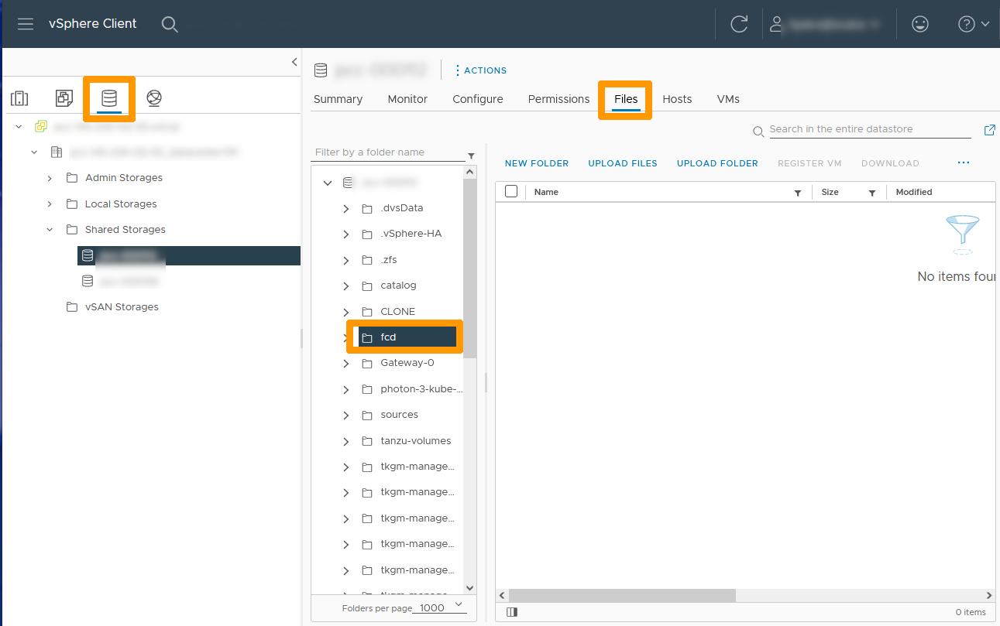
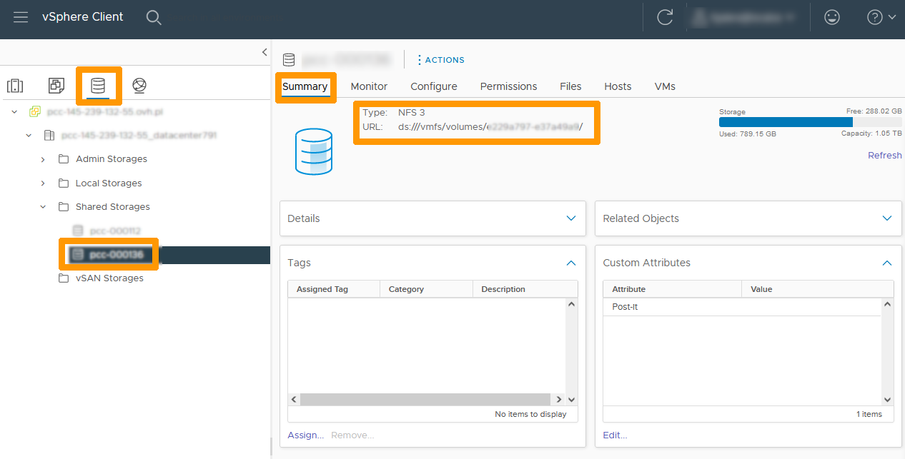
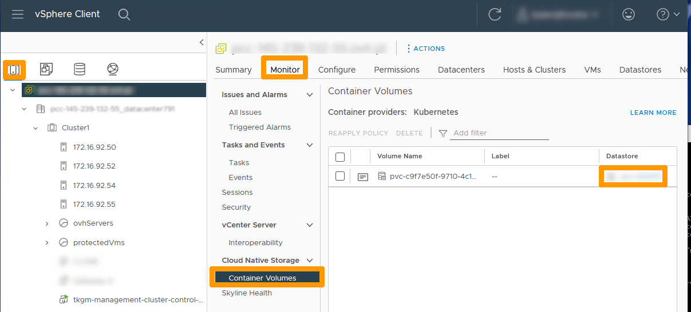

**Last updated 10th November 2022**

## Objective

**This guide documents how to manage persistent volumes on a Tanzu Kubernetes Grid cluster.**

> [!warning]
> OVHcloud provides services for which you are responsible, with regard to their configuration and management. It is therefore your responsibility to ensure that they work properly.
>
> This guide is designed to assist you as much as possible with common tasks. However, we recommend contacting a [specialist provider](https://partner.ovhcloud.com/en-gb/) if you experience any difficulties or doubts when it comes to managing, using or setting up a service on a server.
>

## Requirements

- Being an administrative contact of your [Hosted Private Cloud infrastructure](https://www.ovhcloud.com/pt/enterprise/products/hosted-private-cloud/) to receive login credentials
- A user account with access to the [OVHcloud Control Panel](https://www.ovh.com/auth/?action=gotomanager&from=https://www.ovh.pt/&ovhSubsidiary=pt)
- A user account with access to vSphere
- You need to have deployed the **Workload** **TKG** cluster using the [Tanzu Management Cluster Grid administration guide](https://docs.ovh.com/pt/private-cloud/tanzu-tkgm-management).

## Introduction

Persistent volumes are used to store data permanently on a **Kubernetes** cluster. This mechanism is based on **Storage Classes**. There are various Storage Classes. Read the [Kubernetes Storage Classes](https://kubernetes.io/docs/concepts/storage/storage-classes/) guide for more information.

When deploying a *WorkLoad* cluster, a Storage Class **CSI provisioner** is created and points to the **Datastore** folder that contains the virtual machines in the *WorkLoad* cluster.

From your VMware cluster, go to the inventory. Select the storage icon to the left, and go to the datastore where your *WorkLoad* cluster was deployed. Go to the `Files`{.action} tab and click the `fcd`{.action} folder.

The folder is empty because the *WorkLoad* cluster does not yet use persistent volumes. 

{.thumbnail}

You can create additional Storage Classes for each *WorkLoad* cluster.

## Instructions

We will connect to a *WorkLoad* cluster from the console of the **Bootstrap** virtual machine. You can use the [Tanzu Management Cluster Grid administration](https://docs.ovh.com/pt/tanzu-tkgm-management) guide to create and manage a workload cluster.

From the **Bootstrap** virtual machine console, run this command to view the contexts that can be used on this cluster:

```bash
# Display all the contexts of your TANZU KUBERNETES GRID cluster
kubectl config get-contexts
```

Run this command to use the *WorkLoad* cluster:

```bash
# Connect to WorkLoad cluster
kubectl config use-context tkgm-workload-cluster-admin@tkgm-workload-cluster
```

### Displaying Existing Storage Classes

For information about the Storage Classes in a *WorkLoad* cluster, run these commands:

```bash
# Display Storage Classes
kubectl get storageclass
# Storage Class description
kubectl describe storageclass nomclasse
```

### Creating a storage class on another datastore

On our VMware cluster, we have two datastores connected to NFS servers. One of the datastores contains the virtual machines in the *WorkLoad* cluster, as well as the **fcd** folder used by the Storage Class in the *Workload* cluster. 

We will create a new Storage Class on the second datastore.

Go back to your VMware cluster in storage management, select the second datastore, and click `Summary`{.action} in the tab on the left.

Copy the `URL`{.action} below "Type: NFS 3".



Go to the console of the **Bootstrap** virtual machine, edit a new file named `secondstorageclass.yaml` with this content:

```yaml
kind: StorageClass
apiVersion: storage.k8s.io/v1
metadata:
  name: secondstorageclass
  annotations:
    storageclass.kubernetes.io/is-default-class: "true"
provisioner: csi.vsphere.vmware.com
parameters:
  datastoreurl: "ds:///vmfs/volumes/xxxxxxxxxxxxxxxxx/"
```

Edit the file by replacing `ds:///vmfs/volumes/xxxxxxxxxxxxxxxxx/` with the URL you just copied.

Next, run this command:

```bash
# Creating storageclass from yaml file
kubectl apply -f secondstorageclass.yaml
# Display storageclasses
kubectl get storageclass
```

We are now seeing two Storage Classes:

```bash
NAME                           PROVISIONER              RECLAIMPOLICY   VOLUMEBINDINGMODE   ALLOWVOLUMEEXPANSION   AGE
default (default)              csi.vsphere.vmware.com   Delete          Immediate           true                   3d18h
secondstorageclass (default)   csi.vsphere.vmware.com   Delete          Immediate           false                  12s
tanzu@bootstrap:~$
```

### Creating a persistent volume in the default Storage class

Create a file named `default-pvc-storage.yaml` with this content:

```yaml
kind: persistantVolumeClaim
apiVersion: v1
metadata:
  name: default-pvc-storage
spec:
  accessModes:
    - ReadWriteOnce
  storageClassName: "default"
  resources:
    requests:
      storage: 2Gi
```

The persistent storage name is next to `name`, `storageClassName` contains the name of the Storage Class that is used for this volume.

Run this command to create the persistent volume:

```bash
# Create a namespace that will be used for my persistent volume.
kubectl create namespace myspace
# Applying the configuration file to the created namespace.
kubectl apply -f default-pvc-storage.yaml -n myspace
# Display persistent volumes of created namespace
kubectl get pv,pvc -n myspace
```

Go back to the inventory in your **vCenter** interface, click on the `DataCenter`{.action} icon on the left, then go to the `Monitor`{.action} tab on the right, and click on `Container Volumes`{.action} to see the persistent volumes.

The persistent volume that has been created is displayed, and to the right you can see the name of the datastore on which it is stored.

{.thumbnail}

Click the notebook icon to the left of the volume to view the details.

{.thumbnail}

The information about this persistent storage is displayed, and corresponds to what was created using Kubernetes commands.

{.thumbnail}

Go to the Datastore that is used by default, right-click the `Files`{.action} tab and scroll through the folders in the Datastore to the `fcd` folder.

You see that the folder contains two files, a vmdk file that contains the persistent volume data and an associated temporary file.

{.thumbnail}

### Creating a persistent volume on the second Storage Class

Return to the **Bootstrap** virtual machine and use the command line.

Create a file named `second-storage-pvc.yaml`:

```yaml
kind: persistantVolumeClaim
apiVersion: v1
metadata:
  name: second-storage-pvc
spec:
  accessModes:
    - ReadWriteOnce
  storageClassName: "secondstorageclass"
  resources:
    requests:
      storage: 2Gi
```

The file uses the same syntax as the first persistent storage, but with a different name and **Storage Class**.

Run this command to create the persistent volume in the **myspace namespace**:

```bash
# Applying the configuration file to the created namespace.
kubectl apply -f second-storage-pvc.yaml -n myspace
# Display persistent volumes of created namespace
kubectl get pv,pvc -n myspace
```

The persistent volume is created on the second **Datastore**.

Return to the **vCenter** interface. You will see that you do not have any new files in the `fcd` folder.

{.thumbnail}

Right-click the second Datastore, go to the `fcd`{.action} folder for that datastore. You will see that you have two new files, as in the first datastore.

{.thumbnail}

Go back to the `Datacenter`{.action} at the root of the datacenters, click on the `Monitor`{.action} tab, and choose `Container volumes`{.action} to see the two persistent volumes appear with their locations in the datastores. 

{.thumbnail}

## Go further <a name="gofurther"></a>

[Introduction to Tanzu Kubernetes Grid at OVHcloud](https://docs.ovh.com/pt/private-cloud/tanzu-tkgm-installation)

[Installing Tanzu Kubernetes Grid](https://docs.ovh.com/pt/private-cloud/tanzu-tkgm-installation)

[Managing Tanzu Management Cluster Grid](https://docs.ovh.com/pt/private-cloud/tanzu-tkgm-management)

[Introducing VMware Tanzu Kubernetes Grid](https://tanzu.vmware.com/kubernetes-grid)

[VMware Tanzu Kubenetes Grid documentation](https://https://docs.vmware.com/en/VMware-Tanzu-Kubernetes-Grid/index.html)

[Manual installation of the CLI tool for the deployment of Tanzu Kubernetes GRID](https://docs.vmware.com/en/VMware-Tanzu-Kubernetes-Grid/1.5/vmware-tanzu-kubernetes-grid-15/GUID-install-cli.html)

Join our community of users on <https://community.ovh.com/en/>.
