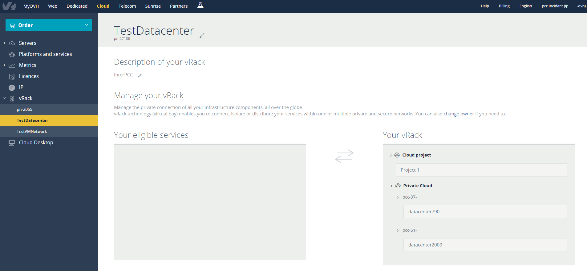

**Last updated 13th July 2020**

## Objective

The OVHcloud vRack feature makes it possible to connect different cloud services with each other, within one or more secure private networks (VLANs).

**This guide explains how to set this up with a Hosted Private Cloud infrastructure.**

## Instructions

### OVHcloud Control Panel

After your [Hosted Private Cloud infrastructure](https://www.ovhcloud.com/en-gb/enterprise/products/hosted-private-cloud/) is delivered, it will be displayed in the section `vRack` (under "Server" in your [OVHcloud Control Panel](https://www.ovh.com/auth/?action=gotomanager)) and the "datacenter" will be automatically included into a vRack.

{.thumbnail}

You can move the "datacenter" of your Private Cloud to another vRack by selecting it and clicking on the `Move`{.action} button.

### vSphere client

In the vSphere client, you can find vRack-capable VLANs in the `Networks` section, located in the *vrack* folder.

> [!success]
>
> By default, OVHcloud delivers an infrastructure with 11 VLANs included (VLAN10 to VLAN20).
>

{.thumbnail}

You can change their settings or create them again by following [this guide](../creation-vlan-vxlan/).

You can then assign these *Distributed Port Groups* to the network interfaces of your virtual machines.

## Go further

Join our community of users on <https://community.ovh.com/en/>.
