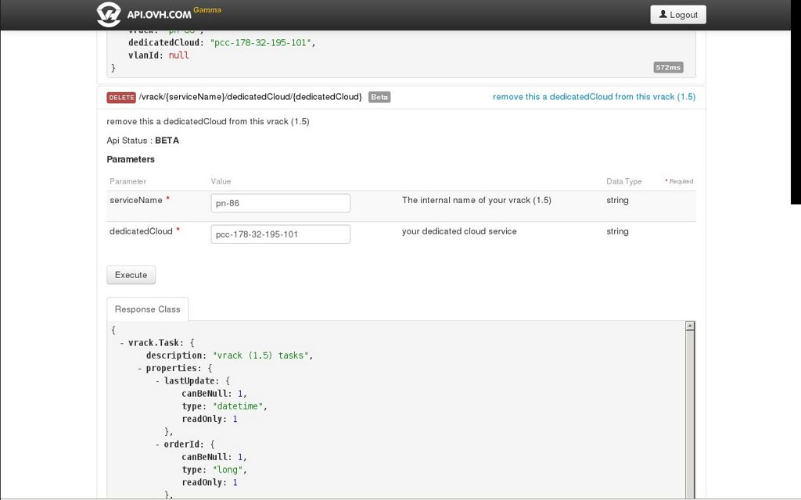

## 
Conéctese al área de cliente haciendo clic en el siguiente enlace: [Manager](https://www.ovh.com/manager/dedicated/)

Una vez se haya conectado, podrá añadir su Dedicated Cloud al vRack simplemente pasando los servidores de la columna izquierda a la derecha con el botón «Añadir».

{.thumbnail}
Automáticamente se creará una tarea para añadirlo.

## Conectarse a la API (mediante script)
Consulte la guía [Primeros pasos con la API]({legacy}934)

## Conectarse a la API (mediante la interfaz web)
Acceda a la página de la API [aquí](https://api.ovh.com/console/).

Haga clic en el botón «Login» situado en la barra superior e identifíquese.

## Añadir un Dedicated Cloud al vRack 1.5
Una vez se haya conectado, acceda a la sección /vrack y, dentro de esta, a GET /vrack. Haga clic en «Execute» para obtener el «serviceName» de su vRack.

{.thumbnail}
A continuación, diríjase a POST /vrack/serviceName/dedicatedCloud, introduzca el nombre del servicio y el nombre del Dedicated Cloud y haga clic en «Execute».

{.thumbnail}

## Eliminar un Dedicated Cloud del vRack 1.5
El procedimiento es el mismo que para añadirlo, pero utilizando la función «DELETE» de la API:

{.thumbnail}

## En modo VSS (Virtual Standard Switch)
En esta configuración, el método es muy sencillo. Solo hay que seleccionar el network label «VM Network» en los parámetros de la conexión de red, como en el siguiente ejemplo.

{.thumbnail}

## En modo VDS (Virtual Distributed Switch) o 1000v
El procedimiento es el mismo que para el VSS, pero cambia el network label.

{.thumbnail}

## Uso de las VXLAN en el 1000v
También puede querer utilizar una VXLAN para que no todas sus máquinas estén expuestas en la VLAN pública de su Dedicated Cloud.

Es posible hacerlo pero, en este caso, hay que configurar una máquina adicional que actuará como puerta de enlace para las MV en la VXLAN y que, por tanto, tendrá una tarjeta en la VXLAN y una tarjeta en la «VM Network» del 1000v, como en este ejemplo.

{.thumbnail}

