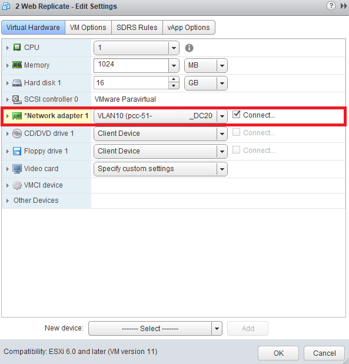
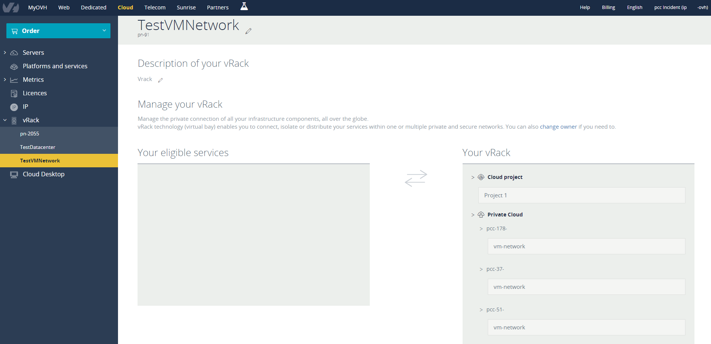

Le vRack, c’est la possibilité de connecter différents services [OVH.com](http://ovh.com/){.external-link} entre eux, au sein d’un ou plusieurs réseaux privés sécurisés (VLAN) : [serveurs dédiés de la gamme Infrastructure](https://www.ovh.com/fr/serveurs_dedies/infra/){.external-link}, [Private Cloud](https://www.ovh.com/private-cloud/){.external-link} (gammes SDDC et Dedicated Cloud), serveurs de stockage, serveurs Big Data. Le tout en quelques clics dans l’espace client ou via l’[API OVH](https://api.ovh.com/){.external-link}.

L'utilisation du vRack sera différente en fonction de la gamme de votre Private Cloud, nous détaillerons donc chaque points de manière différenciée.

Utiliser le vRack avec un SDDC
------------------------------

Un SDDC pourra être géré à deux niveaux différent au niveau du vRack :

- VMNetwork
- Datacentre ("datacenter\_0000" ou le nom personnalisé que vous avez choisi)

Le VMNetwork et le datacentre d'une même infrastructure ne peuvent pas être dans le même vRack. Ainsi si vous avez déjà le datacentre dans un vRack, vous ne verrez pas le VMNetwork de la même infrastructure dans les services disponible pour votre vRack dans la colonne de gauche.

L'offre SDDC inclu des vLANs que vous pouvez "étirer" dans le vRack dans lequel vous placez le datacentre. Dans l'exemple suivant, vous pourrez utiliser vos vLANs entre vos VMs Private Cloud et un projet Public Cloud.

{.thumbnail}

Avec cette configuration de vRAck, le projet Public Cloud utilisé en exemple doit être [configuré sur un vLAN ID](https://www.ovh.com/fr/publiccloud/guides/g2162.utiliser_le_vrack_et_les_reseaux_prives_avec_les_instances_public_cloud#creation_dun_reseau_prive){.external-link}. Nous prendrons ici l'exemple du vLAN ID 10.

Côté Private Cloud, il suffit de choisir la carte réseau correspondant au bon vLAN ID, similaire au service avec lequel les VMs doivent communiquer.

{.thumbnail}

Avec cette configuration, si une VM Private Cloud et le projet Public Cloud ont une configuration réseau privée dans le même sous réseau, les services pourront directement communiquer entre eux.

Vous avez également accès au VMNetwork au niveau du vRack. Le fonctionnement est similaire à l'utilisation de la gamme [Dedicated Cloud détaillée ci-dessous](#UtiliserlePrivateCloudauseind'unvRack-DC).

Utiliser le vRack avec un Dedicated Cloud
-----------------------------------------

Contrairement au SDDC, la gamme Dedicated Cloud n'a accès qu'au "VMNetwork" pour utiliser le vRack. Cela s'explique par l'utilisation de vxLANs et non de vLANs, et implique que vous ne pourrez pas utiliser ces vxLANs pour communiquer avec d'autres services.

{.thumbnail}

Le VMNetwork à plusieurs utilités, la première étant de partager des blocs IPs entre services. En effet, dans l'exemple ci-dessus, chaque Private Cloud peut utiliser ses propres blocs, mais aussi ceux des autres Private Cloud ou du projet Public Cloud.

Cela vous permet également d'effectuer des communications privées entre service, mais sans utiliser de vLAN. En effet, le VMNetwork est le réseau publique de l'infrastructure par défaut, il n'y a donc pas de vLAN ID permettant de communiquer avec d'autres services privés.

{.thumbnail}

Avec cette configuration, le service distant (ici notre projet Public Cloud) ne doit pas utiliser de tag de vLAN. Se faisant, une configuration dans le même sous réseau privé permettra une communication directe entre les services.

Faites attention, le VMNetwork étant par défaut le réseau publique de l'infrastructure, si un utilisateur malveillant parvient à capter le trafic du réseau publique, il pourra également tracer le trafic du réseau privé passant dans le vRack et utilisant ce même réseau "VMNetwork".
