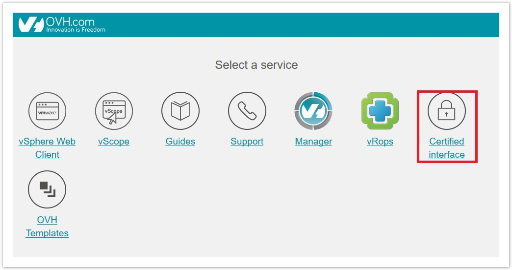
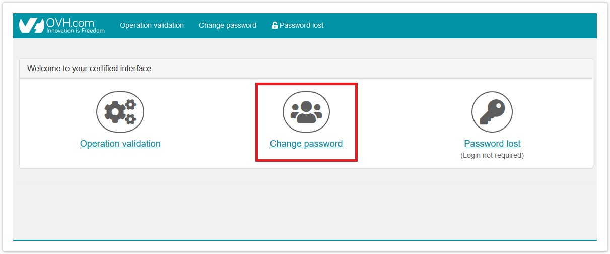
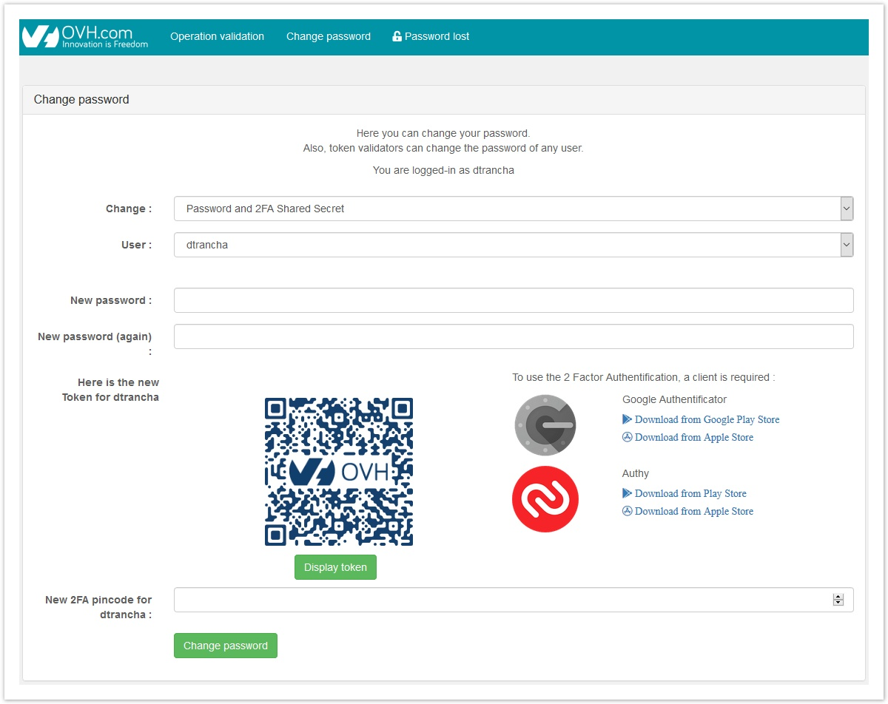
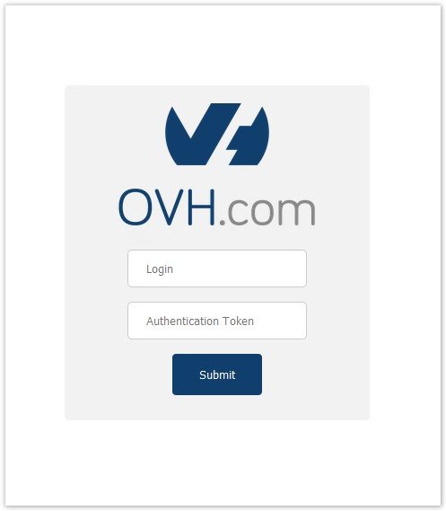

**Last updated 9th July 2020**

## Objective

Having two-factor authentication activated helps to protect your Hosted Private Cloud infrastructure by reducing the risk of attacks (such as password theft).

**This guide explains how to set up a second authentication method to protect your infrastructure.**

## Requirements

- a [Hosted Private Cloud infrastructure](https://www.ovhcloud.com/en-gb/enterprise/products/hosted-private-cloud/) with the [**advanced security** option](https://www.ovhcloud.com/en-gb/enterprise/products/hosted-private-cloud/safety-compliance/sddc/), (included in PCI-DSS and HDS offers)
- a mobile device (smartphone) and authentication application (e.g. Google Authenticator, Authy, OTP Auth, etc.)

## Instructions

### Enabling two-factor authentication

In order to set up two-factor authentication, it is necessary to connect to the certified interface of your Private Cloud.

There are two possibilities for this:
	
- via the gateway to your Private Cloud (https://pcc-xxx-xxx-xxx-xxx.ovh.com)

{.thumbnail}

- directly with the URL https://pcc-xxx-xxx-xxx-xxx.ovh.com/secure/ (be careful not to forget the final "/" of the address).

Once connected to the management interface, click `Change password`{.action}

{.thumbnail}

Within the interface, follow these steps:
	
- select `Password and 2FA Shared Secret`{.action},
- enter a new password, 
- scan the QRcode with the OTP application of your choice,
- confirm the obtained code.

{.thumbnail}

This creates a task and a token will be sent to you.

Go to the part `Operation validation`{.action}, load the operation received by SMS, and confirm with the token received in the same SMS.

> [!primary]
>
> In case of a forgotten password, it is necessary to follow the "Password lost" procedure first, during which you will be offered to set up the 2FA.
>

### Login

You can now log in to your web client via its normal URL to arrive on this page:

{.thumbnail}

It is now necessary to enter the token generated by the authentication application installed on your smartphone before you can sign in with your password.

> [!warning]
>
> Two-factor authentication will be activated when a user's password is changed. This means that if one user changes his password, all users will have 2FA enabled. 
>
> They will need to renew their password and then set up 2FA for their logins to be able to connect.
>
> For customers with a version 6.0 infrastructure, access to the vSphere client (available only on Windows) will no longer be possible. They can access only with the vSphere web client.
>

### Creating a new user

When creating a new user, you now have the option of assigning or not assigning the role of *token validator*.

In both cases, it will be necessary to change the password through the "Certified interface" using the procedure outlined above in order to implement 2FA.

The only difference will be the user's autonomy in token validation.

### Application access permission

Multiple third-party applications can be used that require connection to the vCenter.
These applications must first be authorised through the vCenter access policy that is settable in your OVHcloud [Control Panel](../control-panel-ovh-private-cloud/#security).

These applications will then be able to access our infrastructures, but they will not necessarily handle two-factor authentication.

In this case, it will be necessary to create a **whitelist** to specifically bypass the 2FA.

This whitelist will be an addition to the main list of vCenter accesses.

To add your application's public IP addresses to this second whitelist, the following API calls will need to be used.

- Check for IPs that are allowed to bypass 2FA:

> [!api]
>
> @api {GET} /dedicatedCloud/{serviceName}/twoFAWhitelist
>

- Add an IP to the bypass whitelist of 2FA:

> [!api]
>
> @api {POST} /dedicatedCloud/{serviceName}/twoFAWhitelist
>

- Display information for an allowed IP (requires an ID retrieved with the first call):

> [!api]
>
> @api {GET} /dedicatedCloud/{serviceName}/twoFAWhitelist/{id}
>

- Remove an IP from the whitelist:

> [!api]
>
> @api {DELETE} /dedicatedCloud/{serviceName}/twoFAWhitelist/{id}
>

- Change the information for an allowed IP:

> [!api]
>
> @api {POST} /dedicatedCloud/{serviceName}/twoFAWhitelist/{id}/changeProperties
>

## Go further

Join our community of users on <https://community.ovh.com/en/>.
