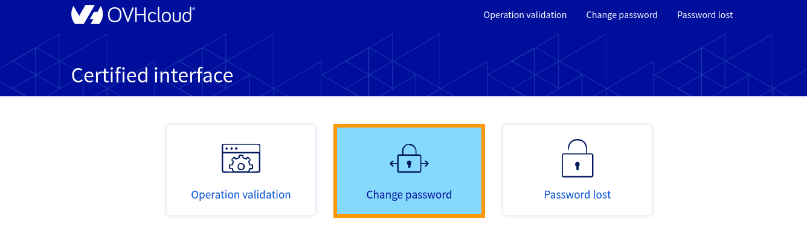

**Ultimo aggiornamento: 10/06/2022**

## Obiettivo

Il metodo di autenticazione a due fattori consente di proteggere l’accesso al Private Cloud riducendo i rischi legati, ad esempio, al furto di password.

**Questa guida ti mostra come attivare questo sistema per rendere più sicuro l’accesso alla tua infrastruttura Private Cloud.**
 
## Prerequisiti

- Disporre di un’infrastruttura [Private Cloud](https://www.ovhcloud.com/it/enterprise/products/hosted-private-cloud/) con l’opzione di [sicurezza avanzata](https://www.ovhcloud.com/it/enterprise/products/hosted-private-cloud/safety-compliance/sddc/) (inclusa nei servizi PCI-DSS e HDS)
- Disporre di uno smartphone e di un'applicazione di autenticazione (ad esempio Google Authenticator, Authy, OTP Auth...)

## Procedura

### Attiva l’autenticazione a due fattori

Per attivare il metodo di autenticazione a due fattori è necessario accedere all’interfaccia certificata del Private Cloud scegliendo tra due modalità:
	
- il gateway del Private Cloud (https://pcc-xxx-xxx-xxx-xxx.ovh.com) 

{.thumbnail}

- l’URL https://pcc-xxx-xxx-xxx-xxx.ovh.com/secure/ (facendo attenzione a non dimenticare “/” alla fine dell’indirizzo)

Una volta connesso all’interfaccia di gestione, clicca su `Change Password`{.action}

{.thumbnail}

Nella nuova pagina:
	
* seleziona `Password and 2FA Shared Secret`{.action}
* inserisci una nuova password 
* esegui la scansione del codice QR dal tuo smartphone con l’applicazione di autenticazione scelta
* conferma il codice ottenuto

{.thumbnail}

A questo punto verrà creato un task e riceverai un token.

Accedi alla sezione `Operation validation`{.action}, identifica l’operazione ricevuta tramite SMS e confermala utilizzando il token contenuto nello stesso messaggio.

> [!primary]
>
> In caso di password dimenticata è necessario avviare la procedura di “Password lost”, in cui verrà proposta l’attivazione del sistema di autenticazione a due fattori. 
>

### Accesso

Accedi al client *Web* con il link abituale utilizzato per connetterti a questa pagina:

{.thumbnail}

A questo punto, prima di poter digitare la password, è necessario inserire il token generato dall’applicazione di autenticazione installata sullo smartphone.

> [!warning]
>
> L’autenticazione a due fattori verrà attivata anche in caso di modifica della password da parte di uno degli utenti: se la password viene modificata anche da un solo utente, l’autenticazione a due fattori risulterà attiva per tutti gli utilizzatori, che saranno quindi costretti a rinnovare la propria password e abilitare la 2FA per continuare a essere in grado di connettersi.
>
> Per i clienti con un’infrastruttura in versione 6.0, l’accesso al client vSphere (disponibile solo su Windows) non sarà più possibile se non tramite il client vSphere Web.
>

### Crea un nuovo utente

Durante la creazione di un nuovo utente è possibile scegliere se assegnare o meno un ruolo di *token validator*.

In entrambi i casi è necessario modificare la password dall’interfaccia certificata, seguendo la procedura descritta precedentemente per attivare la 2FA.

L’unica differenza consisterà nell’autonomia dell’utente per confermare il token.

### Autorizzazioni per applicazioni

È possibile utilizzare diverse applicazioni terze che richiedono la connessione al vCenter.

Queste applicazioni devono essere precedentemente autorizzate attraverso una politica di accesso al vCenter che può essere configurata nello [Spazio Cliente](../manager-ovh-private-cloud/#sicurezza).

Queste applicazioni potranno accedere alle nostre infrastrutture ma non supporteranno necessariamente l’autenticazione a due fattori.

In questo caso sarà necessario creare una *whitelist* specifica per il *bypass* della doppia autenticazione.

Questa *whitelist* sarà complementare alla lista principale che gestisce gli accessi al vCenter.

Per aggiungere gli indirizzi IP pubblici degli applicativi a questa seconda *whitelist* è necessario utilizzare le seguenti chiamate API. 

- Verificare gli indirizzi IP autorizzati a non utilizzare l’autenticazione a due fattori:

> [!api]
>
> @api {GET} /dedicatedCloud/{serviceName}/twoFAWhitelist
>

- Aggiungere un indirizzo IP al *bypass* dell’autenticazione a due fattori:

> [!api]
>
> @api {POST} /dedicatedCloud/{serviceName}/twoFAWhitelist
>

- Visualizzare le informazioni di un indirizzo IP autorizzato (è necessario un ID recuperato con la prima chiamata):

> [!api]
>
> @api {GET} /dedicatedCloud/{serviceName}/twoFAWhitelist/{id}
>

- Eliminare un indirizzo IP dalla lista delle autorizzazioni:

> [!api]
>
> @api {DELETE} /dedicatedCloud/{serviceName}/twoFAWhitelist/{id}
>

- Modificare le informazioni di un indirizzo IP autorizzato:

> [!api]
>
> @api {POST} /dedicatedCloud/{serviceName}/twoFAWhitelist/{id}/changeProperties
>

## Per saperne di più

Contatta la nostra Community di utenti all’indirizzo <https://community.ovh.com/en/>.

