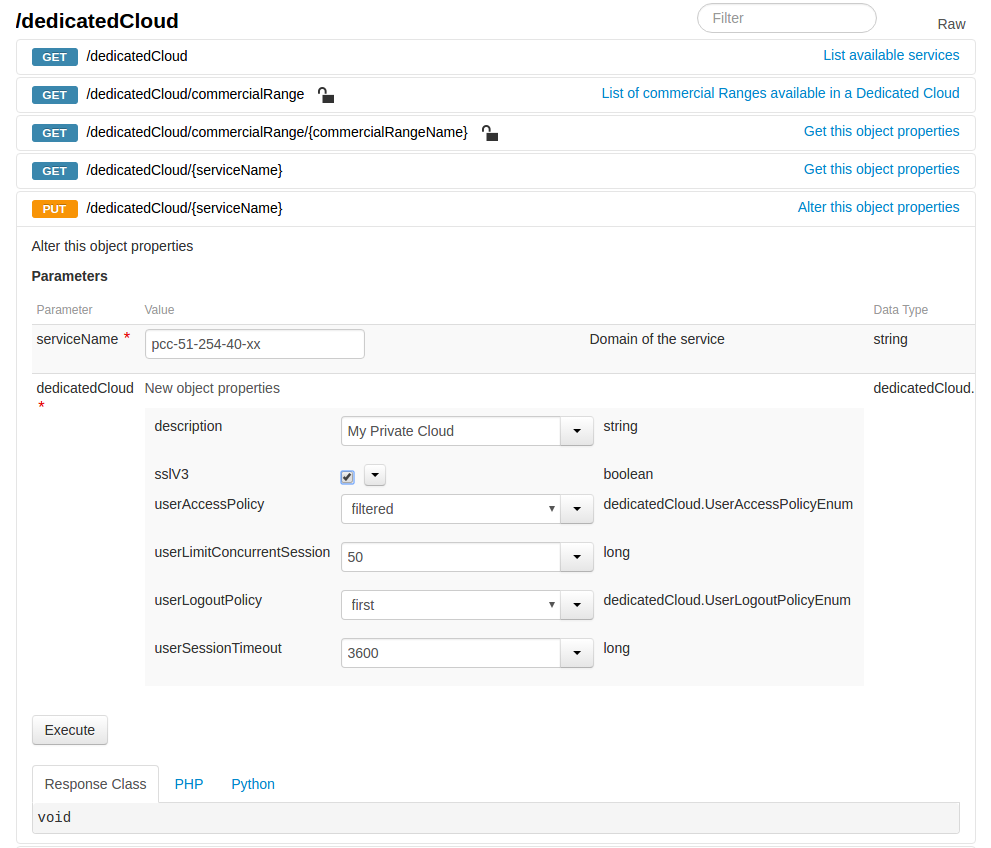

**Dernière mise à jour le 15/02/2019**

## Objectif

Suite à la faille Poodle (cve-2014-3566) nous avons désactivé SSLv3 sur l'ensemble des infrastructures Private Cloud.

SSLv3 est un protocole obsolète et qui présente des failles de sécurité importantes. Nous vous recommandons d'éviter autant que possible de le ré-activer.

Ce conseil de sécurité est confirmé par le standard PCI DSS dans sa version 3.1 qui demandait la désactivation en Décembre 2015, puis l'a repoussée au 30 Juin 2018 suite aux retours du marché.

<https://blog.pcisecuritystandards.org/migrating-from-ssl-and-early-tls>

Toutefois, certains outils ou logiciels requièrent SSLv3 pour fonctionner, c'est pourquoi nous vous proposons une option permettant de réactiver SSLv3.

Si vous utilisez l'un de ces outils, nous vous recommandons de prévoir leur mise à jour au plus vite afin de supprimer votre dépendance à SSLv3.

Si vous utilisez cette technologie pour vos sauvegardes, notre solution [Veeam Backup](https://www.ovh.com/fr/private-cloud/options/veeam.xml){.external-link}, disponible en option, est intégralement gérée par OVH et respecte tous les standards de sécurité.

**Ce guide montre comment vérifier l'état du protocole SSLv3 et comment l'utiliser**

## En pratique

### Vérifier l'état du protocole SSLv3

Vous devez tout d'abord vous rendre sur l'API [ovh.com](http://ovh.com){.external-link} : [http://api.ovh.com](http://api.ovh.com/){.external-link} et vous connecter à l'aide de votre identifiant client ([guide sur l'utilisation de l'API](https://docs.ovh.com/fr/private-cloud/connexion-a-l-api-ovh/)

Dans la section /dedicatedCloud, repérez l'appel `GET /dedicatedCloud/{serviceName}`

Utilisez cette appel pour vérifier l'état de l'option SSLv3 (cliquez sur `Execute`{.action} pour effectuer l'appel API et récupérer les informations).

{.thumbnail}

La réponse de l'api vous indique un ensemble d'informations concernant votre infrastructure. Repérez la ligne **SSLv3** pour connaitre l'état de l'option SSLv3 (*true* pour activée, *false* pour désactivée).

### Ré-activer le protocole SSLv3

Si vous devez impérativement ré-activer SSLv3, voici comment procéder.

**Attention : La réactivation de SSLv3 nécessite au préalable la mise en place des configurations suivantes :**

- [Restreindre l'accès au vCenter aux IPs autorisées](https://docs.ovh.com/fr/private-cloud/manager-ovh-private-cloud/#securite){.external-link}

- [Ajouter explicitement les IPs qui seront autorisées à se connecter](https://docs.ovh.com/fr/private-cloud/manager-ovh-private-cloud/#securite){.external-link}

Vous devez tout d'abord vous rendre sur l'API ovh.com : <http://api.ovh.com> et vous connecter à l'aide de votre identifiant client ([guide sur l'utilisation de l'API](https://docs.ovh.com/fr/private-cloud/connexion-a-l-api-ovh/)

Dans la section /dedicatedCloud, repérez l'appel `PUT /dedicatedCloud/{serviceName}`

Utilisez cette appel en cochant la case "SSLv3" pour ré-activer l'option (cliquez sur `Execute`{.action} pour effectuer l'appel API et sauvegarder la modification).

{.thumbnail}

La réponse de l'api vous indiquera "null". Cette réponse est tout à fait normale. Après quelques instants, vous pourrez vérifier de nouveau l'état de l'option SSLv3 (voir section précédente "Vérifier l'état de l'option SSLv3") pour vérifier sa bonne activation.

### Désactiver le protocole SSLv3

Dès lors que vous n'avez plus besoin de SSLv3, afin de garantir la sécurité de votre infrastructure Private Cloud, nous vous recommandons de désactiver cette option en suivant la procédure suivante.

Vous devez tout d'abord vous rendre sur l'API ovh.com : [http://api.ovh.com](http://api.ovh.com/){.external-link} et vous connecter à l'aide de votre identifiant client ([guide sur l'utilisation de l'API]({legacy}7766879))

Dans la section /dedicatedCloud, repérez l'appel `PUT /dedicatedCloud/{serviceName}`

Utilisez cette appel en dé-cochant la case "SSLv3" pour désactiver l'option (cliquez sur `Execute`{.action} pour effectuer l'appel API et sauvegarder la modification).

{.thumbnail}

La réponse de l'api vous indiquera `null`. Cette réponse est tout à fait normale. Après quelques instants, vous pourrez vérifier de nouveau l'état de l'option SSLv3 (voir section précédente "Vérifier l'état de l'option SSLv3") pour vérifier sa bonne désactivation.

## Aller plus loin

Échangez avec notre communauté d'utilisateurs sur <https://community.ovh.com>.