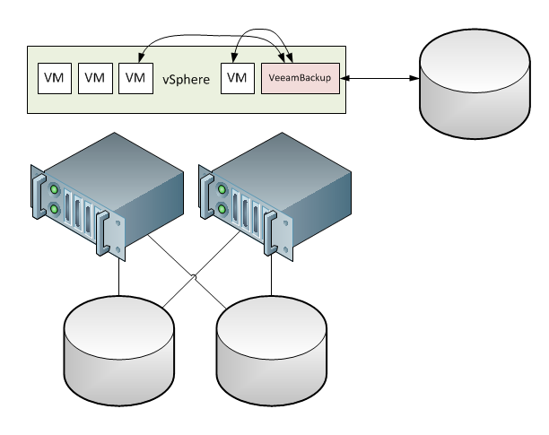
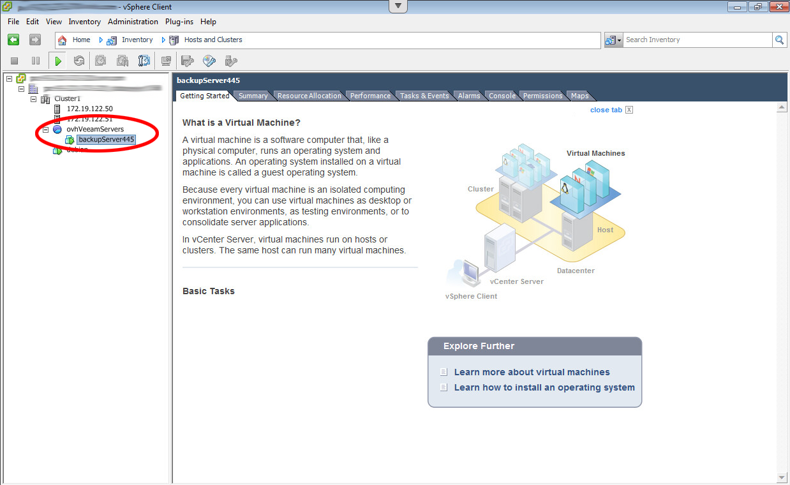
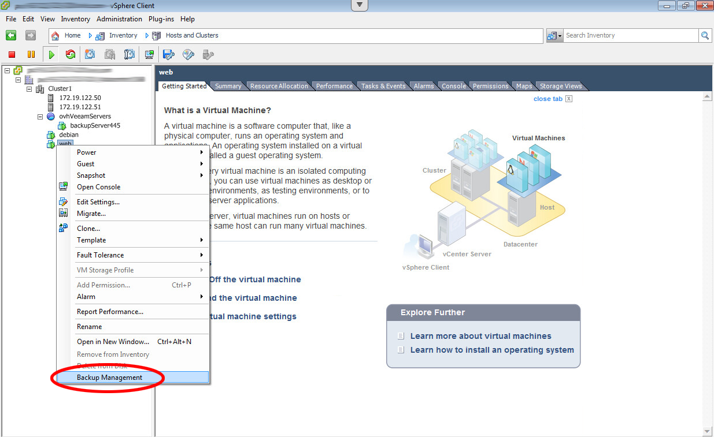
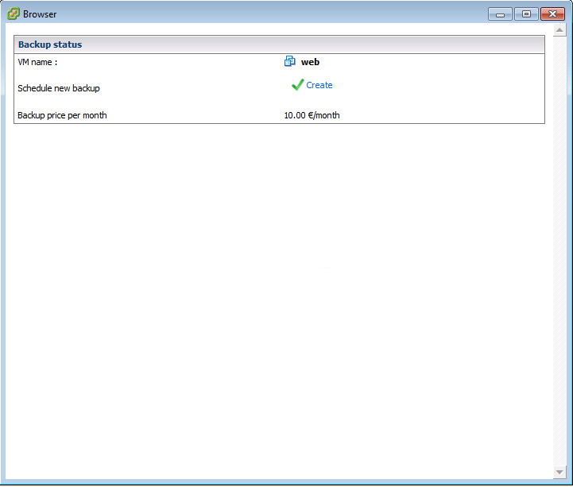
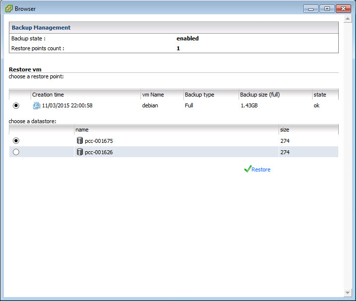
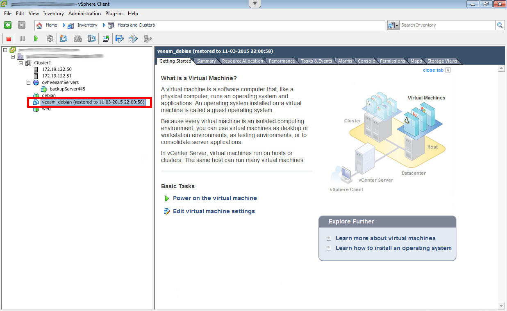

{.thumbnail}

Veeam est un éditeur de logiciel spécialisé dans les solutions de backup et de plan de reprise d'activité sur des environnements virtualisés. vSphere est la solution principale adressée par la suite de logiciel Veeam Availability Suite. L'offre Veeam Backup as a Service s'appuie sur cette brique logicielle pour fournir une solution de backup à la demande.

Les sauvegardes sont réalisées à l'aide d'une machine virtuelle située à l’intérieur même de votre infrastructure Dedicated Cloud. Les données sauvegardées, quant à elles, sont externalisées vers un espace de stockage indépendant, chez OVH. Les sauvegardes s'effectuent la nuit, avec une durée de rétention de 14 à 20 jours.

Nous allons voir comment déployer et utiliser cette solution en quelques clics.

Prérequis
---------

Certaines options sont nécessaires pour faire fonctionner ce service. Il faut notamment activer les options HA et DRS dans vSphere ainsi que la [gestion des licences Windows](https://pccdocs.ovh.net/display/VS/Licences+SPLA+Windows) depuis le manager.

------------------------------------------------------------------------

Étape 1 : Demander la mise en place du service
----------------------------------------------

La première étape consiste à demander l'activation du service. Cela se fait très simplement depuis votre [espace client OVH](https://www.ovh.com/manager/web/login/){.external-link}.

- Dans la partie "Infrastructure" de l'onglet "Dedicated", cliquer sur l'infrastructure vSphere concernée puis sur le datacenter souhaité.
- Un bouton "Activate Backup" permet de faire la demande d'activation.
- Après la mise en place, un e-mail de confirmation est envoyé et un nouveau message apparait dans le manager : "*Status: The backup is activated*". A partir de ce moment là, le service est utilisable directement depuis vSphere.

Automatisation
--------------

Suite à cette demande, OVH se charge de toute la mise en place. Cela se traduit par la création d'une nouvelle machine virtuelle au sein d'un pool de ressources nommé "ovhVeeamServers". Cette machine, qui nécessite 2 vCPU et 2 Go de RAM, prendra en charge la gestion des backups vers un espace de stockage à laquelle elle seule peut accéder. Vous n'avez aucun droit de gestion sur cette machine, qui est gérée directement par les équipes d'OVH.L'installation de cette machine est réalisée sous 2 heures, sous réserve de ne pas se trouver dans l'un des cas suivants :

- aucun cluster
- DRS inactif
- ressources insuffisantes

La résiliation du service s'effectue au sein de votre espace client, dans l'onglet "Backup" de votre datacenter : "Désactiver le backup".

{.thumbnail}

{.thumbnail}

------------------------------------------------------------------------

Étape 2 : Activer le backup pour les VM souhaitées
--------------------------------------------------

Maintenant que le service est en place, il suffit de faire les demandes de backup pour chaque VM à backuper (les VM que vous aurez identifiées comme critiques), depuis le vSphere Client (et non depuis le webclient).

- Avec un clic droit sur la VM, sélectionner "Backup Managment".
- Une fenêtre s'ouvre pour permettre la création du job de backup. Si le navigateur vous affiche un avertissement de sécurité, ajoutez l'URL comme adresse de confiance, sans quoi vous ne pourrez pas valider votre backup.
- Sélectionner "Create", un message d'information indiquant "*creating...*" apparaît.

Veeam est informé de cette nouvelle demande de backup et procède à la création du job de backup de la VM. Chaque nuit, à partir de 22h, une sauvegarde sera programmée en suivant le schéma suivant :

1.  Le 1er jour, un backup complet est fait.
2.  Les 6 jours suivants seront des sauvegardes incrémentales.
3.  Le 8ème jour, un nouveau backup complet est fait.
4.  Les 6 jours suivants seront des sauvegardes incrémentales.
5.  Le 15ème jour, un nouveau backup complet est fait.
6.  Les 6 jours suivants seront des sauvegardes incrémentales.
7.  Le 21ème jour, un nouveau backup complet est fait, les backup des étapes 1 et 2 sont supprimés (J-20 à J-13).

Ce fonctionnement garantit la disponibilité d'au minimum 14 backups à tout instant.

Chaque jour, un e-mail contenant les statuts de l'ensemble des jobs effectués est envoyé à l'adresse du compte OVH.

Info
----

Pour désactiver le Backup, sélectionnez le datacenter dans votre inventaire et dirigez-vous dans l'onglet "Backup Management". Sur cette page vous aurez la liste de vos jobs, le nombre de backups, le dernier statuts du job... et la possibilité de supprimer les jobs.Attention ! l La suppression d'une machine virtuelle de votre inventaire ou du disque ne désactive pas le job relatif à cette machine.

{.thumbnail}

{.thumbnail}

------------------------------------------------------------------------

Étape 3 : Restaurer un backup
-----------------------------

Une fois qu'au moins une sauvegarde ait été réalisée, la restauration peut se faire tout aussi simplement que la demande de backup.

- Clic droit sur la VM concernée, sélectionner "Backup Managment".
- Sélectionner la date du backup à restaurer.
- Sélectionner la destination parmi les datastores de l'infrastructure et valider.

Un job de restauration va être lancé et une nouvelle machine virtuelle sera créée à partir du backup sélectionné. Le nom de la VM commencera par "veeam\_", puis par le nom d'origine de la VM et terminera par la date et l'heure du backup de laquelle elle est issue. Par exemple : veeam\_debian (restored to 11-03-2015 22:00:58)

{.thumbnail}

{.thumbnail}
