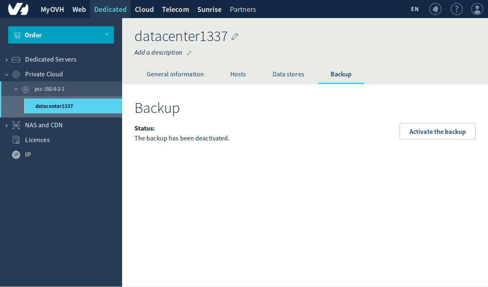
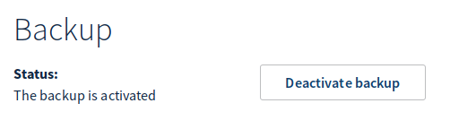
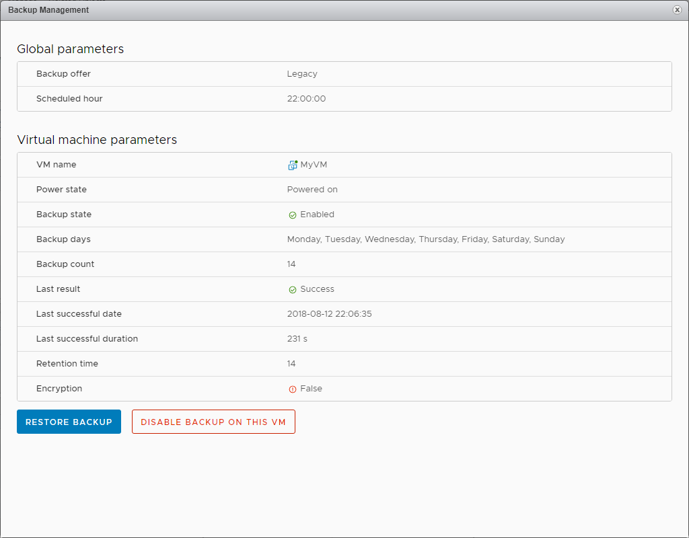
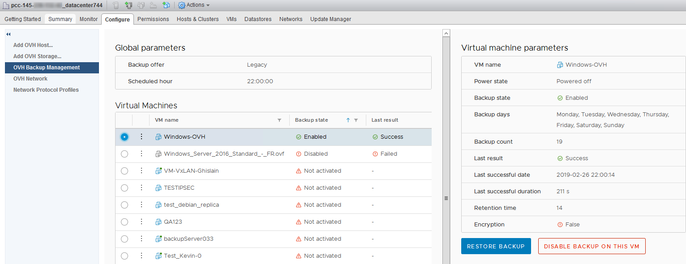

**Dernière mise à jour le 22/08/2018**

## Objectif

Veeam est un éditeur de logiciel spécialisé dans les solutions de sauvegarde et de plan de reprise d'activité (PRA) dans des environnements virtualisés. L'offre Veeam Backup Managed s'appuie sur la brique logicielle Veeam Availability Suite pour vous fournir une solution de backup à la demande.

Les sauvegardes sont réalisées à l'aide d'une machine virtuelle (VM) située à l’intérieur même de votre infrastructure [Private Cloud](https://www.ovh.com/fr/private-cloud/){.external}. Les données sauvegardées sont, quant à elles, externalisées vers un espace de stockage indépendant, chez OVH. Les sauvegardes s'effectuent la nuit, avec une durée de rétention de 14 à 20 jours.

**Ce guide vous explique comment déployer et utiliser l'option Veeam Backup Managed en quelques minutes.**

## Prérequis

* Posséder une offre [Private Cloud](https://www.ovh.com/fr/private-cloud/){.external}.
* [Donner le droit « Ajout de ressources »](https://docs.ovh.com/fr/private-cloud/changer-les-droits-d-un-utilisateur/){.external} pour le datacenter concerné à l'utilisateur depuis l'[espace client OVH](https://www.ovh.com/auth/?action=gotomanager){.external}.
* Être connecté au client vSphere.
* Avoir activé la [haute disponibilité (HA)](https://docs.ovh.com/fr/private-cloud/vmware-ha-high-availability){.external}.
* Avoir activé le [Distributed Ressource Scheduler (DRS)](https://docs.ovh.com/fr/private-cloud/vmware-drs-distributed-ressource-scheduler-new){.external} sur le ou les clusters.
* Mettre en place la [gestion des licences Windows](https://docs.ovh.com/fr/private-cloud/facturation-private-cloud/#licences-windows){.external} sur le Private Cloud.

## En pratique

### Activer le service

La première étape consiste à activer le service depuis l'[espace client OVH](https://www.ovh.com/auth/?action=gotomanager){.external}. Pour cela, rendez-vous dans la partie `Private Cloud`{.action} de l'onglet `Dédié`{.action}. Cliquez sur l'infrastructure vSphere concernée, puis sur le datacenter souhaité. Choisissez l'onglet `Backup`{.action} et validez l'activation en cliquant sur `Activer le backup`{.action}.

{.thumbnail}

Une fois l'option installée, un e-mail de confirmation vous est envoyé et un nouveau message apparaît dans l'espace client : **Etat: Le backup est activé**. Le service est dès lors utilisable directement depuis vSphere.

{.thumbnail}

Vous verrez apparaître sur votre infrastructure vSphere une machine virtuelle correspondant au serveur de sauvegarde :

{.thumbnail}

### Activer la sauvegarde pour les machines virtuelles souhaitées

Maintenant que le service est en place, il suffit de réaliser les demandes de sauvegarde pour chaque machine virtuelle identifiée comme critique depuis le vSphere Web Client.

Faites un clic droit sur une machine virtuelle, puis choisissez `Backup Management`{.action}.

{.thumbnail}

Une fenêtre s'ouvre pour créer le travail de sauvegarde. Cliquez alors sur `Enable backup on this VM`{.action} pour lancer la demande d'activation.

{.thumbnail}

Une fenêtre de confirmation apparaît. Cliquez simplement sur `OK`{.action}.

{.thumbnail}

Veeam est informé de cette nouvelle demande et crée le travail de sauvegarde de la machine virtuelle. Chaque nuit, à partir de 22 heures, une sauvegarde sera programmée selon le schéma suivant :

1.  Le 1er jour, un backup complet est effectué.
2.  Les 6 jours suivants, des sauvegardes incrémentales sont réalisées.
3.  Le 8e jour, un nouveau backup complet est effectué.
4.  Les 6 jours suivants, des sauvegardes incrémentales sont réalisées.
5.  Le 15e jour, un nouveau backup complet est effectué.
6.  Les 6 jours suivants, des sauvegardes incrémentales sont réalisées.
7.  Le 21e jour, un nouveau backup complet est effectué ; les sauvegardes des étapes 1 et 2 sont supprimées (J-20 à J-13).

Ce fonctionnement garantit la disponibilité d'un minimum de 14 backups à tout instant.

Chaque jour, un e-mail contenant les statuts de l'ensemble des travaux effectués est envoyé à l'adresse du compte OVH.

> [!warning]
>
> La suppression d'une machine virtuelle de votre inventaire ou d'un disque ne désactive pas le travail de sauvegarde relatif à cette machine. Celui-ci apparaîtra en erreur dans le rapport.
>

### Restaurer une sauvegarde

Faites un clic droit sur la machine virtuelle à restaurer. Sélectionnez `OVH Private Cloud`{.action}, puis `Restore Backup`{.action}.

{.thumbnail}

Une fenêtre s'ouvre pour créer le travail de restauration. Vérifiez bien le nom de la machine, sélectionnez la date de sauvegarde à restaurer et choisissez le datastore (espace de stockage utilisé comme cible de restauration). Cliquez sur `Restore Backup`{.action} pour lancer la restauration.

{.thumbnail}

Une fenêtre confirme alors que le serveur Veeam est informé de cette nouvelle demande et que la création du travail de restauration de la machine virtuelle a été effectuée.

{.thumbnail}

La machine est restaurée à côté de la machine source.

{.thumbnail}

> [!warning]
>
> Attention, la machine restaurée est connectée au réseau. Si vous démarrez celle-ci sans avoir désactivé la machine source, il risque d'y avoir un conflit d'adresse IP.
>

{.thumbnail}

Pour effectuer ces actions, vous pouvez sélectionner le datacenter dans votre inventaire, cliquer sur l'onglet `Configure`{.action}, puis choisir `OVH Backup Management`{.action}. Dans cette page, vous avez accès à la liste de vos travaux de sauvegarde, avec le nombre de backups et le dernier statut du travail.

### Désactiver la sauvegarde d'une machine virtuelle

Faites un clic droit sur la machine contenant la sauvegarde à désactiver. Sélectionnez `OVH Private Cloud`{.action}, puis `Backup Management`{.action}.

{.thumbnail}

Dans la fenêtre qui s'ouvre, il suffit de cliquer sur `Disable Backup on this VM`{.action} pour désactiver la sauvegarde.

{.thumbnail}

Confirmez ensuite la désactivation en cliquant sur `OK`{.action}.

{.thumbnail}

Pour effectuer ces actions, vous pouvez également sélectionner le datacenter dans votre inventaire, cliquer sur l'onglet `Configure`{.action}, puis choisir `OVH Backup Management`{.action}. Dans cette page, vous avez accès à la liste de vos travaux de sauvegarde, avec le nombre de backups et le dernier statut du travail.

{.thumbnail}

> [!primary]
>
> Dans cette même interface, vous pourrez désactiver le job de sauvegarde d'une VM supprimée.
>
> Il est également possible de désactiver le job de sauvegarde temporairement et de le réactiver par la suite.
>

## Aller plus loin

Échangez avec notre communauté d’utilisateurs sur <https://community.ovh.com/>.