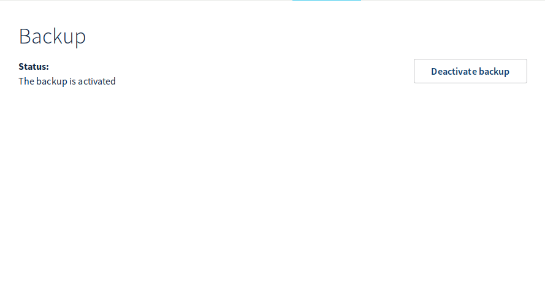
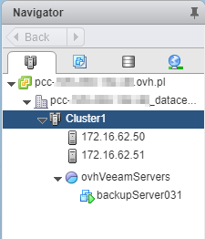
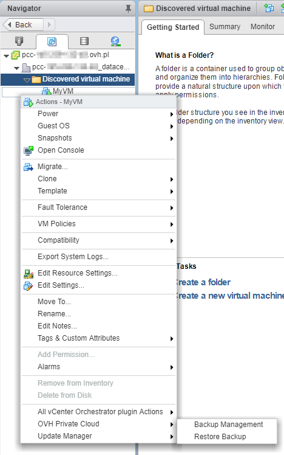
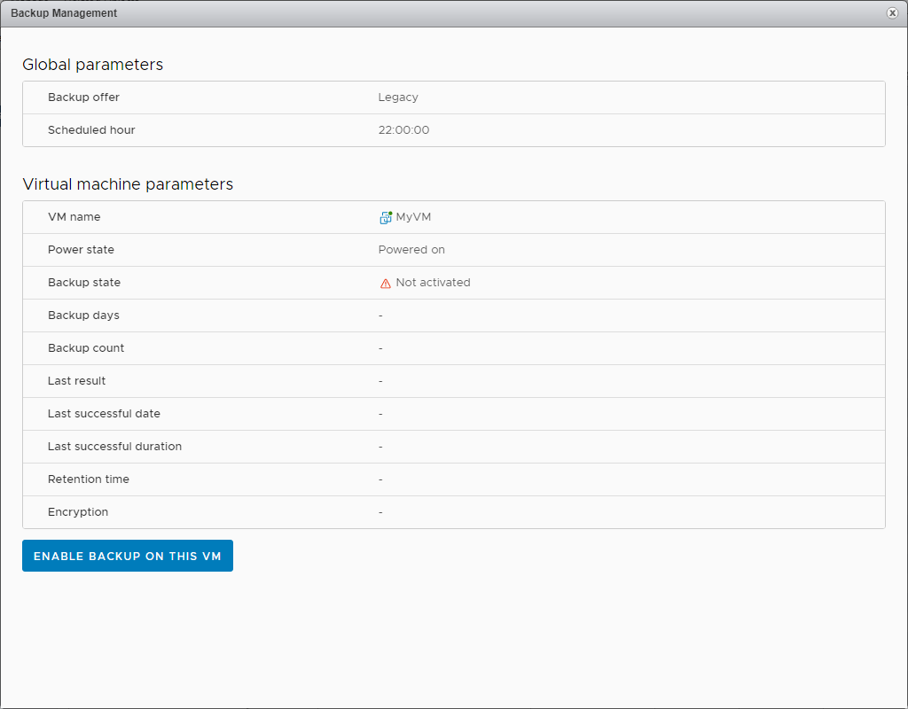
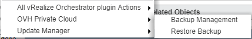
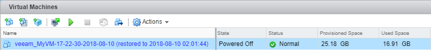

**Dernière mise à jour le 13/08/2018**

## Objectif

Veeam est un éditeur de logiciel spécialisé dans les solutions de backup et de plan de reprise d'activité sur des environnements virtualisés. vSphere est la solution principale adressée par la suite de logiciel Veeam Availability Suite. L'offre Veeam Backup Managed s'appuie sur cette brique logicielle pour fournir une solution de backup à la demande.

Les sauvegardes sont réalisées à l'aide d'une machine virtuelle située à l’intérieur même de votre infrastructure Private Cloud. Les données sauvegardées, quant à elles, sont externalisées vers un espace de stockage indépendant, chez OVH. Les sauvegardes s'effectuent la nuit, avec une durée de rétention de 14 à 20 jours.

Nous allons voir comment déployer et utiliser cette solution en quelques clics.

## Prérequis

* Posséder une offre [Private Cloud](https://www.ovh.com/fr/private-cloud/){.external}.
* [Donner le droit "Ajout de ressources"](https://docs.ovh.com/fr/private-cloud/changer-les-droits-d-un-utilisateur/){.external} pour le datacenter concerné à l'utilisateur depuis l'[espace client OVH](https://www.ovh.com/auth/?action=gotomanager){.external}.
* Être connecté au client vSphere.
* Avoir activer [HA](https://docs.ovh.com/fr/private-cloud/vmware-ha-high-availability){.external} et [DRS](https://docs.ovh.com/fr/private-cloud/vmware-drs-distributed-ressource-scheduler){.external} sur le(s) cluster(s).
* Avoir activer la [gestion des licences Windows](https://docs.ovh.com/fr/private-cloud/facturation-private-cloud/#licences-windows){.external} sur le Private Cloud

## En pratique

### Activer le service

La première étape consiste à demander l'activation du service. Cela se fait très simplement depuis votre [espace client OVH](https://www.ovh.com/manager/web/login/){.external-link}.

- Dans la partie `Private Cloud`{.action} de l'onglet `Dedicated`{.action}, cliquer sur l'infrastructure vSphere concernée puis sur le datacenter souhaité.
- Un bouton `Activate Backup`{.action} permet de faire la demande d'activation.

{.thumbnail}

Après la mise en place, un e-mail de confirmation est envoyé et un nouveau message apparait dans le manager : **Status: The backup is activated**. A partir de ce moment là, le service est utilisable directement depuis vSphere.

{.thumbnail}

Vous verrez apparaître sur votre infrastructure vSphere une machine virtuelle correspondant au serveur de sauvegarde :

{.thumbnail}

### Activer la sauvegarde pour les machines virtuelles souhaitées

Maintenant que le service est en place, il suffit de faire les demandes de sauvegarde pour chaque machine à sauvegardées (les machines que vous aurez identifiées comme critiques), depuis le vSphere WebClient.

Avec un clic droit sur la VM, sélectionner `Backup Managment`{.action}.

{.thumbnail}

Une fenêtre s'ouvre pour permettre la création du travail de sauvegarde. cliquer sur `Enable backup on this VM`{.action} pour lancer la demande d'activation

{.thumbnail}

Un Popup de confirmation apparaît pour lequel vous devez confirmer en cliquant sur `OK`{.action}.

{.thumbnail}

Veeam est informé de cette nouvelle demande de backup et procède à la création du job de backup de la VM. Chaque nuit, à partir de 22h, une sauvegarde sera programmée en suivant le schéma suivant :

1.  Le 1er jour, un backup complet est fait.
2.  Les 6 jours suivants seront des sauvegardes incrémentales.
3.  Le 8ème jour, un nouveau backup complet est fait.
4.  Les 6 jours suivants seront des sauvegardes incrémentales.
5.  Le 15ème jour, un nouveau backup complet est fait.
6.  Les 6 jours suivants seront des sauvegardes incrémentales.
7.  Le 21ème jour, un nouveau backup complet est fait, les backup des étapes 1 et 2 sont supprimés (J-20 à J-13).

Ce fonctionnement garantit la disponibilité d'au minimum 14 backups à tout instant.

Chaque jour, un e-mail contenant les statuts de l'ensemble des travaux effectués est envoyé à l'adresse du compte OVH.

> [!warning]
>
> La suppression d'une machine virtuelle de votre inventaire ou du disque ne désactive pas le travail de sauvegarde relatif à cette machine. Il apparaîtra alors en erreur dans le rapport.
>

### Restaurer une sauvegarde

Avec un clic droit sur la machine à restaurer, sélectionner `OVH Private Cloud`{.action} puis `Restore Backup`{.action}.

{.thumbnail}

Une fenêtre s'ouvre pour permettre la création du travail de restauration.
Vérifier le nom de machine, puis sélectionner la date de sauvegarde à reprendre et enfin choisir le datastore (espace de stockage utilisé comme cible de restauration). Cliquer sur `Restore Backup`{.action} pour lancer celui-ci.

{.thumbnail}

Un Popup de confirmation apparaît confirmant que le serveur Veeam est informé de cette nouvelle demande et procédé à la création du travail de restauration de la machine virtuelle.

{.thumbnail}

****

La machine est restaurée à coté de la machine source :
{.thumbnail}

> [!warning]
>
> Attention la machine restaurée est connectée au réseau, si vous démarrez celle-ci sans avoir désactivé la machine source, il risque d'y avoir un conflit d'adresse IP.
>

{.thumbnail}

****

Pour effectuer ces actions, vous pouvez sélectionnez le datacenter dans votre inventaire et dirigez-vous dans l'onglet `Configure`{.action} puis `OVH Backup Management`{.action}. Sur cette page vous aurez la liste de vos travaux de sauvegarde, le nombre de sauvegarde, le dernier statuts du travail.

### Désactiver la sauvegarde d'une machine virtuelle

Avec un clic droit sur la machine, sélectionner `OVH Private Cloud`{.action} puis `Backup Managment`{.action}.

{.thumbnail}

Une fenêtre s'ouvre et il suffit de cliquer sur `Disable Backup on this VM`{.action} pour désactiver la sauvegarde.

{.thumbnail}

Un Popup de confirmation apparaît pour confirmer la désactivation. Valider en cliquant sur `OK`{.action}.

{.thumbnail}

****

Pour effectuer ces actions, vous pouvez sélectionnez le datacenter dans votre inventaire et dirigez-vous dans l'onglet `Configure`{.action} puis `OVH Backup Management`{.action}. Sur cette page vous aurez la liste de vos machines sauvegardées, le dernier statuts du travail.

## Aller plus loin

Échangez avec notre communauté d’utilisateurs sur <https://community.ovh.com/>.
