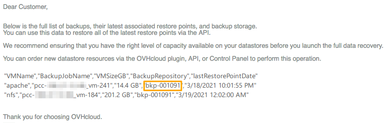

> [!primary]
> Tłumaczenie zostało wygenerowane automatycznie przez system naszego partnera SYSTRAN. W niektórych przypadkach mogą wystąpić nieprecyzyjne sformułowania, na przykład w tłumaczeniu nazw przycisków lub szczegółów technicznych. W przypadku jakichkolwiek wątpliwości zalecamy zapoznanie się z angielską/francuską wersją przewodnika. Jeśli chcesz przyczynić się do ulepszenia tłumaczenia, kliknij przycisk „Zaproponuj zmianę” na tej stronie.
> 

**Ostatnia aktualizacja z dnia 29-03-2021**

## Wprowadzenie

**Niniejszy przewodnik wyjaśnia, jak zidentyfikować i przywrócić kopie zapasowe przez API OVHcloud**

## Wymagania początkowe

- Dostęp do [API OVHcloud](https://api.ovh.com/)
- [Veeam Managed Backup włączony](https://docs.ovh.com/gb/en/private-cloud/veeam-backup-as-a-service/) w ramach usługi Hosted Private Cloud

## W praktyce

Jeśli nie jesteś przyzwyczajony do działania API OVHcloud, zapoznaj się z naszym przewodnikiem Pierwsze kroki [z API OVHcloud](https://docs.ovh.com/pl/api/first-steps-with-ovh-api/).

### Etap 1: wygeneruj raport z kopii zapasowych

Najpierw należy wybrać odpowiednie kopie zapasowe do przywrócenia.

Zaloguj się na stronie [https://api.ovh.com/](https://api.ovh.com/) i skorzystaj z następującego połączenia:

> [!api]
>
> @api {POST} /dedicatedCloud/{serviceName}/datacenter/{datacenterId}/backup/generateReport

Wpisz zmienne:

- serviceName: numer referencyjny usługi Dedicated Cloud w formie `pcc-XX-XX-XX-XX`
- datacenterId: ID centrum danych, w którym jest aktywowane Twoje rozwiązanie Veeam Managed Backup

To wywołanie generuje raport z kopii zapasowych. Zostanie on wysłany e-mailem na adres wskazany w koncie administratora usługi Hosted Private Cloud.
 E-mail zawiera następujące informacje:

- Nazwa VM
- Wykonane kopie zapasowe (BackupJobName)
- Rozmiar każdej kopii zapasowej
- **Katalog przechowywania (BackupRepository)**
- Ostatni punkt przywracania

{.thumbnail}

Zapisz się do katalogu (BackupRepository) i przywróć kopie zapasowe na kolejnym etapie.

### Etap 2: przywróć kopie zapasowe

> [!warning]
>
> Zanim przywracasz dane na datastore, upewnij się, że dysponujesz przestrzenią dyskową wystarczającą do przechowywania przywróconych danych.
>
> Jeśli tak nie jest, zostaniesz powiadomiony e-mailem, a operacja zostanie anulowana.

Zaproszenie API przywróci ostatnie poprawne punkty przywracania każdej kopii zapasowej zapisanej w katalogu.

Zaloguj się na stronie [https://api.ovh.com/](https://api.ovh.com/) i skorzystaj z następującego połączenia:

> [!api]
>
> @api {POST} /dedicatedCloud/{serviceName}/datacenter/{datacenterId}/backup/batchRestore
>

Wpisz zmienne:

- serviceName: numer referencyjny usługi Dedicated Cloud w formie `pcc-XX-XX-XX-XX`
- datacenterId: ID centrum danych, w którym jest aktywowane Twoje rozwiązanie Veeam Managed Backup
- backupJobName (opcjonalnie): nazwa kopii zapasowej (uzyskana w etapie 1) w formie `pcc-XXX-XXX-XXX-XXX-XXX_vm-XXX`, jeśli chcesz przywrócić tylko jedną VM.
- backupRepositoryName: nazwa backupRepository otrzymana w etapie 1

Po zakończeniu przywracania wirtualne maszyny odpowiadające przywróconym kopiom zapasowym znajdziesz w interfejsie vSphere.
 Aby je zidentyfikować, ich nazwy zawierają sufiks *BatchRestore* oraz znacznik czasu przywrócenia.
 Wirtualne maszyny zostały przywrócone. Proszę je włączyć.

{.thumbnail}

## Sprawdź również

Dołącz do społeczności naszych użytkowników na stronie <https://community.ovh.com/en/>.
