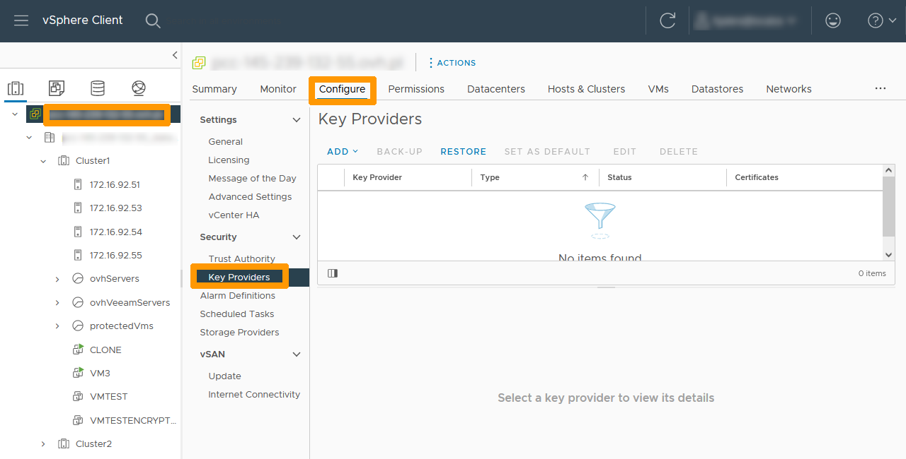
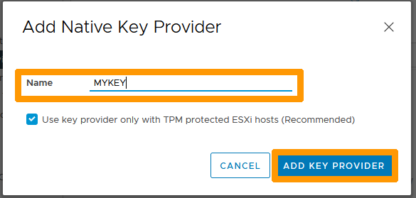
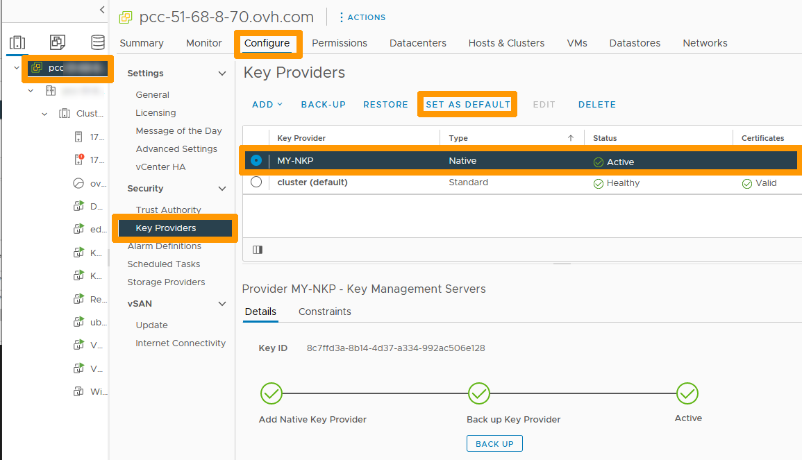
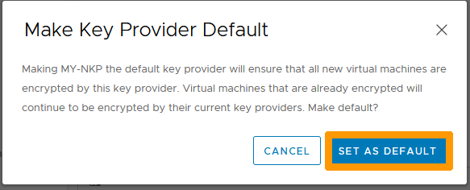
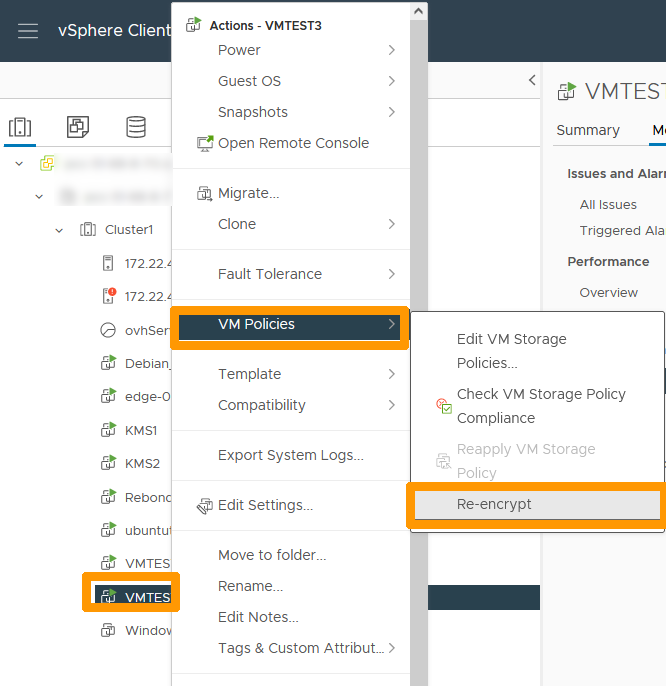

**Dernière mise à jour le 07/09/2022**

## Objectif

Ce guide a pour objectif d'expliquer les détails de la mise en œuvre de **vSphere Native Key Provider** pour ensuite effectuer un chiffrement d'une machine virtuelle dans l'offre **Hosted Private Cloud powered by VMware** d'OVHcloud.

**Découvrez comment mettre en œuvre le chiffrement de vos machines virtuelles à l'aide de vSphere Native Key Provider.**

> [!warning]
> OVHcloud vous met à disposition des services dont la configuration, la gestion et la responsabilité vous incombent. Il vous appartient donc de ce fait d’en assurer le bon fonctionnement.
>
> Ce guide a pour but de vous accompagner au mieux sur des tâches courantes. Néanmoins, nous vous recommandons de faire appel à un prestataire spécialisé si vous éprouvez des difficultés ou des doutes concernant l’administration, l’utilisation ou la mise en place d’un service sur un serveur.
>

## Prérequis
- Avoir souscrit une offre [Hosted Private Cloud powered by VMware](https://www.ovhcloud.com/fr/enterprise/products/hosted-private-cloud/).
- Être connecté à votre [espace client OVHcloud](https://www.ovh.com/auth/?action=gotomanager&from=https://www.ovh.com/fr/&ovhSubsidiary=fr).
- Avoir accès à l’interface de gestion vSphere.
- Avoir la version de vSphere et des hôtes en version 7.0 Update 2 minimum.
- A ce jour, la solution de réplication **Zerto** n'est pas compatible avec le chiffrement. Les VMs chiffrées ne pourront donc pas être répliquées.

> [!warning]
>
> Il est possible que votre cluster **Hosted Private Cloud powered by VMware** ne soit pas en version 7.0 Update 2. Dans ce cas, contactez le support pour faire évoluer votre infrastructure.
>
>
> Les options de chiffrement **vSAN Data-At-Rest Encryption** et  **vSAN Data-In-Transit Encryption** ne sont pas supportées par défaut sur les clusters vSAN. Si toutefois vous souhaitez mettre en place ces options veuillez contacter votre **Technical Account Manager**.  
>

## Présentation

**vSphere Native Key provider** permet de chiffrer les machines virtuelles, d'activer un vTPM dans les machines virtuelles ou d'activer le chiffrement « data-at-rest » sur vSAN, sans avoir besoin d'un serveur **KMS** (*Key Management Server*) externe.

Il est possible d'exporter la clé **vSphere Native Key provider** et de la réimporter sur un autre cluster.

Dans le détail, lorsque l'on chiffre une machine virtuelle, le Vcenter génère une clé **KDK** (Key Derivation Key). 
Cette clé est poussée aux ESXi et permet de générer une autre clé, la **DEK** (Data Encryption Key) qui servira à effectuer le chiffrement des fichiers composant la machine virtuelle et donc de ses données. 
La clé **DEK** est chiffrée à l'aide de la **KDK**. Elle est stockée et chiffrée avec la machine virtuelle. Vous trouverez plus de détails sur le chiffrement **VMware** en consultant les documentations officielles dans la section « [Aller plus loin](#gofurther) » de ce guide.

## En pratique

### Autorisation d'un utilisateur à administrer le chiffrement sur un cluster Hosted Private Cloud powered by VMware 

Connectez-vous à l'[espace client OVHcloud](https://www.ovh.com/auth/?action=gotomanager&from=https://www.ovh.com/fr/&ovhSubsidiary=fr), cliquez sur `Hosted Private Cloud`{.action} et choisissez votre cluster. Positionnez vous sur `Utilisateurs`{.action} et cliquez sur le bouton `...`{.action}.

{.thumbnail}

Cliquez sur `Modifier`{.action}.

{.thumbnail}

Activez la `Gestion du chiffrement`{.action} et cliquez sur `Valider`{.action}.

{.thumbnail}

Attendez que la fenêtre de modification disparaisse.

{.thumbnail}

Les droits de gestion du chiffrement ont été modifiés, comme on peut le constater dans la colonne `Gestion du chiffrement`.

{.thumbnail}

### Création d'une clé vSphere Native Key Provider

Nous allons créer la clé de chiffrement **vSphere Native Key Provider**. Cette clé pourra être utilisée pour chiffrer les fichiers d'une machine virtuelle. Si vous souhaitez ajouter un périphérique virtuel **vTPM**, il est obligatoire de chiffrer la VM.

Connectez-vous à l'interface **vSphere**. Au besoin, aidez-vous du guide « [Se connecter à l'interface vSphere](https://docs.ovh.com/fr/private-cloud/connexion-interface-vsphere/) ».

Cliquez en haut à gauche sur la racine du `cluster`{.action} puis cliquez sur l'onglet `Configurer`{.action} et choisissez `Fournisseurs de clés`{.action}.

{.thumbnail}

Cliquez sur le bouton `Ajouter`{.action} et choisissez dans le menu `Ajouter un fournisseur de clés natif`{.action}.

{.thumbnail}

Saisissez un nom dans `Nom`.

> [!warning]
>
> Si votre offre Private Cloud est plus ancienne que **Premier Hosted Private Cloud powered by VMware**, décochez la case `Utiliser le fournisseur de clés uniquement avec les hôtes ESXi protégés par TPM (recommandé)`.
>

Cliquez sur `AJOUTER UN FOURNISSEUR DE CLÉS`{.action}.

{.thumbnail}

Cliquez sur le bouton `SAUVEGARDE`{.action} à gauche pour sauvegarder la clé en dehors du cluster.

{.thumbnail}

Cochez la case à gauche pour protéger la sauvegarde par un mot de passe.

{.thumbnail}

Saisissez `le mot de passe` et `confirmez-le`. Cochez ensuite la case `J'ai enregistré le mot de passe dans un lieu sûr`{.action} et cliquez sur `SAUVEGARDER LE FOURNISSEUR DE CLÉS`{.action}.

{.thumbnail}

Il est maintenant possible d'utiliser la clé pour chiffrer des machines virtuelles.

{.thumbnail}

### Chiffrement d'une machine virtuelle

Nous allons chiffrer une machine virtuelle ainsi que ses données. 

> [!warning]
> L'opération de chiffrement d'une machine virtuelle ne peut se faire que lorsque celle-ci est éteinte.
>

Faites un clic droit sur la `machine virtuelle`{.action} puis, dans le menu `Stratégies de VM`{.action}, choisissez `Modifier les stratégies de stockage VM`{.action}.

{.thumbnail}

Dans le menu déroulant `Stratégies de stockage de VM`, choisissez `VM Encryption Policy`{.action} et cliquez sur `OK`{.action}.

{.thumbnail}

Dans les propriétés de la machine virtuelle, cliquez sur l'onglet `Résumé`{.action}. Vous verrez apparaitre un `cadenas` suivi du texte `Chiffré avec un fournisseur de clés natif` qui indique que la machine virtuelle est chiffrée. 

{.thumbnail} 

### Migration d'une solution existante de chiffrement vers vSphere Native Key provider

Certains clients OVHcloud utilisent une solution de chiffrement avec des clés KMS externes. Il est possible de migrer le chiffrement vers **vSphere Native Key Provider**.

Suivez les instructions ci-dessous pour migrer une machine virtuelle chiffrée avec une clé générée par un KMS externe nommée **cluster** vers une clé vSphere Native Key Provider portant le nom **MY-NKP**.

Depuis la console **vSphere** de votre cluster, cliquez en haut à gauche sur la `racine du cluster`{.action}. 
Allez en haut dans l'onglet `Configurer`{.action}. 
Cliquez sur `Fournisseurs de clés`{.action} dans la barre verticale, positionnez-vous sur la `clé vSphere Native Key provider`{.action} et cliquez sur `DÉFINIR COMME VALEUR PAR DÉFAUT`{.action}.

{.thumbnail}

Confirmez votre choix en cliquant sur `DÉFINIR COMME VALEUR PAR DÉFAUT`{.action}.

{.thumbnail}

La clé **vSphere Native Key Provider** est alors définie par défaut.

{.thumbnail}

Cliquez sur `la machine virtuelle`{.action} et allez dans l'onglet `Résumé`{.action}. Cette machine virtuelle utilise le `fournisseur de clés standard`. Nous allons changer le chiffrement de cette machine virtuelle.

{.thumbnail}

Dans le client **vSphere**, faites un clic droit sur `la machine virtuelle`{.action} qui doit être à nouveau chiffrée. Dans l'entrée `VM Policies`{.action} du menu, choisissez `Chiffrer à nouveau`{.action}.

> [!primary]
> L'opération liée au nouveau chiffrement peut se faire avec la machine virtuelle allumée, car uniquement la clé **DEK** est chiffrée à nouveau.
>

{.thumbnail}

Le nouveau chiffrement s'effectue en quelques millisecondes car l'opération effectuée n'est qu'un renouvellement du chiffrement de la clé **DEK**. Cette  clé est maintenant chiffrée à l'aide de la nouvelle clé **vSphere Native Key Provider**.

{.thumbnail}

Cliquez sur la `machine virtuelle`{.action} sur laquelle le chiffrement a été modifié et allez dans l'onglet `Résumé`{.action}. Vous pouvez constater que le chiffrement utilise un fournisseur de clés natif à coté du `cadenas`.

{.thumbnail}

## Aller plus loin 

[Présentation VMware de vSphere Native Key Provider](https://core.vmware.com/native-key-provider)

[Documentation VMware du processus de chiffrement sur vSphere](https://docs.vmware.com/fr/VMware-vSphere/7.0/com.vmware.vsphere.security.doc/GUID-4A8FA061-0F20-4338-914A-2B7A57051495.html#GUID-4A8FA061-0F20-4338-914A-2B7A57051495)

[Documentation VMware concernant vSphere Native Key Provider](https://docs.vmware.com/fr/VMware-vSphere/7.0/com.vmware.vsphere.security.doc/GUID-54B9FBA2-FDB1-400B-A6AE-81BF3AC9DF97.html#GUID-54B9FBA2-FDB1-400B-A6AE-81BF3AC9DF97)

Échangez avec notre communauté d’utilisateurs sur <https://community.ovh.com/>.
